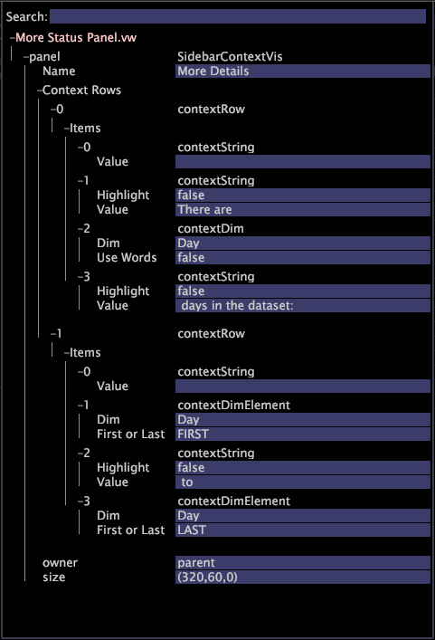

# サイドバーの設定{#configure-the-sidebar}

{{eol}}

サイドバーを使用して、よく使用する機能にアクセスしたり、ビジュアライゼーションを保持したままワークスペース間を移動したりできます。

管理者は、様々なユーザーグループに合わせてサイドバーをカスタマイズし、プロファイルと共にデプロイすることができます。

サイドバーは、フィルターやローカルオーバーライドを追跡できるようにする理想的なツールです。サイドバーを使用したくない場合は、非表示にできます。

## サイドバーへのビジュアライゼーションの追加 {#section-666f70a405db4f8d8eaffa567ffcac06}

1. 起動Data Workbench。
1. サイドバーで、 **[!UICONTROL Add]** > *&lt;**[!UICONTROL item]**>*. 例：[!DNL Selections Panel]、[!DNL Filters Panel]、[!DNL Table]。

   Data Workbenchの標準インストールでは、次のサイドバーパネルを使用できます。 以下の特定のプロファイルでは、その他の項目を使用できる場合があります。

   * **選択パネル：** 現在のワークスペースでアクティブな選択を把握できます。 この [!DNL Selections Panel] は、新しい選択を行うたびに更新されます。 **[!UICONTROL x]** をクリックして、選択範囲をクリアできます。詳しくは、 [ビジュアライゼーションでの選択](../../home/c-get-started/c-vis/c-sel-vis/c-sel-vis.md#concept-012870ec22c7476e9afbf3b8b2515746) 」を参照してください。
   * **フィルターパネル：** 保存済みフィルターの読み込みと適用が容易になります。 複数のフィルターを読み込み、各フィルターの横のチェックボックスをクリックして、個別に有効/無効にできます。「 [フィルターエディター](../../home/c-get-started/c-analysis-vis/c-filter-editors/c-filter-editors.md#concept-2f343ecbed8240f18b0c1f1eccef11e3).
   * **ローカルの上書きパネル：** このパネルには、プロファイルに存在する、プロファイルの個人コピーで変更された指標、ディメンション、フィルターが表示されます。 自分のクライアントと他のユーザーのクライアントでデータの表示が異なる可能性に関して注意を促すのに役立ちます。指標、ディメンション、フィルターの変更をサーバーに保存すると、上書きは [!DNL Local Overrides panel]. 上書きをクリックし、 **[!UICONTROL Revert to Server]**&#x200B;を指定した場合、ローカルの上書きが削除され、項目が共有バージョンに戻ります。
   * **指標の凡例：** 指標の凡例を追加します。 [!DNL Metric legends] プロファイルに関連するベースライン指標と、データセットに関連する統計（作成済みの場合は現在の選択）を表示できます。 詳しくは、 [指標の凡例](../../home/c-get-started/c-analysis-vis/c-legends/c-metric-leg.md#concept-e7195bc8f7844ae295bda3a88b028d5b).
   * **カラー凡例：** 色凡例を追加します。 コンバージョンや定着などの指標別にビジュアライゼーションを色分けし、ほぼすべての [!DNL Workspace]. ビジネス指標を色にリンクすると、異常、例外、トレンドを見極めやすくなります。「[色凡例](../../home/c-get-started/c-analysis-vis/c-legends/c-color-leg.md#concept-f84d51dc0d6547f981d0642fc2d01358)」を参照してください。
   * **テキスト注釈：** メモパネルを追加します。 [!DNL Text annotations] は、任意のテキストを入力して、説明情報やコメントをに追加できるウィンドウです [!DNL Workspace]. 詳しくは、 [テキスト注釈の操作](../../home/c-get-started/c-analysis-vis/c-annots/c-text-annots.md#concept-55b4aa3e0c58470b8e3c9d452e12a777).
   * **テーブル：** テーブルを追加します。 テーブルには、1 つ以上のデータのディメンションにまたがる 1 つ以上の指標を表示できます。詳しくは、 [テーブル](../../home/c-get-started/c-analysis-vis/c-tables/c-tables.md#concept-c632cb8ad9724f90ac5c294d52ae667f).
   * **開く：** 保存されたファイルを開きます。

## サイドバーパネルを開く {#section-cbc8e57491854274a577d47a48c306b8}

保存した場所またはクリップボードから、サイドバーのビジュアライゼーションを開けます。

1. サイドバーで、 **[!UICONTROL Add]** > **[!UICONTROL Open]**.
1. クリック **[!UICONTROL File]** を見つける [!DNL .vw] 追加するパネルのファイルを選択するか、 **[!UICONTROL Last Closed Window]**：ビジュアライゼーションをクリップボードから取り込みます。

   また、 **[!UICONTROL From Clipboard]** をクリックして、クリップボードにコピーしたビジュアライゼーションを貼り付けます。 「[サイドバーパネルのコピー](../../home/c-get-started/c-config-sidebar.md#section-720ae057632a4b8dbb94412e06a370b1)」を参照してください。

## サイドバーパネルのコピー {#section-720ae057632a4b8dbb94412e06a370b1}

1. パネルの上の境界線を右クリックし、 **[!UICONTROL Copy]** > **[!UICONTROL Window]**.
1. パネルを貼り付けるには、 **[!UICONTROL Add]** > **[!UICONTROL Open]** > **[!UICONTROL From Clipboard]**.

## サイドバーパネルの保存 {#section-fb19936b12704fb0a4c592abb579db1d}

サイドバーパネルで、タイトルバーを右クリックし、 **[!UICONTROL Save]**.

同様に、保存されているサイドバーのビジュアライゼーションを開くこともできます。Data Workbenchはビジュアライゼーションを [!DNL .vw] ファイルを指定します。

## デフォルトのサイドバーに戻す {#section-4d14b8771ad747bba799876267f24831}

サイドバーで、 **[!UICONTROL Options]** > **[!UICONTROL Revert]**.

Data Workbenchを閉じると、現在のサイドバー設定が [!DNL sidebar.vw] ファイルをユーザープロファイルに追加します。 Data Workbenchを開くと、 [!DNL sidebar.vw] ファイルを作成します。

デフォルトのサイドバーまたは以前保存したサイドバーに戻すことができます。以前保存したサイドバーはユーザープロファイルから削除され、親プロファイルからサイドバーが再読み込みされます。管理者は、デフォルト（親）のサイドバーを、 [!DNL Profile Manager].

## その他のステータスパネルファイルをカスタマイズする {#section-8d502f3b59cc4331966edec05e896ce1}

システム管理者は、 [!DNL More Status Panel.vw]. これにより、指標とディメンションの値に関してコンテキスト語が配置され、結果が [!DNL More Status panel] サイドバーに表示されます。

次の手順で [!DNL More Status panel] サイドバーで、次の例に示す矢印をクリックします。

以下の手順は、データセットに含まれる日数を示す、カスタマイズされたステータスを作成する方法の簡単な例を示しています。

1. 内 [!DNL Profile Manager]をクリックし、 **[!UICONTROL Sidebar\]**.

1. 内 [!DNL Base_5_3*] 列、 [!DNL More Status Panel.vw] ファイル。

   これを行うには、ファイルのチェックマークを右クリックし、 **[!UICONTROL Make Local]**.

1. を開きます。 [!DNL More Status Panel.vw] ファイルを [!DNL .vw] [!DNL Editor] またはメモ帳で。

   

1. 次を完了： [!DNL Context] および [!DNL Items] フィールド [!DNL Editor]. 詳しくは、 [クエリ言語構文](../../home/c-get-started/c-qry-lang-syntx/c-qry-lang-syntx.md#concept-15d1d3f5164a47d49468c5acb7299d9f) 構文に関するガイドラインを参照してください。

1. ファイルを保存します。

   前述の例の値は、次のように表示されるステータス数式になります。

   
