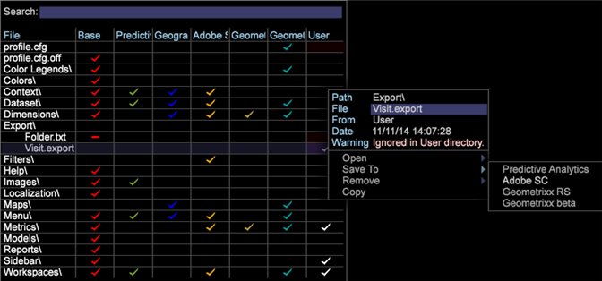

# カスタムヘッダーでのセグメントエクスポート{#segment-export-with-custom-headers}

セグメントエクスポートファイルのカスタム列のエクスポートヘッダーを作成して、エクスポートされたセグメントのわかりやすい説明を追加できます。このエクスポート機能を使用して、TSV や CSV ファイルとして出力することもできます。

ヘッダー付きや CSV および TSV 形式でエクスポートする機能などの新機能がセグメントエクスポートに追加されました。

エクスポートファイルの列ヘッダーを作成できます。

## 新しいセグメントエクスポートの作成 {#section-cffff55855f8467ea468b71393ab7676}

1. ワークスペースを開き、右クリックして/を **[!UICONTROL Tools]** 選択しま **[!UICONTROL Detail Table]**&#x200B;す。

1. 右クリックし、/項目を **[!UICONTROL Add Level > Extended]** 選択を選択します。
1. タイトルを右クリックし、メニューから「デ **[!UICONTROL Add Attribute.]** ィメンションを選択」を選択します。

1. タイトルを右クリックし、メニューから「 **[!UICONTROL Add Metric.]** 指標を選択」を選択します。

1. タイトルを右クリックし、を選択しま **[!UICONTROL New Segment Export]**&#x200B;す。

   

   **[!UICONTROL New Segment Export with Header]** 列名に指標の名前が自動的に入力されます。 **[!UICONTROL New Segment Export]** には、カスタム名を設定する必要があります。 

   >[!NOTE]
   >
   >[列名]フィールドを空のままにしておくことはできません。空白にしないと、ヘッダが存在しません。

1. 右クリックしてセグメントに名前を付け、をクリックしま **[!UICONTROL Save Export File]**&#x200B;す。

   エクスポートウィンドウが開きます。

1. Right-click the export name and click **[!UICONTROL Save as<export filename>]**を参照してください。

   

1. Right-click [!DNL Admin] > [!DNL Profile Manager] > [!DNL Expand Export]. 作成したエクスポートファイルを見つけ、既存のプロファイルに保存します。

   

