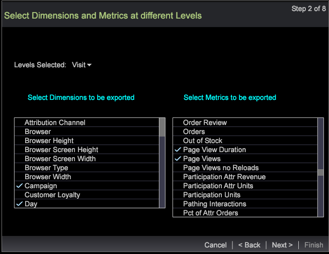
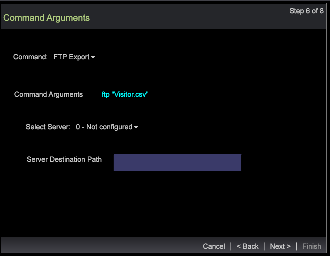

# Segment export wizard{#segment-export-wizard}

セグメントエクスポートウィザードを使用したセグメントのエクスポート

The segment export wizard provides a step-by-step process to configure and export segments rather than [exporting segments from a detail table](https://docs.adobe.com/content/help/en/data-workbench/using/client/export-data/c-sgmt-expt.html).

## Export segments using the wizard {#section-b30f2699dbc7490bad18512b91cb0cb3}

ウィザードを開くには、ワークスペースを右クリックし、**管理者**／**ウィザード**／**セグメントのエクスポートウィザード**&#x200B;を選択します。

>[!NOTE]
>
>ウィザードを開く前に適用したセグメントのみがキャプチャされます。 また、ウィザードから作成されたセグメントエクスポートは外部コマンドを生成できません。

1. エクスポートに追加するディメンションと指標の各種親レベルを選択します。

   表示されるレベルは選択したプロファイルによって異なります。プロファイルにもとづいた複数のディメンションレベルを選択できます。

   

1. 「**次へ**」をクリックします。
1. 選択したレベルのディメンションと指標を選択します。

   例えば、ページビューを親レベルとして選択した後に、エクスポート可能な子ディメンションと指標を選択できます。

1. 「**次へ**」をクリックします。

   

   

1. エクスポート形式を選択し、エクスポートファイルの名前を入力します。

   

   エクスポートの形式が CSV、TSV、セグメントエクスポートおよびセグメントのヘッダー付きエクスポートの場合は追加の設定を必要としません。しかし、プロファイルとオーディエンスのエクスポート、カスタムレコードサービスおよび Adobe Target エクスポートは手順 3 で設定する必要があります。例えば、プロファイルとオーディエンスのエクスポートの設定フィールドを参照してください。これらのエクスポートタイプを設定し、「**次へ**」をクリックします。

   

   

   

1. 選択した書き出しの種類を設定します。

   ヘッダー — ヘッダーが True である場合、**出力ファイル**&#x200B;フィールドに名前を付けます。

   Escape Field—Set as **True** or **False**.

   順序フィールド — フィールドを選択し、上下に移動して、エクスポートファイルの順序を設定します。

   

   「**次へ**」をクリックします。

1. このダイアログでレベルおよび適用されたフィルターを表示します。「**次へ**」をクリックします。

1. **CSV**、**TSV**、**セグメントエクスポート**、または&#x200B;**セグメントのヘッダー付きエクスポート**&#x200B;が選択されている場合、次の 3 つのオプションがあります。

   汎用エクスポート - 出力ファイルがサーバー／エクスポートフォルダーのサーバーによって生成されます。

   

   FTP エクスポート - 出力ファイルが選択したサーバーに転送されます（サーバーのリストが FTPServerInfo.cfg ファイルから選択されます）。

   

   SFTP エクスポート - 出力ファイルが選択したサーバーへ安全に転送されます。

1. 「**次へ**」をクリックします。

   **注意：** 選択した書き出しタイプが **Profiles and Audience Export**、 **Custom Record Service**、 **** Adobe Target Exportの場合、選択した書き出しに基づいてテキストが静的になります。

1. スケジュールパラメーターを設定します。

   **ワンショット**&#x200B;は True または False に設定できます。

   **詳細スケジュール**&#x200B;は「詳細スケジュール設定」ボタンをクリックすることで、ON または OFF にできます」と表示されます。

   

   詳細テーブルからエクスポートするのと同様に、詳細設定が ON になっている場合は、ワンショットは消去されます。「**次へ**」をクリックします。

1. エクスポートファイルをプレビューし、「**エクスポートを実行**」をクリックします。

   

   

次のエクスポートタイプはウィザードの使用時に使用可能です。

**セグメントエクスポートタイプ**

* 汎用
* FTP
* SFTP

**セグメントのヘッダー付きエクスポート**

* 汎用
* FTP
* SFTP

**CSV エクスポート**

* 汎用
* FTP
* SFTP

**TSV エクスポート**

* 汎用
* FTP
* SFTP

