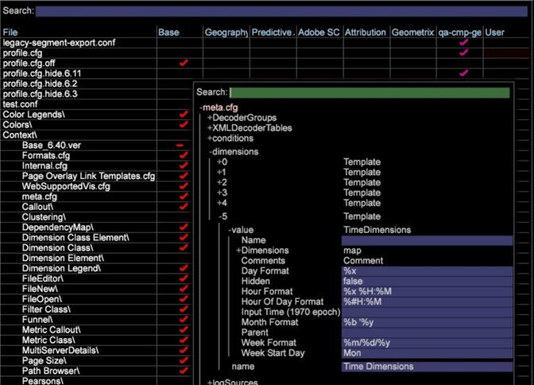

# 時間ディメンションのローカライズ{#localizing-time-dimensions}

{{eol}}

ロケールに合わせて正しく表示されるように時間ディメンションを設定します。

時間ディメンションの表示形式は、 **[!DNL Standard Time Dimensions.cfg]** ファイル ( デフォルトでは **[!DNL Server/Profiles/`<my profile>`/Dataset/Transformation/Time/Standard TimeDimension.cfg]**) をクリックします。

例えば、北米では、2015 年 5 月 3 日を5/3/15と表すことができます。 **`%m/%d/%y`**. しかし、世界の他の地域では、これは次のように解釈できます `%d/%m/%y`、または 2015 年 3 月 5 日（値の曖昧さが原因） このような状況を回避するため、管理者はロケール内のユーザーの期待に合うように表示形式を変更できます。

## 1. Standard Time Time.cfg でのデフォルトの時間Dimensionの上書き {#section-7d0b24657bef4b15abb3cbea66cb617f}

この機能を有効にするには、管理者が既存の時間ディメンションを編集するか、パラメーターを追加して新しい時間ディメンションを作成して、デフォルト値をオーバーライドする必要があります。

時間ディメンションの変更例を以下に示します。

この例では、Week、Hour、Day、Month および Hour of Day の **Format** の値はデフォルトに設定されています。

>[!NOTE]
>
>これらの行を省略した場合、Data Workbenchの動作は変更されず、ディメンションはデフォルトを使用してコンパイルされます。

```
Transformation Include = TransformationInclude:  
  Extended Dimensions = vector: 1 items 
    0 = TimeDimensions:  
      Comments = Comment: 0 items 
      Dimensions = map:  
        Day = string: Day 
        Day of Week = string: Day of Week 
        Hour = string: Hour 
        Hour of Day = string: Hour of Day 
        Month = string: Month 
        Week = string: Week 
      Hidden = bool: false 
      Input Time (1970 epoch) = string: x-unixtime 
      Week Format = string:  
  %m/%d/%y
      Hour Format = string:  
  %x %H:%M 
      Day Format = string:  
  %x
      Month Format = string:  
  %b '%y
      Hour Of Day Format = string:  
  %#H:%M
      Name = string: Visit Time 
      Parent = string: Visit 
      Week Start Day = string: Mon 
  Transformations = vector: 0 items
```


## 2. meta.cfg ファイルの設定 {#section-5e077d3298dd48fda7f7bb16af9ea00c}

さらに、パッケージ管理者は、以下のパラメーターとそのデフォルト値をプロファイルの **[!DNL meta.cfg]** ファイルに追加する必要があります。これによって、ワークステーションからの編集が可能になります。

設定済みの **[!DNL meta.cfg]** ファイルの抜粋を以下に示します。

```
dimensions = vector: 6 items 
  0 = Template: 
    ...
  ...
  5 = Template: 
    name = string: Time Dimensions 
    value = TimeDimensions: 
      Name = string:  
      Comments = Comment: 0 items 
      Hidden = bool: false 
       
  Week Format = string: %d/%m/%y 
       Hour Format = string: %x %H:%M 
       Day Format = string: %x 
       Month Format = string: %b '%y 
       Hour Of Day Format = string: %#H:%M</b> 
      Input Time (1970 epoch) = string:  
      Parent = string:  
      Week Start Day = string: Mon 
      Dimensions = map: 
        Hour of Day = string: Hour of Day 
        Day of Week = string: Day of Week 
        Hour = string: Hour 
        Day = string: Day 
        Week = string: Week 
        Month = string: Month
```

ワークステーションの **[!DNL meta.cfg]** ファイルの例を以下に示します。



これで、管理者は、時間ディメンションが設定されているファイル（**など）を**&#x200B;ファイルマネージャー&#x200B;**[!DNL Standard Time Dimensions.cfg]**&#x200B;から開き、ワークステーションで編集することができます。
