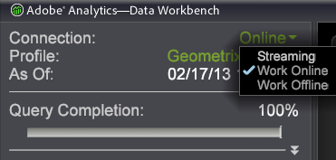

# オフラインおよびオンラインでの操作{#working-offline-and-online}

{{eol}}

オフラインまたはオンラインでのData Workbenchサーバーの操作に関する情報です。

Data Workbenchが [!DNL server] オンラインで作業しています。 オンラインで動作するように指定していない場合、Data Workbenchは、プロファイルとそのデータをコンピューターのキャッシュから読み込みます。 この場合、プロファイルを使用して最後にオンラインで動作した時にダウンロードされたプロファイルとそのデータが表示されます。

オフラインでの動作は、ローカルキャッシュを使用して作業し、コンピューター上のデータをクエリーするので、処理速度の面でメリットがあります。オンラインで作業する場合は、すべてのクエリをData Workbenchサーバに戻す必要があります。その処理に時間がかかり、他のオンラインユーザとサーバーリソースを競い合わせる必要があります。 Data WorkbenchサーバーにData Workbenchが接続されている限り、オフラインで作業すると、Data WorkbenchサーバーがData Workbench上のプロファイルやデータを更新するのを停止しますが、接続サーバーへの項目の保存は停止しません。

オフラインで作業できる機能により、Data Workbenchサーバーは、Data Workbenchユーザー数と共に、データセット内のある量のリアルタイムトラフィック入力とある量のデータを処理できるサイズになりますが、同時使用ユーザー数の上限を設定する必要はありません（実際には頻繁にはありません）。 ユーザーは通常、傾向や比率を探し求め、データを調べているので、ほとんどの場合、正確な数を必要としません。現在のデータを使用して正確な数をクエリーし、解決する必要がある場合は、オンラインで動作して正確な数を取得できますが、クエリーを 100 ％解決するまでにかかる時間は長くなります。

**オンラインまたはオフラインで作業するには**

サイドバーで、 **[!UICONTROL Connection]** を設定し、をクリックします。 **[!UICONTROL Work Online]**.



オンラインで作業する場合、Data WorkbenchはData Workbenchサーバーに接続し、コンピューター上の情報とData Workbenchサーバー上のプロファイルとデータセット情報を同期します。

Data Workbenchのデフォルトの設定はオフラインで動作しますが、次の節で説明するように、各ユーザーは [!DNL Insight.cfg] ファイルを使用して、Data Workbenchのインスタンスをデフォルトでオンラインで動作させます。

**デフォルトでオンライン動作させるには**

1. Insight インストールディレクトリに移動します。
1. [!DNL Insight.cfg] ファイルをテキストエディターで開きます。
1. 以下の例に示すように、ハイライトされている行をファイルに追加します。

```
Update Software = bool: true
Default to Online = bool: true
Color Set = int: 0
```

次にData Workbenchを開くと、Data Workbenchサーバーに接続し、デフォルトでオンラインで動作します。
