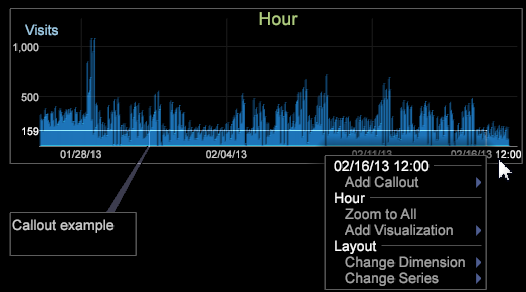

# Adding callouts to a workspace{#adding-callouts-to-a-workspace}

引き出し線は、特定のディメンション要素からなるバーチャルな選択範囲を使用して新しいビジュアライゼーションを作成することにより、ワークスペースに追加してその要素に注意を向けるためのウィンドウです。

Data Workbenchには、標準的な引き出し線タイプのセットが付属しています。 data workbench の実装は完全にカスタマイズ可能なので、表示される使用可能な引き出し線タイプが本ガイドの記載と異なる場合があります。

Data Workbenchには、デフォルトで次の引き出し線が用意されています。

* [注釈](../../../home/c-get-started/c-vis/c-call-wkspc.md#section-7b6742160b3f4aed872a09c8c023f90d)
* [空白の折れ線グラフ](../../../home/c-get-started/c-vis/c-call-wkspc.md#section-5dcc0504bdb64ed4976f880e2f7b277f)
* [空白の散布グラフ](../../../home/c-get-started/c-vis/c-call-wkspc.md#section-5dcc0504bdb64ed4976f880e2f7b277f)
* [空白のテーブル](../../../home/c-get-started/c-vis/c-call-wkspc.md#section-5dcc0504bdb64ed4976f880e2f7b277f)
* [信頼性の凡例](../../../home/c-get-started/c-vis/c-call-wkspc.md#section-386d1293ddc24a0c9cccb332e20db791)
* [指標の凡例](../../../home/c-get-started/c-vis/c-call-wkspc.md#section-daa6d372c22246d9827880a9d6e804d8)

>[!NOTE]
>
>引き出し線内に選択範囲を作成しない限り、引き出し線は選択範囲として機能しません（つまり、ワークスペース内の他のビジュアライゼーションに影響を与えません）。

You can add or edit callout definitions by configuring the callout files stored in the *profile name*\Context\Callout folder of the [!DNL Server] installation folder. 「引き出し線 [の設定」を参照してくださ](../../../home/c-get-started/c-intf-anlys-ftrs/c-config-callouts.md#concept-f6e91e172f5e4c009245c9c549beb76a)い。

## To add an annotation callout to a visualization {#section-7b6742160b3f4aed872a09c8c023f90d}

1. 引き出し線を作成する要素を右クリックし、//または// **[!UICONTROL Add Callout]** を **[!UICONTROL Annotation]** クリ **[!UICONTROL Image]** ック **[!UICONTROL Add Callout]** し **[!UICONTROL Annotation]** ます **[!UICONTROL Text]**。 空白のウィンドウに、その要素への可視の接続が表示されます。

   

   グラフのビジュアライゼーションに引き出し線を追加するには、ビジュアライゼーションの下部（ベース軸）を右クリックして、メニューを表示する必要があります。

   

1. 選択に応じて、該当する手順を実行します。

   * テキスト注釈の場合は、目的のテキストを引き出し線に入力または貼り付け、必要に応じてテキストを書式設定します。「 [テキスト注釈の操作](../../../home/c-get-started/c-analysis-vis/c-annots/c-text-annots.md#concept-55b4aa3e0c58470b8e3c9d452e12a777).
   * 画像注釈の場合は、目的の画像をコピーし、引き出し線内で右クリックして、引き出し線に貼り付けます。クリック **[!UICONTROL Paste image]**. See [Working with Image Annotations](../../../home/c-get-started/c-analysis-vis/c-annots/c-image-annots.md#concept-02081ed7d91c4fdcb8fc863f2a51c962).

## To add a blank table, line graph, or scatter plot callout to a visualization {#section-5dcc0504bdb64ed4976f880e2f7b277f}

1. Right-click the element for which you want to create a callout and click **[!UICONTROL Add Callout]** > *&lt;**[!UICONTROL callout type]**>*.

   以下の例は、空白のテーブルの引き出し線を示しています。

   

1. ディメンションを選択するには、右クリックし **[!UICONTROL None]** て、「>」 **[!UICONTROL Change Dimension]** をクリ *ックし&#x200B;**[!UICONTROL dimension name]**ます*。

   >[!NOTE]
   >
   >引き出し線を含むビジュアライゼーション内のディメンションを変更すると、引き出し線が元のディメンションの要素に接続されている状態から、ビジュアライゼーション全体に接続されている状態に変わります。

## To add a confidence legend callout to a visualization {#section-386d1293ddc24a0c9cccb332e20db791}

1. Right-click the element for which you want to create the callout and click **[!UICONTROL Add Callout]** > **[!UICONTROL Confidence Legend]**.

   

1. 必要に応じて、フィールドを変更 [!DNL Metric or Formula] します。

式の構文ルールについては、「クエリー言語の構 [文」を参照してくださ](../../../home/c-get-started/c-qry-lang-syntx/c-qry-lang-syntx.md#concept-15d1d3f5164a47d49468c5acb7299d9f)い。 信頼性の凡 [例を参照してください](../../../home/c-get-started/c-analysis-vis/c-legends/c-conf-leg.md#concept-73db81c2c218427786c04068aa778efd)。

## To add a metric legend callout to a visualization {#section-daa6d372c22246d9827880a9d6e804d8}

1. Right-click the element for which you want to create the callout and click **[!UICONTROL Add Callout]** > **[!UICONTROL Metric Legend]**.

   

1. 必要に応じて、指標の凡例に指標を追加、または指標の凡例から指標を削除します。

「 [指標の凡例](../../../home/c-get-started/c-analysis-vis/c-legends/c-metric-leg.md#concept-e7195bc8f7844ae295bda3a88b028d5b).
