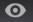

# ビジュアライゼーションへの注釈の付加{#annotating-visualizations}

{{eol}}

プレゼンテーションレイヤーを使用して、ワークスペースビジュアライゼーションのマークアップおよび注釈の付与を行ってから、引き出し線とコメントを付加して発行することができます。テキスト説明、グラフィックオブジェクト、引き出し線矢印、色分け、画像およびその他の機能のオーバーレイへの追加によって注釈を付加し、重要なデータポイントを明確化したうえで、関係者と共有します。

**ビジュアライゼーションに注釈を追加します。**

1. ワークスペースを開きます。
1. **ファイル**／**プレゼンテーションレイヤー**&#x200B;を選択します。
1. 「**プレゼンテーションレイヤーを許可**」をクリックします。

   このメニューでコマンドを切り替えて、プレゼンテーションレイヤーの生成を許可または拒否します。プレゼンテーションレイヤーが許可されている場合は、チェックマークが表示されます。

   

   プレゼンテーションレイヤーを許可すると、ツールバーの右側にクリック可能なアイコンが表示されます。

    このクリック可能なアイコンは、「**プレゼンテーションレイヤーを非表示**」モードになっているが、注釈を見ることができないということを示します。

1. アイコンをクリックして、「**プレゼンテーションレイヤーを表示**」に切り替えます。

   プレゼンテーションレイヤーに注釈が表示されます。

    このクリック可能なアイコンは、「**プレゼンテーションレイヤーを表示**」モードになっているが、注釈を編集できないということを示します。

   >[!NOTE]
   >
   >ワークスペース内で右クリックして、メニューコマンドを使用してモードを変更することもできます。

   

1. **引き出し線機能を編集して追加します。**

   アイコンを再度クリックしてワークスペースビジュアライゼーションの静的表現を取得し、オーバーレイを開いて注釈を付加または編集します。

    このクリック可能なアイコンは、注釈を付加および編集するための「**プレゼンテーションレイヤーを編集**」モードになっていることを示します。

   編集モードになっている間は、グレーのオーバーレイが表示されます。

1. **引き出し線機能を追加します**。

   ビジュアライゼーションを右クリックし、新しいテキストボックス、矢印およびその他の引き出し線機能を追加して、プレゼンテーションを強調したり、注釈を付与したりします。

   

1. **グラフィック機能を設定します**。

   グラフィックオブジェクトを選択し、右クリックしてオプションを設定します。ボックスや他のグラフィックオブジェクトの色の設定、テキストボックスのテキスト設定の調整、矢印の追加または線の階層化の設定を行うことができます。

   

1. **ワークスペースに画像を追加します**。

   右クリックして .png 画像および .jpg 画像をオーバーレイに追加し、サイズを変更します。

1. **グラフィックオブジェクトに色を割り当てます**。

   プレゼンテーションレイヤー内のオブジェクトを選択し、カラーピッカーを使用して色を割り当てることができます。 

1. **プレゼンテーションレイヤーをエクスポートして共有します**。

   ワークスペースビジュアライゼーションに注釈を付加してから、ビジュアライゼーションと一緒にプレゼンテーションレイヤーをエクスポートして、.png グラフィックファイルとして共有することができます。

   **エクスポート**／**PNG を書き出し**&#x200B;をクリックします。
