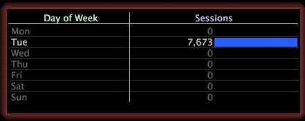

# レベルの選択{#select-a-level}

{{eol}}

サブセットを作成するときには、レベルを指定する必要があります。

レベルは、任意の可算ディメンションです。例えば、Web サイトデータで作業している場合、Day of Week（曜日）ディメンションから要素 Tue（火曜日）を選択してサブセットを作成するときに、Page View（ページビュー）、Session（セッション）または Visitor（訪問者）から、表示するレベルを選択する必要があります。

* **Day of Week=“Tue” by Page View：**&#x200B;ページビューレベルでは、火曜日に発生したページビューだけが表示されます。

   

* **Day of Week=“Tue” by Session：**&#x200B;セッションレベルでは、火曜日に発生したセッションだけが表示されます。

   

* **Day of Week=“Tue” by Visitor：**&#x200B;訪問者レベルでは、火曜日にサイトを訪問したすべての訪問者が表示されますが、同じ訪問者がそのサイトを訪問した別の日も表示されます。

   
