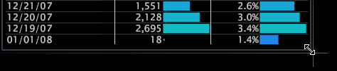

# ワークスペース内のウィンドウの操作{#manipulate-windows-in-a-workspace}

使用可能なウィンドウのタイプは、使用しているプロファイルとアプリケーションによって異なります。

**ウィンドウを追加するには**

1. ワークスペース内で右クリックし、目的のメニューオプションをクリックします。
1. 表示されるメニューから、表示するウィンドウのタイプを選択します。

**ウィンドウを移動するには**

マウスポインターをウィンドウの上の枠に置き、ポインターの形が 4 方向矢印に変わったら、ワークスペース内の目的の場所までクリックしながらドラッグします。

**ウィンドウのサイズを変更するには**

マウスポインターをウィンドウのいずれかの辺または角に置き、ポインターの形が 2 方向矢印に変わったら、ウィンドウが目的のサイズになるまでウィンドウの角または辺をクリックしながらドラッグします。

**ウィンドウをコピーして貼り付けるには**

ワークスペース内およびワークスペース間でウィンドウをコピーして貼り付けられます。

1. ウィンドウの上の枠を右クリックし、 **[!UICONTROL Copy]** > **[!UICONTROL Window]**&#x200B;をクリックします。
1. 目的のワークスペースで、**[!UICONTROL Open]** > **[!UICONTROL From Clipboard]**&#x200B;をクリックします。

**ビジュアライゼーションの引き出し線としてウィンドウをコピーして貼り付けるには**

1. ウィンドウの上の枠を右クリックし、 **[!UICONTROL Copy]** > **[!UICONTROL Window]**&#x200B;をクリックします。
1. 目的のビジュアライゼーションで、目的の要素を右クリックし、**[!UICONTROL Add Callout]** / **[!UICONTROL From Clipboard]**&#x200B;をクリックします。
