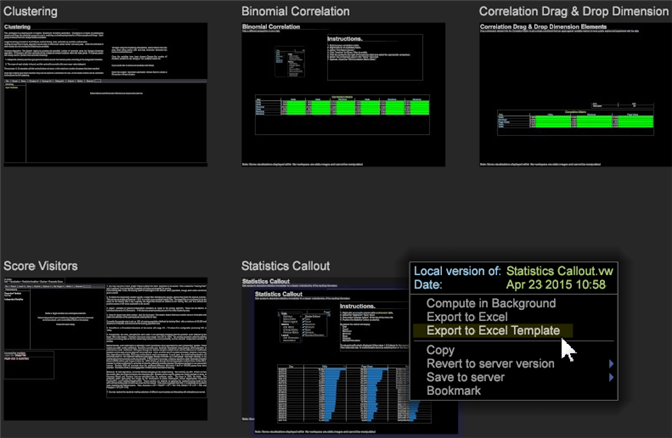
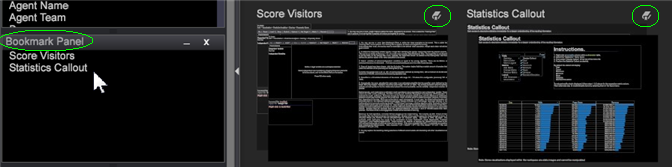

# ワークトップサムネールメニューの使用{#using-the-worktop-thumbnail-menu}

ワークトップからの書き出し、コピーおよびブックマークの方法を説明します。

ワークスペースを右クリックして、ワークトップからエクスポート、コピーおよびブックマーク機能を使用できます。

## インターフェイスの説明{#section-fd027dd94b7d4cb6b933d70c08ccd3e2}

[!DNL Worktop]サムネールメニューでは、次の要素を使用できます。

**サーバーワークスペース :***name*

未編集のサーバーワークスペースに対してのみ表示されます。この名前付きワークスペースは、サーバー上に保存されているワークスペースと同一であることを示します。

**日付：***day and time*

ワークスペースが最後に開かれた日付および時刻です。

**ローカルバージョン :***name*

サーバーワークスペースのローカルバージョンに対してのみ表示されます。この名前付きワークスペースは、サーバー上に保存されているワークスペースのローカルバージョンであり、編集されていることを示します。

**ユーザーワークスペース :***name*

ユーザーワークスペースに対してのみ表示されます。この名前付きワークスペースは、ローカルマシンにのみ存在するワークスペースであることを示します。

**バックグラウンドで計算**

オンラインで作業している場合のみ表示されます。ユーザーが作業を続行している間、選択したワークスペースのクエリーがバックグラウンドで引き続き実行されます。選択すると、サムネールにクエリーの進行状況を示す次の情報が表示されます。

* 作業中 : *n%* - クエリーが処理中であることと、完了した処理の割合を示します。
* *n* MB クエリーの読み込み - クエリー結果の合計サイズ。クエリ読み込みは、Data Workbenchサーバーのメモリ読み込みの合計に比例しますが、直接の相関はありません。 ガイドラインとして、10 MB 以上のクエリーの読み込みは、システムに過大な負担をかける場合があります。表示されるクエリーの読み込みでは、クラスタリングが考慮されていません。

   >[!NOTE]
   >
   >「バックグラウンドで計算」を選択したままにすると、選択したワークスペースのクエリは常設クエリになり、更新が継続され、メモリ読み込みを使用し続けます。 ワークスペースでの作業を終了するときに、必ず「バックグラウンドで計算」の選択を解除してください。

**Excel にエクスポート**

ワークスペースデータを Microsoft Excel の表（.xls ファイルおよび .xslx ファイル）にエクスポートします。ワークスペースを Excel にエクスポートする場合、Data Workbench は、特定のビジュアライゼーションのデータ、ディメンションと値の凡例、テキスト注釈を、ワークシートごとに 1 つのビジュアライゼーションを持つ新しい Excel ブックにエクスポートします。

**Excel テンプレートにエクスポート**

Excel テンプレート（.xltx）にエクスポートします。

**Copy**

ワークスペースをコピーします。コピーしたワークスペースの貼り付けについて詳しくは、「[既存のワークスペースのコピーと貼り付け](../../home/c-get-started/c-work-worksp/c-create-worksp.md#section-f91ae89b845640c9a4a52820a6110e65)」を参照してください。

**サーバーバージョンに戻す**

サーバーワークスペースのローカルバージョンに対してのみ表示されます。このワークスペースのローカルコピーを削除します。オリジナルはサーバー上に残ります。

**削除**

ユーザーワークスペースに対してのみ表示されます。ユーザーワークスペース（ローカルマシンにのみ存在）を削除します。接続されているData Workbenchサーバーからのワークスペースの削除については、「[作業プロファイルからのファイルの削除](../../home/c-get-started/c-admin-intrf/c-prof-mgr/t-del-files-wkg-prof.md#task-1e29c25e6c824cc9b51cb651e835856b)」を参照してください。

**サーバーに保存**

サーバーワークスペースのローカルバージョンとユーザーワークスペースに対してのみ表示され、適切な権限のあるユーザーに対してのみ機能します。ワークスペースのローカルコピーをサーバーに保存します。デフォルトでは、ワークスペースは適切な作業用`<profile name>\Workspaces\<tab name>`フォルダーに保存されます。

**ブックマーク**

後ですばやく取得できるようにワークスペースをブックマークします。

ブックマークアイコン  がワークトップのワークスペースの上に表示され、ワークスペース名がブックマークパネルに表示されます。  
