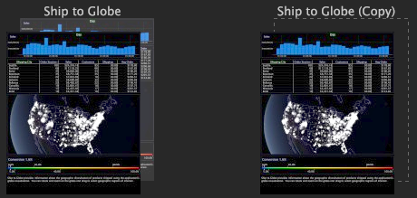

# ワークスペースの作成{#create-a-workspace}

既存のビジュアライゼーションを追加または変更して既存のワークスペースをカスタマイズしたり、新しいワークスペースを作成したりできます。

これらのワークスペースは、保存して再利用できます。「 [ワークスペースの作成](../../../home/c-get-started/c-work-worksp/c-create-worksp.md#concept-d8bc99d7739e4eaeab2a02b022394a31).

空白のワークスペースを作成したり、既存のワークスペースをコピーして貼り付けたり、ワークスペースを別の場所に保存したり、別の名前を使用することで、新しいワークスペースを作成できます。

この節では、以下の作業について説明します。

* [新しいワークスペースの作成](../../../home/c-get-started/c-work-worksp/c-create-worksp.md#section-4236ae30e2884ea08f0885bf329f0778)
* [既存のワークスペースのコピーと貼り付け](../../../home/c-get-started/c-work-worksp/c-create-worksp.md#section-f91ae89b845640c9a4a52820a6110e65)
* [ワークスペース名の変更](../../../home/c-get-started/c-work-worksp/c-create-worksp.md#section-ca7edb913e4e4630a856f45a2536ffad)

## 新しいワークスペースの作成  {#section-4236ae30e2884ea08f0885bf329f0778}

目的の[!DNL Worktop]タブで、タブ内の空白の領域を右クリックし、次のいずれかのオプションをクリックします。

* **[!UICONTROL New]** > **[!UICONTROL Blank Workspace]**。標準サイズの空白のワークスペースが表示されます。

* **[!UICONTROL New]** > **[!UICONTROL Report Template]**。レポートの作成に使用できる、標準サイズのテンプレートが表示されます。

新しいタイプのワークスペースのサムネールがタブに表示されます。

>[!NOTE]
>
>新しいワークスペースを開いた後に、**追加**／**一時的にロック解除**&#x200B;をクリックする必要がある場合があります。

## 既存のワークスペースのコピーと貼り付け {#section-f91ae89b845640c9a4a52820a6110e65}

既存のワークスペースをコピーして他のワークスペースに貼り付けられます。同じ名前のサーバーバージョンのワークスペースを含むタブにワークスペースを貼り付ける場合、ワークスペースはそのワークスペースのローカルバージョンとして貼り付けられます。同じ名前のサーバーバージョンとローカルバージョンのワークスペースを含むタブにワークスペースを貼り付ける場合、ワークスペースはそのワークスペースのユーザーバージョンとして、後ろに（コピー）と付いた同じ名前で貼り付けられます。同じ名前のワークスペースを含まないタブにワークスペースを貼り付ける場合、ワークスペースは新しいユーザーワークスペースとして貼り付けられます。

**既存のワークスペースをコピーして貼り付けるには**

1. 目的の[!DNL Worktop]タブで、コピーするワークスペースを右クリックし、「**[!UICONTROL Copy]**」をクリックします。

   

1. ワークスペースを貼り付けるタブに移動し、タブ内の空白の領域を右クリックして、**[!UICONTROL Paste]**&#x200B;をクリックします。

   次の例は、サーバーバージョンを含むワークスペースタブに貼り付けられたワークスペースです。

   

次の例は、既にサーバーバージョンとローカルバージョンを含むワークスペースタブに貼り付けられたワークスペースです。ワークスペースは、そのワークスペースのユーザーバージョンとして、後ろに（コピー）と付いた同じ名前で貼り付けられます。

## ワークスペース名の変更  {#section-ca7edb913e4e4630a856f45a2536ffad}

**ワークスペース名を変更するには**

1. 目的の[!DNL Worktop]タブで、表示するワークスペースのサムネールをクリックします。
1. 次の例に示すように、ワークスペース内で、タイトルバーのタイトルテキストをクリックし、新しいタイトルを入力します。

   

## ワークスペースの削除  {#section-fb04cc195e1a4a5491ff634f5f3ca972}

**ワークスペース名を変更するには**
