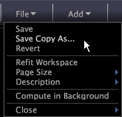

#  ワークスペースファイルメニュー{#workspace-file-menu}

{{eol}}

ワークスペースファイルメニューで利用できるメニューオプションに関する情報です。

ワークスペースで、 **[!UICONTROL File]**.

次の表で、各メニュー項目について説明します。

**保存**

ワークスペースを保存します。詳しくは、「 [ワークスペースの保存](../../../home/c-get-started/c-work-worksp/c-save-wksp.md#concept-e0c34e75cc194e57bd02d1f02316a606).

**名前を付けてコピーを保存**

ワークスペースを別の名前で、または別の場所に保存します。詳しくは、「 [ワークスペースの保存](../../../home/c-get-started/c-work-worksp/c-save-wksp.md#concept-e0c34e75cc194e57bd02d1f02316a606).

**元に戻す**

現在のワークスペースを最後に保存したバージョンに戻します。

**ワークスペースを再適合**

使用している表示解像度にビジュアライゼーションのサイズを変更します。この機能は、ディスプレイをプレゼンテーションに合わせてすばやく調整するのに役立ちます。

**ページサイズ**

ワークスペースの作業ページサイズを設定します。「画面にフィット」、「標準」またはコンピューター画面、印刷ページおよびレポート用の特定のサイズを選択できます。「画面にフィット」を選択すると、ご使用の特定の画面にフィットします。「標準」は、お客様の会社の標準的な画面サイズに合わせることのできる設定です。デフォルトの「標準」設定では、1024 x 768 の解像度を使用する画面にフィットします。

コピーするワークスペース、名前を付けて保存 [!DNL .png] ファイルや印刷物も、このページサイズを出力に使用します。 Data Workbenchのビジュアライゼーションより大きいページサイズではスクロールバーを使用しますが、小さいサイズでは画面の中央に配置され、ワークスペースの周囲に明るいグレーの境界線が表示されます。

**説明**

ワークスペースのテキストの説明を作成したり編集したりできます。このテキストは、 [!DNL Worktop] サムネールの下に 詳しくは、 [ワークスペースへの説明の追加](../../../home/c-get-started/c-work-worksp/t-add-wksp-desc.md#task-163734487e8848dfa0a4d8da6323a963).

**バックグラウンドで計算**

（オンラインで作業している場合のみ表示されます）ユーザーが作業を続行している間、選択したワークスペースのクエリーがバックグラウンドで引き続き実行されます。選択すると、サムネールにクエリーの進行状況を示す次の情報が表示されます。

* 作業中 : *n%* - クエリーが処理中であることと、完了した処理の割合を示します。
* *n* MB クエリーの読み込み - クエリー結果の合計サイズ。クエリ読み込みは、メモリサーバーの総Data Workbench読み込み量に比例しますが、直接の相関はありません。 ガイドラインとして、10 MB 以上のクエリーの読み込みは、システムに過大な負担をかける場合があります。表示されるクエリーの読み込みでは、クラスタリングが考慮されていません。

>[!NOTE]
>
>「バックグラウンドで計算」を選択したままにすると、選択したワークスペースのクエリーは常設クエリーになり、更新が続き、メモリ読み込みを使用します。 ワークスペースでの作業を終了するときに、必ず「バックグラウンドで計算」の選択を解除してください。

**閉じる**

ワークスペースを閉じます。クリック **[!UICONTROL Close]** > **[!UICONTROL Save]** ワークスペースで行った変更を保存するには、以下をクリックします。 **[!UICONTROL Close]** > **[!UICONTROL Don’t Save]** に戻る [!DNL Worktop] ワークスペースで行った変更を保存せずに

また、変更を保存し、ワークスペースを閉じて、 [!DNL Worktop] 次のいずれかの方法を使用します。

* Data Workbenchの左上隅にあるワークスペースロゴをクリックします。
* マウスにナビゲーションボタンがある場合、マウスの「戻る」ボタンをクリックします。

また、キーを押して保存せずにワークスペースを閉じることで、変更を無効にすることもできます **Ctrl + Backspace**.

**テンプレートからエクスポート**

Microsoft Excel がData Workbench機能にインストールされている場合、は自動的にMicrosoft Excel を起動し、特定のビジュアライゼーション、特定の凡例およびテキスト注釈からテンプレート Excel ファイルにデータをエクスポートします ( [!DNL .xls]または [!DNL .xlsx]) をクリックします。 詳しくは、「[テンプレート Excel ファイルにエクスポートする](../../../home/c-get-started/c-work-worksp/c-ex-wksp.md#section-814772929ca64cf6b92b89d3fdd02302)」を参照してください。
