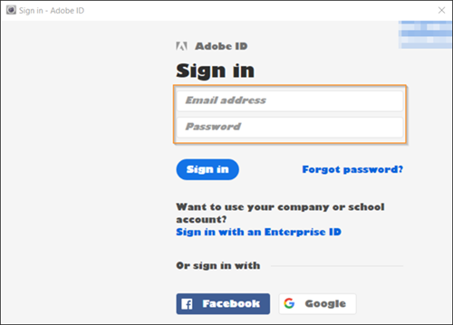

# Data Workbench の起動{#opening-data-workbench}

{{eol}}

Data Workbenchがインストールされ、サーバーに接続されたら、それを使用して処理済みのデータを分析できます。

1. インストールディレクトリData Workbenchに移動します。
1. ダブルクリック [!DNL insight.exe] をクリックして、アプリケーションを起動します。
1. 「**[!UICONTROL Login]**」をクリックします。

   

1. 資格情報を入力します。

   

   を初めて起動すると、 [!DNL Start] ページに移動し、プロファイルデータとデータキャッシュのダウンロードを開始します。

1. データキャッシュの充填が開始されたら、 **[!UICONTROL Start]**.

   システムに「 [!DNL Worktop].

   

   次回Data Workbenchを開始すると、 [!DNL Start] ページと [!DNL Worktop]（新しいプロファイルがサーバーに追加されている場合を除く）

   オンラインで作業していて、ネットワークサーバーにネットワーク接続されている場合にのみ、プロファイルとそのデータの更新がData Workbenchされます。 オンラインでの作業について詳しくは、 [オフラインおよびオンラインでの作業](../../home/c-get-started/c-off-on.md#concept-cef8758ede044b18b3558376c5eb9f54).

   >[!NOTE]
   >
   >複数のユーザーが 1 台のマシンを共有してワークステーションを使用することは推奨されません。
