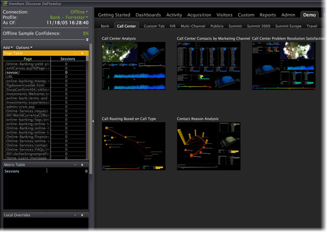

# Data Workbench の起動{#opening-data-workbench}

Data Workbenchをインストールし、サーバーに接続したら、それを使用して処理済みデータを分析できます。

1. Data Workbenchのインストールディレクトリに移動します。
1. [!DNL insight.exe]を重複クリックして開始します。
1. 「**[!UICONTROL Login]**」をクリックします。

   

1. 資格情報を入力します。

   

   初めて開始すると、[!DNL Start]ページが表示され、プロファイルデータとデータキャッシュのダウンロードが開始されます。

1. データキャッシュの記入が開始されたら、「**[!UICONTROL Start]**」をクリックします。

   [!DNL Worktop]が表示されます。

   

   次回開始Data Workbenchを行う際、新しいプロファイルがサーバーに追加されていない限り、[!DNL Start]ページはスキップされ、[!DNL Worktop]が表示されます。

   プロファイルとそのデータに対する更新は、オンラインで作業していて、Data Workbenchサーバーにネットワーク接続している場合にのみダウンロードされます。 オンラインでの作業について詳しくは、[オフラインでの作業とオンラインでの作業](../../home/c-get-started/c-off-on.md#concept-cef8758ede044b18b3558376c5eb9f54)を参照してください。

   >[!NOTE]
   >
   >複数のユーザーがワークステーションを使用するために1台のマシンを共有することはお勧めしません。
