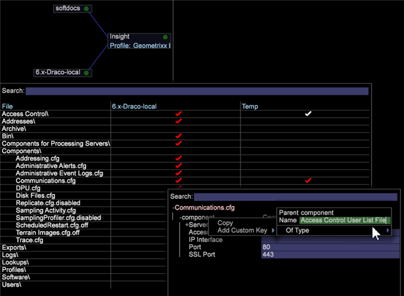

# グループメンバーアクセスのユーザー管理{#user-administration-of-group-member-access}

管理者は、カスタムグループのアクセス制御の管理を部分的にワークステーションユーザーに任せることができます。

**グループメンバーアクセスの自己管理**&#x200B;は、カスタムグループ内のメンバーを追加および削除する権限を管理者以外のユーザーに付与するものです。管理者は、**User List** ファイルを作成し、新しいグループメンバー用の [Access Control.cfg](https://docs.adobe.com/content/help/en/data-workbench/using/server-admin-install/admin-dwb-server/access-control/c-config-acs-ctrl.html) ファイル内でグループアクセスを設定します。

**サーバーマネージャーのアクセス**

Setting up the **[!DNL User List]** file and synching it with the **[!DNL Communications.cfg]** file is done in the **Servers Manager** workspace.

1. ワークトップで、「**管理者**」タブ／「**データセットとプロファイル**」タブをクリックします。

1. **サーバーマネージャー**&#x200B;ワークスペースを開きます。
1. ダイヤグラム内の &lt;*your server name*> を右クリックし、「**ファイル**」を選択します。

   The server files will open in a table with columns *File*, *`<server name>`*, and *Temp*.

1. **サーバー** ・ファイルのサーバー列を右クリックして、「ローカル化」を選択します(この機能との場 **[!DNL Access Control]** 合は **[!DNL Components/Communications.cfg)]**、

   **Temp** 列に白いチェックマークが表示されます。Temp フォルダー内で編集を行うことができます。次に、チェックマークを右クリックして、「**サーバーに保存**」を選択します（サーバーと同期が行われると、チェックマークが赤に変わります）。

## User List.cfg ファイルの作成 {#section-c25bcaf34f4546e6b8b65f5e7f69ac09}

The administrator needs to create a **[!DNL User List.cfg]** file in the **[!DNL Access Control]** folder.

1. Right-click** Access Control** row in the **Temp** column and select **Open** > **Folder**. 

   **Temp** フォルダー内の Access Control フォルダーが開き、**[!DNL Access Control.cfg]** ファイルだけが表示されます。

1. Add another text file to this folder and name it **[!DNL User List.cfg]** (next to the **[!DNL Access Control.cfg]**).

1. Add the following parameters to the **[!DNL User List.cfg]** file.

User List ファイルには **AccessGroup** オブジェクトのベクターを含める必要があり、各 **AccessGroup** オブジェクトには名前と **Members** という文字列ベクターが必要です。

```
Access Control Groups = vector: 1 items 
  0 = AccessGroup:  
    Name = string: Group 1 
    Members = vector: 1 items 
      0 = string: CN:Joe User
```

You can then edit and add users this in the Workstation view of the **[!DNL User List.cfg]**file.


Here&#39;s the most basic parameters to add to the **[!DNL User List.cfg]** file. これでワークステーションビューに Members を追加できます。

```
Access Control Groups = vector: 1 items 
  0 = AccessGroup:  
    Name = string:  
    Members = vector: 0 items
```

>[!IMPORTANT]
>
>As with any **[!DNL .cfg]** file that you manually edit, make sure to use spaces instead of tabs and to pay close attention to the whitespace and syntax. このファイルに誤りがあると、*Adobe Insight Server* は User List ファイルを無視します。

各 **Access Group** の **Name** フィールドは、[!DNL Access Control.cfg] ファイル内で参照されます。

>[!NOTE]
>
>Only valid members with directory service prefixes, such as **CN:** or **OU:** are accepted, and these cannot contain wildcard character (*).

## Communications.cfg ファイルの設定 {#section-9d6f05ba81c14f15be63e361533459e8}

An administrator first enables this feature by opening the **[!DNL Components]>[!DNL Communications.cfg]**file and adding a new key with the name **[!DNL Access Control User List File]**. このキーの文字列値は、この新しいファイルが配置されるパスです。

1. サーバーファイルから「**Components**」をクリックし、サーバー列のチェックマークを右クリックします。「**ローカル化**」をクリックします。

   **Temp** 列に白いチェックマークが表示されます。

1. **Temp** 列のチェックマークを右クリックし、**開く**／**ワークステーションで**&#x200B;を選択します。

1. **Communication.cfg** ファイル内で **component** を右クリックし、「**カスタムキーを追加**」を選択します。 

1. 「**名前**」に「*Access Control User List File*」と入力し、「**タイプ**」に *String* を設定します。

   >[!NOTE]
   新しいリストファイルをパスとして作成することはできません。 これを修正するには、ファイルを保存し、エディター（メモ帳）で開いて、「String」を「Path」に変更します。

   変更前：

   ```
   component = CommServer:  
     Access Control File = Path: Access Control\\Access Control.cfg 
     Access Control User List File =  
    <string>: Access Control\\User List.cfg
   ```

   変更後：

   ```
   component = CommServer:  
     Access Control File = Path: Access Control\\Access Control.cfg 
     Access Control User List File =  
    <Path>: Access Control\\User List.cfg
   ```

1. **[!DNL Communications.cfg]** ファイルを保存し、（必要に応じて）サーバーに保存します。これによってサーバー内のコンポーネントが再起動するので、**[!DNL Communications.cfg]** ファイルの解析を妨げる可能性があるミスをしないようにしてください。
1. If your system includes processing servers, modify the configuration file in the **[!DNL Components for Processing Servers.cfg]** file.
1. Right-click **[!DNL Communications.cfg]** and save to server.

Data Workbench 管理者は、目的のユーザーに User List ファイルへのアクセス権があり、そのユーザーがグループを管理できることを確認できるようになりました。ユーザーは、User List ファイルを開き、編集し、必要に応じて CN または OU メンバーを追加および削除できます。

## Access Control.cfg ファイルの同期 {#section-ca6da453dfb4432bb40b86ef15ede872}

次に、管理者は、**[!DNL Access Control.cfg]** を編集して、User List ** ファイルで定義されているグループへの参照を挿入することができます。

グループへの参照は、その他のメンバーと同様に挿入しますが、以下の構文に従う必要があります。

```
$(Group Name)
```

「Group Name」は、User List ファイルで定義されているもの（空白を含む）と一致しています。 

この時点で、Data Workbench 管理者は、選択されたグループユーザーに User List ファイルへのアクセス権があることを確認できます。選択されたユーザーは、**[!DNL User List.cfg]** ファイルを開き、編集し、必要に応じて CN または OU メンバーを追加および削除できます。
