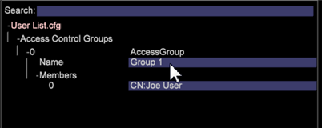

# グループメンバーアクセスのユーザー管理{#user-administration-of-group-member-access}

{{eol}}

管理者は、カスタムグループのアクセス制御の管理を部分的にワークステーションユーザーに任せることができます。

**グループメンバーアクセスの自己管理**&#x200B;は、カスタムグループ内のメンバーを追加および削除する権限を管理者以外のユーザーに付与するものです。管理者は、**User List** ファイルを作成し、新しいグループメンバー用の [Access Control.cfg](https://experienceleague.adobe.com/docs/data-workbench/using/server-admin-install/admin-dwb-server/access-control/c-config-acs-ctrl.html) ファイル内でグループアクセスを設定します。

**サーバーマネージャーのアクセス**

設定 **[!DNL User List]** ファイルを作成し、 **[!DNL Communications.cfg]** ファイルが **サーバーマネージャー** ワークスペース。

1. ワークトップで、「**管理者**」タブ／「**データセットとプロファイル**」タブをクリックします。

1. **サーバーマネージャー**&#x200B;ワークスペースを開きます。
1. ダイヤグラム内の &lt;*your server name*> を右クリックし、「**ファイル**」を選択します。

   サーバーファイルは、列を含むテーブルで開きます *ファイル*, *`<server name>`*、および *Temp*.

1. **ローカル化** （この機能の）サーバーファイルのサーバー列を右クリックする **[!DNL Access Control]** および **[!DNL Components/Communications.cfg)]**.

   **Temp** 列に白いチェックマークが表示されます。Temp フォルダー内で編集を行うことができます。次に、チェックマークを右クリックして、「**サーバーに保存**」を選択します（サーバーと同期が行われると、チェックマークが赤に変わります）。

## User List.cfg ファイルの作成 {#section-c25bcaf34f4546e6b8b65f5e7f69ac09}

管理者は、 **[!DNL User List.cfg]** ファイルを **[!DNL Access Control]** フォルダー。

1. [**アクセス制御**] 行を右クリックします。 **Temp** 列と選択 **開く** > **フォルダー**. 

   **Temp** フォルダー内の Access Control フォルダーが開き、**[!DNL Access Control.cfg]** ファイルだけが表示されます。

1. このフォルダに別のテキストファイルを追加し、名前を付けます **[!DNL User List.cfg]** ( **[!DNL Access Control.cfg]**) をクリックします。

1. 次のパラメーターを **[!DNL User List.cfg]** ファイル。

User List ファイルには **AccessGroup** オブジェクトのベクターを含める必要があり、各 **AccessGroup** オブジェクトには名前と **Members** という文字列ベクターが必要です。

```
Access Control Groups = vector: 1 items 
  0 = AccessGroup:  
    Name = string: Group 1 
    Members = vector: 1 items 
      0 = string: CN:Joe User
```

その後、ワークステーションビューの**[!DNL User List.cfg]**ファイル。



以下に、 **[!DNL User List.cfg]** ファイル。 これでワークステーションビューに Members を追加できます。

```
Access Control Groups = vector: 1 items 
  0 = AccessGroup:  
    Name = string:  
    Members = vector: 0 items
```

>[!IMPORTANT]
>
>任意の **[!DNL .cfg]** ファイルを手動で編集する場合は、必ずタブの代わりにスペースを使用し、空白や構文に十分注意してください。 このファイルに誤りがあると、*Adobe Insight Server* は User List ファイルを無視します。

各 **Access Group** の **Name** フィールドは、[!DNL Access Control.cfg] ファイル内で参照されます。

>[!NOTE]
>
>ディレクトリサービスのプレフィックスを持つ有効なメンバー（例： ）のみ **CN:** または **OU:** を受け入れ、ワイルドカード文字 (&#42;) をクリックします。

## Communications.cfg ファイルの設定 {#section-9d6f05ba81c14f15be63e361533459e8}

管理者はまず、 **[!DNL Components]>[!DNL Communications.cfg]** ファイルを作成し、名前を持つ新しいキーを追加する **[!DNL Access Control User List File]**. このキーの文字列値は、この新しいファイルが配置されるパスです。

1. サーバーファイルから「**Components**」をクリックし、サーバー列のチェックマークを右クリックします。「**ローカル化**」をクリックします。

   **Temp** 列に白いチェックマークが表示されます。

1. **Temp** 列のチェックマークを右クリックし、**開く**／**ワークステーションで**&#x200B;を選択します。

1. **Communication.cfg** ファイル内で **component** を右クリックし、「**カスタムキーを追加**」を選択します。 

1. 「**名前**」に「*Access Control User List File*」と入力し、「**タイプ**」に *String* を設定します。

   >[!NOTE]
   >
   >新しいリストファイルをパスとして作成することはできません。 これを修正するには、ファイルを保存し、エディター（メモ帳）で開いて、「String」を「Path」に変更します。

   変更前：

   ```
   component = CommServer:  
     Access Control File = Path: Access Control\\Access Control.cfg 
     Access Control User List File =  
    <string>: Access Control\\User List.cfg
   ```

   変更後：

   ```
   component = CommServer:  
     Access Control File = Path: Access Control\\Access Control.cfg 
     Access Control User List File =  
    <Path>: Access Control\\User List.cfg
   ```

1. **[!DNL Communications.cfg]** ファイルを保存し、（必要に応じて）サーバーに保存します。これによってサーバー内のコンポーネントが再起動するので、**[!DNL Communications.cfg]** ファイルの解析を妨げる可能性があるミスをしないようにしてください。
1. システムに処理サーバーが含まれている場合は、 **[!DNL Components for Processing Servers.cfg]** ファイル。
1. 右クリック **[!DNL Communications.cfg]** サーバに保存します。

Data Workbench 管理者は、目的のユーザーに User List ファイルへのアクセス権があり、そのユーザーがグループを管理できることを確認できるようになりました。ユーザーは、User List ファイルを開き、編集し、必要に応じて CN または OU メンバーを追加および削除できます。

## Access Control.cfg ファイルの同期 {#section-ca6da453dfb4432bb40b86ef15ede872}

次に、管理者は、**[!DNL Access Control.cfg]** を編集して、User List ** ファイルで定義されているグループへの参照を挿入することができます。

グループへの参照は、その他のメンバーと同様に挿入しますが、以下の構文に従う必要があります。

```
$(Group Name)
```

「Group Name」は、User List ファイルで定義されているもの（空白を含む）と一致しています。 

この時点で、Data Workbench 管理者は、選択されたグループユーザーに User List ファイルへのアクセス権があることを確認できます。選択されたユーザーは、**[!DNL User List.cfg]** ファイルを開き、編集し、必要に応じて CN または OU メンバーを追加および削除できます。
