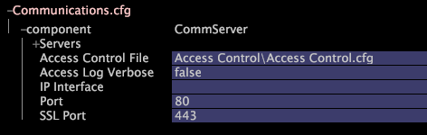

# 通信の設定{#configuring-communications}

Communications設定ファイルCommunications.cfgには、Insight Serverのネットワーク設定と、アクセス制御.cfgファイルへのパスが含まれています。

これらの設定は、に接続する際に役立ち [!DNL Insight Server]ます。

**推奨頻度：** 必要な場合のみ

**通信設定を表示および変更するには[!DNL Insight]**

1. の「>」 [!DNL Insight]タブで [!DNL Admin] 、 [!DNL Dataset and Profile]**[!UICONTROL Servers Manager]** サムネールをクリックしてサーバーマネージャーワークスペースを開きます。
1. 設定するアイコンを右クリック [!DNL Insight Server] し、をクリックし **[!UICONTROL Server Files]**&#x200B;ます。
1. In the [!DNL Server Files Manager], click **[!UICONTROL Components]** to view its contents. [!DNL Communications.cfg] ファイルは、このディレクトリ内に格納されています。
1. Right-click the check mark in the *server name* column for [!DNL Communications.cfg] and click **[!UICONTROL Make Local]**. A check mark appears in the [!DNL Temp] column for [!DNL Communications.cfg].
1. Right-click the newly created check mark in the [!DNL Temp] column and click **[!UICONTROL Open]** > **[!UICONTROL in Insight]**.
1. In the [!DNL Communications.cfg] window, click **[!UICONTROL component]** to view its contents.
1. 必要に応じて設定を変更します。 このファイルで使用できるパラメーターの詳細については、「 [通信設定](../../../home/c-inst-svr/c-cfg-stgs-ref/c-comm-cfg-stgs.md#concept-aed00587c7a1432fb487bd154aaea6b1)」を参照してください。

   

1. 次の操作を行って、変更をサーバーに保存します。

   1. ウィンドウ上部 **[!UICONTROL (modified)]** を右クリックし、をクリックし **[!UICONTROL Save]**&#x200B;ます。

   1. で、列内 [!DNL Server Files Manager]のファイルのチェックマークを右クリックし、 [!DNL Temp] / **[!UICONTROL Save to]** &lt; *>を選択します&#x200B;**[!UICONTROL server name]***。

