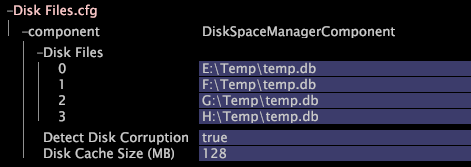

# クラスタリング用のMaster Insightサーバーの設定{#configuring-the-master-insight-server-for-clustering}

Master Insightサーバー上のクラスターの設定、クラスターのアクセス制御ファイルの更新などに関する情報です。

クラスターを設定するには、マスターで次の手順を実行しま [!DNL Insight Server]す。

* 処理の共通名と [!DNL Insight Servers’] アドレスをアドレスファイルに追加します。
* すべてをファイル内 [!DNL Insight Servers] のCluster Serversグループに追加し [!DNL Access Control.cfg] ます。

* Components for Processing Serversデ [!DNL Synchronize.cfg] ィレクトリ内のファイルを更新して、マスターを指定しま [!DNL Insight Server]す。

* 必要に応じて、Components for Processing Servers [!DNL Disk Files.cfg] ディレクトリ内のファイルを変更し、処理上のファイルの場 [!DNL temp.db] 所を指定しま [!DNL Insight Servers]す。

これらの手順を実行するには、(個人のデジタル証明書で指定された [!DNL Insight Server])共通名と、クラスター内の各IPアドレスを把握する必 [!DNL Insight Server] 要があります。 この情報がまだない場合は、先に進む前に取得します。

>[!NOTE]
>
>この節で説明する手順は、必須で [!DNL Insight]す。 をインストールしていな [!DNL Insight]い場合は、作業を進める前に、『ユーザガ **[!DNL Insight]イド&#x200B;**』の手順に従います。

## 処理インサイトサーバーのアドレスファイルへの追加 {#section-2fe5298180164e8dbaa59ea6b6ff682d}

処理の共通名とIPアドレスをマスタ [!DNL Insight Servers’] ー上のアドレスファイルに追加するには、次の手順を実行しま [!DNL Insight Server]す。 (アドレスファイルはマスター上で維持および管理されますが、 [!DNL Insight Server]クラスター内のすべてのユーザーに [!DNL Insight Servers] よって使用されます)。

>[!NOTE]
>
>次の例では、アドレスファイルが既にマスター用に設定されていることを前提としていま [!DNL Insight Server]す。 マスター [!DNL Insight Server’s] IPアドレスをアドレスファイルにまだ追加していない場合は、開始する前に、「サーバーのネットワークの場所の定義  」の手順を実行します。

**アドレスファイルに処理[!DNL Insight Servers]を追加するには**

1. タイト [!DNL Insight] ルバーを右クリックし、/をクリックして、設定プロファイルを起動し、読み込み **[!UICONTROL Switch Profile]** ます（まだ開いていない場合） **[!UICONTROL Configuration]**。

1. の「/」 [!DNL Insight]タブで、サ [!DNL Admin] ムネールを [!DNL Dataset and Profile] クリックして、サーバ **[!UICONTROL Servers Manager]** ーマネージャーワークスペースを開きます。

1. マスターのアイコンを右クリックし、をク **[!UICONTROL Insight Server]** リックしま **[!UICONTROL Server Files]**&#x200B;す。

1. で、Addressesデ [!DNL Server Files Manager]ィレクトリを開き、次の手順を実行してアドレスファイル [!DNL Insight Server’s] を開きます。

   1. サーバー名列のチェックマークを右ク *リックし* 、をクリックしま **[!UICONTROL Make Local]**&#x200B;す。

   1. 列のチェックマークを右クリックし、/ [!DNL Temp] をクリッ **[!UICONTROL Open]** クしま **[!UICONTROL in Insight]**&#x200B;す。

1. 構造の内容を展開 [!DNL Locations] し、NetworkLocation 0、Addresses、およびAddressDefinitionを展開します。
1. 次の手順を実行して、クラスター内の各処理のNetworkLocation 0にAddressDefinitionを [!DNL Insight Server] 追加します。

   1. 右クリックし、/ **[!UICONTROL AddressDefinition]** をクリ **[!UICONTROL Add New]** ックしま **[!UICONTROL Address Definition]**&#x200B;す。

   1. Nameパラメーターで、処理の共通名を [!DNL Insight Server’s] 指定します。
   1. Addressパラメーターで、処理IPアドレスを [!DNL Insight Server’s] 指定します。

      「アドレス」フィールドでは、10.10.116のように、アスタリスクをワイルドカードとして使用できます。*を使用して、クラスタリングを単純化します。 Understanding [Access Levelsを参照してください](../../../../../../home/c-inst-svr/c-admin-inst-svr/c-config-acs-ctrl/c-undst-acc-lvls.md#concept-6b292edf79214750a8d0525097b8795a)。

      次の例では、2つを含むクラスターを定義しま [!DNL Insight Servers]す。

      

1. サーバが複数のネットワークに接続されている場合は、手順6を繰り返して、それらのネットワークのNetworkLocations [!DNL Insight Servers] に処理を追加します。

   次の例は、2つのネットワーク(「企業イントラネ [!DNL Insight Servers] ット」と「インターネット」)に接続された4つのクラスタを示しています。

   

1. 次の手順を実行して、変更をサーバーに保存します。

   1. ウィンドウ上部 **[!UICONTROL (modified)]** のを右クリックし、をクリックしま **[!UICONTROL Save]**&#x200B;す。

   1. で、列 [!DNL Server Files Manager]内のファイルのチェックマークを右クリックし [!DNL Temp] て、/ **[!UICONTROL Save to]** &lt; ***[!UICONTROL server name]**>を選択します*。

## クラスタのアクセス制御ファイルの更新 {#section-fce1367d92a445168c35e9ca506e7d6b}

クラスター [!DNL Insight Servers] 内で使用するには、クラ [!DNL Insight Server] スター内の各（マスターを含む）が、Cluster Serversアクセ [!DNL Insight Server]ス制御グループに属している必要があります。 Cluster Serversグループは、クラスターへの参加を許可されるサーバーを（IPアドレスで）識別します。 このファイルはマスター上で管理および管理されますが、ク [!DNL Insight Server]ラスター内のすべてのユーザーによっ [!DNL Insight Servers] て使用されます。

**アクセス制御ファイルを編集するには**

1. の「/」 [!DNL Insight]タブで、サ [!DNL Admin] ムネールを [!DNL Dataset and Profile] クリックして、サーバ **[!UICONTROL Servers Manager]** ーマネージャーワークスペースを開きます。

1. マスターのアイコンを右クリックし、をク [!DNL Insight Server] リックしま **[!UICONTROL Server Files]**&#x200B;す。

1. で、Access Control [!DNL Server Files Manager]ディレクトリを開きます。
1. 次の手順を実行してファイルを開 [!DNL Access Control.cfg] きます。

   1. サーバー名列のチェックマークを右ク *リックし* 、をクリックしま **[!UICONTROL Make Local]**&#x200B;す。

   1. 列のチェックマークを右クリックし、/ [!DNL Temp] をクリッ **[!UICONTROL Open]** クしま **[!UICONTROL in Insight]**&#x200B;す。

1. Access Control Groups構造を展開し、AccessGroup (Cluster Servers)を展開します。
1. クラスター [!DNL Insight Server] 内の（マスターを含む）それぞれ [!DNL Insight Server]に対して、次の手順を実行します。

   1. 右クリックし、/ **[!UICONTROL Members]** をクリ **[!UICONTROL Add New]** ックしま **[!UICONTROL New Member]**&#x200B;す。

   1. IPアドレス( [!DNL Insight Server’s] 名前ではなく数値のIPアドレス)を指定します。 複数のネッ [!DNL Insight Servers] トワークに接続されている場合、このAccessGroupには、クラスタ内のサーバー間通信に使用する内 [!DNL Insight Servers] 部アドレスのみが含まれている必要があります。

      次に、4つのクラスタのAccessGroup（クラスタサーバ）を示しま [!DNL Insight Servers]す。

      

1. 次の手順を実行して、変更をサーバーに保存します。

   1. ウィンドウ上部 **[!UICONTROL (modified)]** のを右クリックし、をクリックしま **[!UICONTROL Save]**&#x200B;す。

   1. In the [!DNL Server Files Manager], right-click the check mark for the file in the [!DNL Temp] column and click **[!UICONTROL Save to]** > *&lt;**[!UICONTROL server name]**>*.

## 同期ファイルの設定 {#section-d23e751771c84da6bab6a34a8db867bc}

次の手順を使用して、ファイルの中央コピーを設定でき [!DNL Synchronize.cfg] ます。 このファイルの中央コピーはマスター上に保持されま [!DNL Insight Server]す。 クラスタ内 [!DNL Insight Servers] の処理は、このファイルの更新されたコピーを取 [!DNL Insight Server] 得するためにマスタとの通信を開始します。

マスタ [!DNL Synchronize.cfg] ーの場所を指定するファイルで [!DNL Insight Server]す。 また、クラスター内の各処理がマスターから取得する管理フ [!DNL Insight Servers] ァイルのセットも識別します [!DNL Insight Server]。 処理では、これらのフ [!DNL Insight Servers] ァイルを開始時にマスターから自動的にダ [!DNL Insight Server] ウンロードします。 また、ファイルが変更された場合に、これらのファイルの更新されたコピーをマス [!DNL Insight Server] ターから動的に取得します。

>[!NOTE]
>
>マスター上でファイル [!DNL Synchronize.cfg] を設定しても、マ [!DNL Insight Server]スター自体はこ [!DNL Insight Server] のファイルを使用しません。 このファイルは、処理でファイルを取得す [!DNL Insight Server] る際に適切に設定されるように、マスター上で更 [!DNL Insight Servers] 新する必要があります。

**マスター上のSynchronize.cfgファイルを更新するには[!DNL Insight Server]**

1. の「/」 [!DNL Insight]タブで、サ [!DNL Admin] ムネールを [!DNL Dataset and Profile] クリックして、サーバ **[!UICONTROL Servers Manager]** ーマネージャーワークスペースを開きます。

1. マスターのアイコンを右クリックし、をク [!DNL Insight Server] リックしま **[!UICONTROL Server Files]**&#x200B;す。

1. で、For [!DNL Server Files Manager]Processing Serversディレ **[!UICONTROL Components]** クトリを開きます。

1. 次の操作を行って開きま [!DNL Synchronize.cfg]す。

   1. サーバー名列のチェックマークを右ク *リックし* 、をクリックしま **[!UICONTROL Make Local]**&#x200B;す。

   1. チェックマークを右ク [!DNL Temp] リックし、/をク **[!UICONTROL Open]** リックしま **[!UICONTROL in Insight]**&#x200B;す。

1. コンポーネント構造を展開します。
1. Cluster Primary Server Addressパラメーターで、マスター（プライマリ）のIPアドレスを指定しま **[!UICONTROL Insight Server]**&#x200B;す。

   .png)

   マスターと処理の間で同期が発生するたびに記録するログを作 [!DNL Insight Server] 成するには、Enable Synchronization Logパラメー [!DNL Insight Servers]ターが「true」に設定されていることを確認します。

1. 次の手順を実行して、変更をサーバーに保存します。

   1. ウィンドウ上部 **[!UICONTROL (modified)]** のを右クリックし、をクリックしま **[!UICONTROL Save]**&#x200B;す。

   1. In [!DNL Server Files Manager], right-click the check mark for the file in the [!DNL Temp] column and click **[!UICONTROL Save to]** > *&lt;**[!UICONTROL server name]**>*.

## データセットの場所の設定(temp.db) {#section-5ec257a4b4c64fb58baec1f12119a822}

デフォルトの場所とは異なるディレクトリまたはドライブ内で処理（データセット）を維持する場合、または複数のドライブに分散する場合は、次の手順 [!DNL Insight Servers][!DNL temp.db][!DNL temp.db] を実行します。

>[!NOTE]
>
>処理はすべて同 [!DNL Insight Servers] じなので、こ [!DNL Disk Files.cfg]のファイルで指定するファイルの場所をすべてサポートする必要があります。 例えば、Eに次のよう [!DNL temp.db] に割り当てます。ドライブの場合、クラスタ [!DNL Insight Server] ー内のすべての処理にE:ドライブ。

**temp.dbの場所を設定するには**

1. の「/」 [!DNL Insight]タブで、サ [!DNL Admin] ムネールを [!DNL Dataset and Profile] クリックして、サーバ **[!UICONTROL Servers Manager]** ーマネージャーワークスペースを開きます。

1. マスターのアイコンを右クリックし、をク [!DNL Insight Server] リックしま **[!UICONTROL Server Files]**&#x200B;す。

1. で、ディレ [!DNL Server Files Manager]クトリを開 **[!UICONTROL Components for Processing Servers]** きます。

1. 次の操作を行って開きま [!DNL Disk Files.cfg]す。

   1. サーバー名列のチェックマークを右ク *リックし* 、をクリックしま **[!UICONTROL Make Local]**&#x200B;す。

   1. 列のチェックマークを右クリックし、/ [!DNL Temp]をクリッ **[!UICONTROL Open]** クしま **[!UICONTROL in Insight]**&#x200B;す。

1. DiskSpaceManagerComponent構造を展開し、[ディスクファイル]リストを展開します。
1. エントリ0を編集して、ファイルの場所を変更し [!DNL temp.db] ます。
1. 複数のドライブに分散する [!DNL temp.db] 場合は、次の手順を使用して、追加の各ドライブに対する追加のエントリを作成します。

   1. 右クリックし、/ **[!UICONTROL Disk Files]** をクリ **[!UICONTROL Add New]** ックしま **[!UICONTROL Disk File]**&#x200B;す。

   1. 新しいエントリで、書き込む場所を指定し [!DNL temp.db] ます。
   次の図は、4台のドラ [!DNL temp.db] イブに書き込まれています。

   

1. 次の手順を実行して、変更をサーバーに保存します。

   1. ウィンドウ上部 **[!UICONTROL (modified)]** のを右クリックし、をクリックしま **[!UICONTROL Save]**&#x200B;す。

   1. In [!DNL Server Files Manager], right-click the check mark for the file in the [!DNL Temp] column and click **[!UICONTROL Save to]** > *&lt;**[!UICONTROL server name]**>*.

