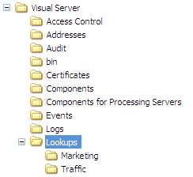

# プロファイルと参照ファイルのインストール{#installing-profiles-and-lookup-files}

Adobeが特定のアプリケーション用に開発したプロファイルとルックアップファイルは、データセットの分析を可能にする指標、ディメンション、ワークスペースを提供する内部プロファイルです。

Adobeが提供する他のすべての内部プロファイルと同様に、これらのプロファイルは変更しないでください。 すべてのカスタマイズは、お客様のデータセットまたはお客様が作成する役割に特有のプロファイルまたはその他のプロファイルで行う必要があります。

Adobeは、アプリケーションのプロファイルと参照ファイルを[!DNL .zip]ファイルとして配布します。 各zipファイルには、そのファイルに含まれるプロファイルファイルと参照ファイルを持つアプリケーションの名前が付けられます。 (例えば、[!DNL Site52.zip]にはSite v5.2のプロファイルファイルが含まれています)。 [!DNL .zip]ファイルには2つのフォルダー（[!DNL Lookups]と[!DNL Profiles]）が含まれています。

>[!NOTE]
>
>アプリケーションのプロファイルと参照ファイルが含まれているインストールファイルがまだない場合は、まずAdobeのFTPサイトからダウンロードしてください。

プロファイルとそのルックアップファイルは、データセットプロファイルを処理し実行する[!DNL Insight Server]マシンにインストールする必要があります。 [!DNL Insight Server]クラスターを実行している場合は、マスターサーバーにファイルをインストールする必要があります。 データセットのプロファイルについて詳しくは、『*データセット設定ガイド*』を参照してください。

**Adobeアプリケーション用のプロファイルをインストールするには**

1. Adobeから提供された[!DNL .zip]ファイルの[!DNL Profiles]フォルダーを開きます。

1. [!DNL .zip]ファイル内の[!DNL Profiles]フォルダー内のすべてのフォルダーを、[!DNL Insight Server]インストールディレクトリ内の[!DNL Profiles]フォルダーにコピーします。 次の例に示すように、[!DNL Insight Server]上の&#x200B; [!DNL ...\Profiles\]*&lt; [!DNL internal profile name]>*&#x200B;フォルダーで終わりたい。 実際のプロファイル名は異なる場合があります。

   

1. [!DNL Insight Server]をインストールしたディレクトリ内の&#x200B; [!DNL Profiles\]*&lt;[!DNL dataset profile name]>*&#x200B;フォルダーに移動し、このディレクトリ内の[!DNL profile.cfg]ファイルを探します。

   >[!NOTE]
   >
   >初めてプロファイルをインストールする場合は、付属のサンプルプロファイルをデータセットプロファイルとして使用できます。 [!DNL Insight Server]インストールディレクトリ内の[!DNL Profiles\Sample]プロファイルーには、Sampleフォルダーの[!DNL profile.cfg]ファイル（[!DNL profile.cfg.offline]のような名前が付けられている場合があります）があります。

1. メモ帳などのテキストエディターを使用して[!DNL profile.cfg]ファイルを開き、次の操作を行います。

   1. Directoriesベクトル内の追加内部プロファイルのエントリ。 プロファイル名は、[!DNL Insight Server]マシンの[!DNL Profiles]フォルダーにコピーしたディレクトリの名前に対応します。

   1. 必要に応じてディレクトリ数を更新します。
   1. 次追加に示すように、このファイルの「共通名」行に対するサーバーの共通名。

      ```
      Profile = profileInfo: 
      Directories = vector: n+1 items
        0 = string: Base\\
        1 = string: internal profile name 1\\
        2 = string: internal profile name 2\\
      . . .
        n = string: internal profile name n\\
      Processing Servers = vector: 1 items
        0 = ProfileServerInfo: 
          Common Name = string: serverCommonName
          Server = string: 
      ```

      >[!NOTE]
      >
      >[!DNL profile.cfg]ファイルの「共通名」に指定する&#x200B;*serverCommonName*&#x200B;は、データセットプロファイルを処理して実行する[!DNL Insight Server]マシンのサーバー共通名に対応しています。 データセットプロファイルが[!DNL Insight Server]クラスター上で実行されるように[!DNL profile.cfg]を更新する手順については、[Insight Server Clusters](../../../../home/c-inst-svr/c-install-ins-svr/c-ins-svr-clstrs/c-abt-ins-svr-clsters.md)を参照してください。

1. ファイルを保存します。別の名前が付けられている場合は、ファイルを[!DNL profile.cfg]として保存してください。

**Adobeアプリケーションの参照ファイルをインストールするには**

1. Adobeから提供された[!DNL .zip]ファイルの[!DNL Lookups]フォルダーを開きます。

1. [!DNL .zip]ファイル内の[!DNL Lookups]フォルダー内のすべてのフォルダーを、[!DNL Insight Server]インストールディレクトリ内の[!DNL Lookups]フォルダーにコピーします。 次の例に示すように、[!DNL Insight Server]上の&#x200B; [!DNL ...\Lookups\]*&lt; [!DNL internal profile name]>*&#x200B;フォルダーで終わりたい。 実際のプロファイル名は異なる場合があります。

   
