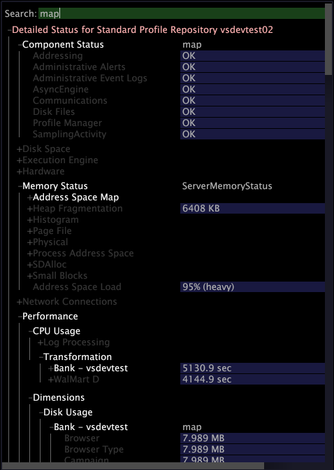

# Insight サーバーへの接続の設定{#configuring-the-connection-to-insight-server}

Insightソフトウェアと電子証明書をインストールしたら、Insightを起動して、Insightサーバーへの接続を設定する必要があります。

>[!NOTE]
>
>場合によっては、Insightサーバーへの接続が、Adobeコンサルティングサービスまたはシステム管理者によって事前に設定されている可能性があります。 その場合は、このタスクを実行する必要はありません。

Insightを初めて起動すると、デジタル証明書を登録するために、Adobeライセンスサーバーに自動的に接続されます。 登録プロセスを正常に完了するには、以下の手順を実行するときに、コンピューターがインターネットに接続できる必要があります。

>[!NOTE]
>
>「[デジタル証明書のダウンロードとインストール](../../../home/c-install-insight/install-setup/c-dgtl-crtf.md#topic-fed3b44e472c4e4ca6dd5852af14cdb9)」の説明に従って、事前ロック済み証明書を既に要求、ダウンロード、インストールしている場合、Insightはライセンスサーバーへの接続を試みず、エラーは表示されません。

**Insightサーバーへの接続を設定するには**

クラスター環境で作業する場合は、同期の問題を回避するために、マスターInsightサーバーにアクセスするようにInsightを設定する必要があります。 Insightでは、[サーバーマネージャー](https://experienceleague.adobe.com/docs/data-workbench/using/client/admin-ui/c-svrs-mgr.html)の[!DNL Related Servers]メニュー項目を使用して、クラスター内の処理[!DNL Insight Servers]に関する情報を表示できます。

1. Insightを起動します。
1. [!DNL Worktop]で、「**[!UICONTROL Admin]**」、「**[!UICONTROL First Steps]**」の順にクリックします。

1. **[!UICONTROL Configure Connection to Servers]**&#x200B;サムネールをクリックします。

   [!DNL Servers Manager]、[!DNL Insight.cfg]ファイル、および[!DNL Insight.cfg]ファイルを設定するための手順が表示されます。

1. [!DNL Insight.cfg]ウィンドウで&#x200B;**[!UICONTROL Servers]**&#x200B;を右クリックし、**[!UICONTROL Add new child]** / **[!UICONTROL Server]**&#x200B;をクリックします。

   

1. サーバーのパラメーターを入力または変更して、InsightにマスターInsightサーバーへのアクセスを提供します。 Insight.cfgファイル内のパラメーターについて詳しくは、[設定パラメーター](https://experienceleague.adobe.com/docs/data-workbench/using/client/c-insght-config-param.html)を参照してください。

   

1. 接続を設定するInsightサーバーごとに、手順4と手順5を繰り返します。
1. 設定の変更を保存するには、ウィンドウ上部の&#x200B;**[!UICONTROL Insight.cfg (modified)]**&#x200B;を右クリックし、「**[!UICONTROL Save as Insight.cfg]**」をクリックします。

   Insightは、指定した設定を使用して[!DNL Insight Server(s)]に接続を試みます。 接続が確立されると、次のページに示すように、 [!DNL Servers Manager]に緑のノードが表示されます。

   

   * **緑：** Insightサーバーへの接続がアクティブであることを示します。
   * **薄赤色：**&#x200B;サーバー処理のドレイン、メモリ使用量が高い、ディスク容量が少ないなど、サーバーの潜在的な問題を示しています。
   * **赤：** Insightサーバーへの接続がアクティブでないことを示します。

   指定した設定を使用して接続できない場合は、赤いノードが[!DNL Servers Manager]に表示されます。 この場合は、[接続のトラブルシューティング](../../../home/c-install-insight/install-setup/t-conn-trbsh.md#task-034e588c5ce04c4a8f6d0097364d3b2b)を参照してください。

<!--
c_dir_crt_setup.xml
-->

使用するプロファイルを選択すると、（関連するデータとプロファイルに定義されている特定のワークスペースまたはビジュアライゼーションを含む）プロファイル情報がコンピューターにダウンロードされます。各プロファイルをダウンロードすると、Insightにより、プロファイル名を使用してインストールディレクトリ内にフォルダーが作成されます。

例えば、Salesという名前のプロファイルを選択すると、Salesという名前のフォルダーがInsightディレクトリに表示されます。 このフォルダーには、Sales プロファイルで定義されている指標、ディメンション、ワークスペースおよびビジュアライゼーションが含まれています。プロファイルの初期読み込みの後で、オフラインで作業するときにプロファイルを使用できます。[オフラインおよびオンラインでの作業](https://experienceleague.adobe.com/docs/data-workbench/using/client/c-off-on.html)を参照してください。

また、InsightからInsightサーバーに初めて接続した場合、InsightサーバーはInsightインストールディレクトリに次のディレクトリを作成します。

* **[!DNL Trace]ディレクトリ：** ディレクト [!DNL Trace] リ内には、Insightログファイル(  [!DNL insight.log])が含まれます。[!DNL Insight.log]ファイルのサイズが100 MBに達すると、ファイル名が[!DNL insight-1.log]に変更されます。 [!DNL insight-1.log]という名前のファイルが既に存在する場合、[!DNL insight-1.log]は[!DNL insight-2.log]に名前が変更され、[!DNL insight-9.log]までになります。 [!DNL insight.log] ファイルには、常に最新のログ情報が含まれ、[!DNL insight-max.log] には最も古いログ情報が含まれます。

* **[!DNL User]ディレクトリ：** ディレクトリ内 [!DNL User] には、これまでに使用された各プロファイルに対応するフォルダーが含まれ、各プロファイルフォルダー内には、およびという名前のフォルダー [!DNL Work] が含まれま [!DNL Workspaces]す。`User\*profile name*\Workspaces`ディレクトリは、Insightワークスペースファイルが保存されるデフォルトの場所です。 `User\*profile name*\Work` は、Insightユーザーが実行したInsightのビジュアライゼーションおよびその他のカスタム作業を保存するデフォルトの場所です。

次の表は、よくアクセスされるコンポーネントのデフォルトの場所のリストを示しています。

<table id="table_0254A8C25AF5400F89F87A242746D07E"> 
 <thead> 
  <tr> 
   <th colname="col1" class="entry"> コンポーネント </th> 
   <th colname="col2" class="entry"> ディレクトリの場所 </th> 
  </tr>
 </thead>
 <tbody> 
  <tr> 
   <td colname="col1"> 
保存されたビジュアライゼーション 
 </td> 
   <td colname="col2"> 
<i>Insight</i>\User\<i>profile name</i>\Work\ 
 </td> 
  </tr> 
  <tr> 
   <td colname="col1"> 
保存されたワークスペース 
 </td> 
   <td colname="col2"> 
<i>Insight</i>\User\<i>profile name</i>\Workspaces\<i>tab name</i>\ 
 </td> 
  </tr> 
  <tr> 
   <td colname="col1"> 
保存された .png ファイル 
 </td> 
   <td colname="col2"> 
<i>Insight</i>\User\<i>profile name</i>\Work\ 
 </td> 
  </tr> 
  <tr> 
   <td colname="col1"> 
データキャッシュ 
 </td> 
   <td colname="col2"> 
<i>Insight</i>\User\Cache.db 
 </td> 
  </tr> 
  <tr> 
   <td colname="col1"> 
 Insight.log ファイル 
 </td> 
   <td colname="col2"> 
<i>Insight</i>\Trace\ 
 </td> 
  </tr> 
 </tbody> 
</table>

<!--
c_config_file_ent.xml
-->

キー名、キータイプまたは値で検索して、エントリをすばやく見つけることができるので、大きなファイル全体をスクロールしてネストされた情報を探す必要がありません。ディメンション名やサーバー名などを検索できます。次の例は、フレーズマップでの検索の一致を示しています。

このフィールドに検索語句を入力して、データを見つけます。一致が見つかったかどうかによって、フィールドの色が変化します。一致はハイライト表示され、不一致は暗く表示されます。一致がない場合は、検索フィールドの背景が赤くなります。Enter キーを押すと、設定ツリーの一致があるすべての箇所が展開され、一致がない箇所は折りたたまれます。

[!DNL Search]フィールドでも正規表現を使用できます。 例えば、次のように使用できます。[!DNL *zip.*] 」と入力します。

検索をクリアするには、**[!UICONTROL Escape]** キーを押します。
