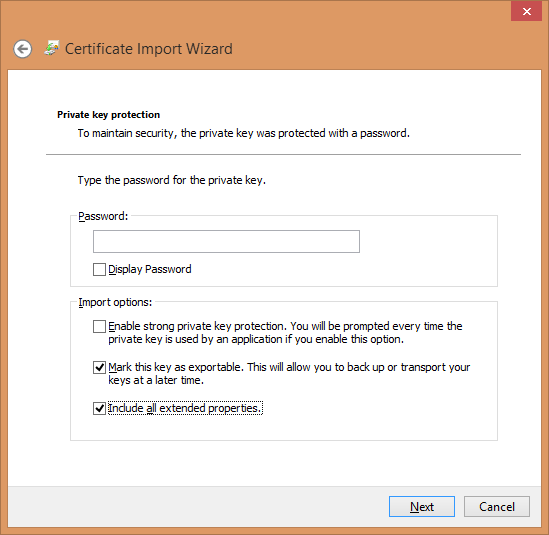

# デジタル証明書のダウンロードとインストール{#downloading-and-installing-the-digital-certificate}

Insightプログラムファイルをインストールしたら、アドビから提供されたデジタル証明書をダウンロードしてインストールする必要があります。

## デジタル証明書のダウンロードとインストール {#topic-fed3b44e472c4e4ca6dd5852af14cdb9}

Insightプログラムファイルをインストールしたら、アドビから提供されたデジタル証明書をダウンロードしてインストールする必要があります。

## デジタル証明書について {#concept-9eed01c8d95440cda6ce29d68e65098c}

アドビは、X.509 デジタル証明書を使用して実装されたクライアントおよびサーバーコンポーネントを識別し、認証します。

<!--
c_undst_dgtl_crtf.xml
-->

Insightをインストールする場合は、インストール済みのクライアントアプリケーションを使用するために、名前付きの個人（Jane Smithなど）を認証するデジタル証明書をインストールする必要があります。

>[!NOTE]
>
>Insightを別のコンピューターまたは別の名前付きユーザーに移行する必要がある場合は、アドビから新しい証明書を取得する必要があります。 その場合は、アドビカスタマーケアにお問い合わせください。

Insightは、このデジタル証明書を提示して、サーバーコンポーネントにアクセスできるようにします。 サーバーコンポーネントの管理者は、ユーザーの証明書に表示されるコモンネームまたは組織単位の値に基づいてサーバーリソースへのアクセスを制限できます。

また、アドビアプリケーションと一緒にインストールされる X.509 デジタル証明書は、クライアントおよびサーバーコンポーネントが Secure Sockets Layer（SSL）経由で情報を交換する場合にも使用されます。SSL では、公開鍵と秘密鍵の暗号化システムを使用して HTTP 経由の送信のセキュリティを確保します。アドビの SSL 実装は、1024 ビットの RSA キーをサポートし、128 ビットの RC4 暗号化アルゴリズムを使用します。

セキュリティに加えて、インストールしたデジタル証明書は、Insightを実行するためのライセンスキーとしても機能します。 正常に機能させるには、ノードロックされた最新のデジタル証明書が必要です。これがないと、アプリケーションは起動しません。

## ノードロックされた証明書 {#section-984aa8f2f5a1448cadc4afea978aedc9}

ノードロックされた証明書とは、インストール先のコンピューターに登録されているデジタル証明書です。ノードロックすることにより、証明書は特定のノード識別子（特定のコンピューターを一意に識別する値）に永続的に関連付けられます。証明書をノードロックするには、コンピューターからインターネット経由で Adobe License Server に、または License Server にアクセス可能なプロキシサーバーにアクセスできることが必要です。

インターネットにアクセスできないコンピューターにインストールする場合は、[インターネットにアクセスできないコンピューターでのデジタル証明書の使用](../../../home/c-install-insight/install-setup/c-dgtl-crtf.md#section-d3c060131d7f45cda27f68848b704fa1)に記載されているように、事前にロックされた特別な証明書を入手してインストールする必要があります。

インターネットにアクセスできるコンピューターにをインストールする場合、Insightを初めて起動すると、デジタル証明書が自動的にノードロックされます。 ノードロックされた後は、その証明書を他のコンピューターで使用することはできません。Insightを別のコンピューターに移行する必要がある場合は、アドビから新しいロック解除済みの証明書を取得する必要があります。

## 最新の証明書 {#section-0816b031df3e415ab3f0205b720c723e}

ノードロックされているだけでなく、デジタル証明書は最新であることも必要です。最新の状態に維持するには、証明書を定期的に再検証する必要があります（通常は 30 日ごとですが、アドビとの契約によって異なります）。コンピューターがインターネットにアクセスできる場合、再検証プロセスは完全に透過的です。必要に応じて、InsightはLicense Serverに自動的に接続し、証明書を再検証します。 コンピューターがインターネットにアクセスできない場合は、次のセクションで説明するように、更新済みの証明書を手動でインストールする必要があります。

## インターネットにアクセスできないコンピューターでのデジタル証明書の使用 {#section-d3c060131d7f45cda27f68848b704fa1}

インターネットにアクセスできないコンピューターにをインストールする場合は、Insightのインストール用に、事前にロックされた証明書を要求する必要があります。 事前にロックされた証明書とは、アドビがコンピューターのノード識別子に手動でロックしたデジタル証明書です。

事前にロックされた証明書をリクエストするには、ノード識別子と証明書番号をアドビのカスタマーケアに送信する必要があります。 To obtain the node identifier for your computer, contact Adobe Customer Care to request the Adobe [!DNL Node Identifier] utility. また、InsightがLicense Serverへの接続を試行し、接続できない場合に発行するアラートからノード識別子を取得することもできます。 When you receive the pre-locked certificate, install it as described in the last two steps of [Installing Digital Certificates](../../../home/c-install-insight/install-setup/c-dgtl-crtf.md#task-1dad1e1d86d04100a7bcf87f26303c38).

証明書を再検証する必要がある場合は、検証済みの新しい証明書を License Server からダウンロードし、コンピューターに再インストールする必要があります（アドビとの契約に特に指定のある場合を除く）。

## デジタル証明書のインストール {#task-1dad1e1d86d04100a7bcf87f26303c38}

<!--
t_install_dgtl_crtf.xml
-->

**デジタル証明書をダウンロードしてインストールするには**

1. Open your web browser to [!DNL http:\\license.visualsciences.com].

   >[!NOTE]
   >
   >この時点で、ブラウザーからデジタル証明書の提示を求められる場合があります。 If it does, click **[!UICONTROL Cancel]** to dismiss the dialog box.

1. On the login screen, enter the [!DNL Account Name] and the [!DNL Password] that you received from Adobe, then click **[!UICONTROL login]**.
1. Locate the certificate that has been issued for your instance of Insight ( *Your Name*.pem) and click the  icon associated with that certificate.
1. When prompted to save the certificate, click **[!UICONTROL Save]**.
1. Download the file to the [!DNL Certificates] folder in the directory where you installed Insight.

   This folder contains a certificate file named [!DNL trust_ca_cert.pem]. Insightが機能するには、両方の証明書ファイルが常に存在する必要があります。

## Windows証明書ストア {#concept-4acb13b7de9340ea8cde8ad84b93358d}

Windowsの証明書ストアでは、クライアントの証明書と秘密鍵をWindowsの証明書ストアに保存し、サーバーとのSSL通信を可能にします。

<!--
crypto-api.xml
-->

クライアント向けの Windows 証明書ストアは新しい機能で、SSL 通信証明書および秘密鍵を、`Insight/Certificates/<CertName>.pem` ファイルではなく、Windows 証明書ストアに格納できます。Windows 証明書ストアの使用は、他のアプリケーションに証明書ストアを使用する場合、および 1 か所で証明書管理を行いたい場合に適しています。また、Windows 証明書ストアが提供するその他の Windows 監査ログを使用したいユーザーに適しています。

>[!NOTE]
>
>Licensing with the license server is still maintained using the existing `<Common Name>.pem` file, and that the certificate obtained from the certificate store will only be used for communication to the servers that you specify.

## 前提条件 {#section-69b18600052145ff8e5299b7123e69c5}

1. [!DNL certmgr.msc] ファイルへのアクセス権を持っていて、証明書と鍵を **Personal** ストアにインポートできる必要があります。（これは、デフォルトではほとんどの Windows ユーザーに当てはまります。）

1. 設定を行うユーザーは、**OpenSSL** コマンドラインツールのコピーを持っている必要があります。
1. サーバーとクライアントは、既にカスタムSSL証明書を使用するように設定されている必要があります。この場合、 **Certificatesディレクトリに保存するのではなく、クライアント証明書をWindowsの証明書ストアに保存する手順を示します** 。

## Windows 証明書ストアの設定 {#section-3629802122e947d4b4f63e8b732cfe27}

クライアント向けの Windows 証明書ストアは、次の手順で有効になります。

**手順 1：ユーザーの SSL 証明書および秘密鍵を Windows 証明書ストアに読み込む。**

イン [Using Custom Certificates in Data Workbench](../../../home/c-install-insight/install-setup/c-dgtl-crtf.md#concept-ee6a9b5015f84a0ba64a11428b0a72dd) you are directed to put the SSL certificate and key in the following directory:

```
< 
<filepath>
  DWB Install folder 
</filepath>>\Certificates\
```

The certificate&#39;s name is `<Common Name>.pem` such as Analytics Server 1.pem (not the trust_ca_cert.pem file.)

証明書および秘密鍵が読み込めるようになる前に、.[!DNL pem] の形式を、など [!DNL .pfx] の形式に変更し [!DNL pkcs12.pfx] ます。

1. コマンドプロンプトまたはターミナルを開き、次のディレクトリに移動します。

   ```
   <CommonName>.pem c: cd \<filepath>DWB Install folder</filepath>>\Certificates
   ```

1. Run [!DNL openssl] with the following arguments (with the actual [!DNL .pem] file name):

   ```
   openssl pkcs12 -in "<Common Name>.pem" -export -out "<Common Name>.pfx"
   ```

   書き出しパスワードを求めるメッセージが表示されたら、**Enter** キーを押して入力をスキップします。

1. ファイル名を指定して実行、スタートメニューまたはコマンドラインから [!DNL certmgr.msc] を実行します。
1. 現在のユーザーの&#x200B;**個人**&#x200B;証明書ストアを開きます。

   

1. **証明書**&#x200B;を右クリックして、**すべてのタスク**／**インポート**&#x200B;をクリックします。

   「**現在のユーザー**」オプションが選択されていることを確認して、「**次へ**」をクリックします。

   

1. Click **Browse** and select the `<CommonName>.pfx` file you created previously. ファイル拡張子ドロップダウンボックスを X.509 証明書から **Personal Information Exchange** または&#x200B;**すべてのファイル**&#x200B;のどちらかに変更する必要があります。

   ファイルを選択して、「**開く**」をクリックし、「**次へ**」をクリックします。

1. パスワードは入力せず、「**このキーをエクスポート可能にする**」および「**すべての拡張プロパティを含める**」オプションのみが選択されていることを確認します。

   

   「**次へ**」をクリックします。

1. 「**証明書をすべて次のストアに配置する**」が選択されていることと証明書ストアが「**個人**」にリストされていることを確認します。（上級ユーザーの場合、この時点で別のストアを選択できますが、後で設定を変更する必要があります。）

1. **「次へ」**&#x200B;をクリックし、**「完了」**&#x200B;をクリックします。インポートが成功したことを示すダイアログボックスが表示されると、ストアの証明書フォルダーに証明書が表示されます。

   >[!NOTE]
   >
   >Pay particular attention to the **Issued To** and **Issued By** fields. これらは、次の手順で必要になります。

**手順 2：Insight.cfg ファイルを編集する。**

[!DNL Insight.cfg] ファイルは、Data Workbench に Windows 証明書ストア機能を使用することを指示するために、編集する必要があります。このファイルの各サーバーエントリには、いくつかの追加のパラメーターが指定されている必要があります。パラメーターが省略されると、ワークステーションは既存の証明書設定を使用するデフォルト設定になります。パラメーターが指定されているが誤った値の場合、ワークステーションはエラー状態を入力し、ユーザーはエラー情報についてログファイルを参照する必要があります。

1. **Insight.cfg** ファイルを開きます（**Insight** インストールディレクトリにあります）。

1. 設定したいサーバーエントリまでスクロールします。すべてのサーバーで Windows 証明書ストアを使用したい場合、[!DNL serverInfo] オブジェクトのベクトルにあるすべてのエントリに対して、これらの修正を行う必要があります。
1. [!DNL Insight.cfg] ファイル内に、次のパラメーターを追加します。この作業は、ワークステーションから実行するか、これらのパラメーターを手動で [!DNL serverInfo] オブジェクトに追加することで実行できます（このファイルでは、タブ文字ではなく必ず通常のスペースを使用してください。また、スペルや文法の間違いがないように注意してください）。

   ```
   SSL Use CryptoAPI = bool: true  
   SSL CryptoAPI Cert Name = string: <Common Name>  
   SSL CryptoAPI Cert Issuer Name = string: Visual Sciences,LLC  
   SSL CryptoAPI Cert Store Name = string: My 
   ```

   bool 型のパラメーターは、この機能を有効または無効に設定するものです。証明書名は、証明書マネージャーの「**発行先**」に一致します。証明書の発行者名は、「**発行者**」に一致し、「**ストア名**」は、証明書ストア名に一致する必要があります。

   >[!NOTE]
   >
   >The name &quot;Personal&quot; in the Certificate Manager (certmgr.msc) actually refers to the certificate store named **My.**&#x200B;その結果、推奨のとおりに SSL 通信証明書および鍵（.PFX）を「**個人**」証明書ストアにインポートする場合、**SSL CryptoAPI Cert Store Name** 文字列を &quot;My&quot; に設定する必要があります。このパラメーターを &quot;Personal&quot; に設定すると、機能しなくなります。これは、Windows 証明書ストアに独特のものです。

   事前定義されたシステムストアの完全なリストについては、次の場所から入手できます：[ https://msdn.microsoft.com/ja-jp/library/windows/desktop/aa388136(v=vs.85).aspx](https://msdn.microsoft.com/en-us/library/windows/desktop/aa388136%28v=vs.85%29.aspx)。お使いのシステムには、その他の証明書ストアがある場合があります。「個人」（**My** など）以外のストアを使用したい場合、証明書ストアの正規名を入手し、[!DNL Insight.cfg] ファイルに指定する必要があります。（システムストア名「My」は、Windows ドキュメントでは、「My」および「MY」と一貫性なく呼ばれています。このパラメーターは、大文字と小文字が区別されないようです。）

1. これらのパラメーターを追加して、値が Windows 証明書マネージャーのリストと一致するのを検証したら、[!DNL Insight.cfg] ファイルを保存します。

これで、ワークステーションを開始（またはサーバーから切断／再接続）できます。問題がなければ、証明書ストアから証明書およびキーが Data Workbench に読み込まれ、通常どおりの接続が確立されます。

## ログ出力 {#section-a7ef8c9e90ef4bbabaa3cd51a2aca3ab}

証明書が見つからない場合や有効でない場合は、[!DNL HTTP.log] ファイルに次のエラーメッセージが記録されます。

```
ERROR Fatal error: the cert could not be found!
```

>[!NOTE]
>
>The L4 logging framework can be enabled by setting up the [!DNL L4.cfg] file (see your account manager to set this up).

## Data Workbench でのカスタム証明書の使用 {#concept-ee6a9b5015f84a0ba64a11428b0a72dd}

カスタム証明書の使用に関する手順です。

<!--
using-custom-certificates-DWB.xml
-->

Data Workbench クライアントまたはサーバーで使用される証明書は、信頼できる CA（証明機関）によって署名されている必要があります。Data Workbench のお客様は、Visual Sciences CA によって署名された証明書を受け取ります。[!DNL trust_ca_cert.pem]（Insight ソフトウェアと共に提供され、サーバーおよびクライアントの **Certificates** ディレクトリに格納されている）に Visual Sciences CA のルート CA 証明書&#x200B;**&#x200B;があるので、これらの証明書は、Data Workbench ソフトウェアによって信頼されます。これらの証明書は、クライアントとサーバーが SSL を使用してお互いに通信する場合に、ソフトウェアのライセンシングおよび認証に使用されます。Visual Sciences CA によって発行された証明書のみライセンシングに使用できますが、通信および認証にはその他の証明書が使用されることもあります。Visual Sciences 以外の CA によって発行された証明書は、「カスタム証明書&#x200B;**」と呼びます。

**重要なお知らせ：**&#x200B;サーバーおよびクライアントについて、Data Workbench ソフトウェアは、クライアントおよびサーバーの **Certificates** ディレクトリにインストールされた証明書ファイルまたは設定で明示的に識別された証明書を使用します。ただし、クライアントの場合、Windows 証明書ストアを使用することもできます。

次に、Data Workbench クライアントおよびサーバーで通信するためにカスタム証明書を使用するための手順について説明します。すべてに厳密に従う必要があるわけではなく、プロセスでは様々なバリエーションが使用されます。ただし、以下の手順が機能することはテストされています。

## カスタムクライアント証明書の設定 {#section-2083fd41973e451fa404e7a4ae4da591}

1. 証明書を発行する CA を [!DNL trust_cert_ca.pem] に追加します。これは、クライアントおよびこのカスタム証明書を使用してアクセスできるすべてのクラスターのすべてのサーバーの **Certificates** ディレクトリにインストールされています。

1. 次の状態にあるクラスターの各サーバーのカスタム証明書を入手します。

   1. Certificate is formatted as a [!DNL .pem] certificate.
   1. 証明書は、その鍵を含んでおり、暗号化されていない（つまり、パスワード／パスフレーズがない）。

      証明書は、次の行のどちらかを持つ、その証明書の鍵を含んでいる。

      ```
      BEGIN PRIVATE KEY 
      BEGIN RSA PRIVATE KEY
      ```

      One way to remove the password phrase from a [!DNL .pem] certificate:

      ```
      openssl rsa  -in password-protected-cert.pem -out no-password-cert.pem 
      openssl x509 -in password-protected-cert.pem >> no-password.pem
      ```

   1. 証明書に、CN、O、OU など（サーバーの [!DNL Access Control.cfg] ファイルでこのクライアントに必要とされている）がある。
   1. 証明書は、*client*（または *server* **と** *client* の両方）の *purpose **** を使用して発行された。

      証明書がサーバーおよび／またはクライアントの purpose コードを持っていることを検証するには、次のコマンドを使用できます。

      ```
      openssl verify -CAfile trust_ca_cert.pem -purpose sslserver -x509_strict custom_communications_cert.pem 
      openssl verify -CAfile trust_ca_cert.pem -purpose sslclient -x509_strict custom_communications_cert.pem
      ```

      サーバー証明書の場合、両方のコマンドで次の結果が返されます。

      ```
      custom_communications_cert.pem: OK
      ```

      クライアント証明書の場合、[!DNL OK] が返されるには、2 番目のコマンドが必要です。

1. クライアントの **Certificates** ディレクトリに証明書を配置します。
1. [!DNL Insight.cfg] で、この証明書を使用する各クラスターの *serverInfo* の下に、*custom client cert* が指定されていることを確認します。例：

   ```
   Servers = vector: 1 items 
     0 = serverInfo: 
       SSL Client Certificate = string:  
     <my_custom_client_cert.pem>
   ```

## Setting up Custom Server Certificates {#setting-up-custom-server-certificates}

この節では、Visual Sciences が発行した証明書を使用した、稼動中のクラスターがあり、設定は一般的な慣習（例えば、マスターの *Components for Processing Servers* ディレクトリは、すべての DPU の *Components* ディレクトリと同期するなど）に従っていると仮定します。

1. 証明書を発行する CA を、クラスターのすべてのサーバーおよびこのクラスターと通信する必要のあるすべてのクライアントにインストールされた [!DNL trust_cert_ca.pem] に追加します。
1. 次の要件に沿ったクラスターの各サーバーのカスタム証明書を入手します。

   1. Custom certificate is formatted as a [!DNL .pem] certificate.
   1. 証明書は、その鍵を含んでおり、暗号化されていない（つまり、パスワード／パスフレーズがない）。

      証明書は、その証明書の鍵（次のような行を持つ場合）を含んでいる。

      ```
      BEGIN PRIVATE KEY 
      BEGIN RSA PRIVATE KEY
      ```

      One way to remove the password phrase from a [!DNL .pem] certificate:

      ```
      openssl rsa  -in password-protected-cert.pem -out no-password-cert.pem 
      openssl x509 -in password-protected-cert.pem >> no-password.pem
      ```

   1. 証明書は、現在サーバーにインストールされている [!DNL server_cert.pem] と同じ CN を持っている。
   1. 証明書は、*server* および&#x200B;*client* の purpose を使用して発行された。

      証明書がサーバーおよび／またはクライアントの purpose コードを持っていることを検証するには、次のコマンドを使用できます。

      ```
      openssl verify -CAfile trust_ca_cert.pem -purpose sslserver -x509_strict custom_communications_cert.pem 
      openssl verify -CAfile trust_ca_cert.pem -purpose sslclient -x509_strict custom_communications_cert.pem
      ```

      サーバー証明書の場合、両方のコマンドで次の結果が返されます。

      ```
      custom_communications_cert.pem: OK
      ```

      クライアント証明書の場合、[!DNL OK] が返されるには、2 番目のコマンドが必要です。

1. 各サーバーのカスタム証明書を **としてサーバーの** Certificates[!DNL custom_communications_cert.pem] ディレクトリにインストールします。

1. テキストエディターを使用して、**Components** および *Components for Processing Servers* ディレクトリにある *Communications.cfg* ファイルの最初の行（[!DNL component = CommServer]）の直下に、次の行を追加します。

   ```
   Certificate = string: Certificates\\custom_communications_cert.pem
   ```

1. すべてのサーバーを再起動します。

**証明書の失敗の警告について**

Insight サーバーまたはクライアントが&#x200B;**ライセンス**&#x200B;証明書を **Certificates** ディレクトリに探す際に、Insight CA 証明書のハードコードされたコピーと対照して、すべての証明書（[!DNL trust_ca_cert.pem] を除く）を検証しようとします。これにより、このディレクトリに存在するすべてのカスタム証明書がエラーになります。サーバーは、次の警告を発します。

```
Certificate failed to verify. Error 20 at 0 depth. Desc: unable to get local issuer certificate. Cert details:
```

この警告は、無視してかまいません。

## 文字列の暗号化 {#concept-35da0b53650a4d7e82b240ad27f6d45a}

クライアントとサーバー間の通信において、パスワードやその他の文字列を暗号化します。

<!--
string_encryption.xml
-->

Data Workbench のクライアント（ワークステーション）とサーバー間の通信においては、Value パラメーター（パスワードなど）を *EncryptedString* タイプで保存することができます。This hides the parameter and saves the string to the *Windows Credential Store* on the server with the corresponding key returned. この機能は、主としてエクスポート内に資格情報を格納するとき使用しますが、任意のパラメーターの暗号化に使用することもできます。

* A new folder was added at Server\**EncryptStrings**.

   これは、文字列を暗号化するための設定ファイルを指定する場所です。

* A new configuration file was added at Server\Component\**EncryptedStrings.cfg**.

   ```
   component = EncryptionComponent: 
     Path = Path: EncryptStrings\\*.cfg
   ```

   This file polls the *Server*\*EncryptStrings* folder for encryption configuration files.

**文字列を暗号化するには**：

1. 暗号化する文字列のために、次のフィールドを含んだ **EncryptedStrings.cfg** 設定ファイルを作成します。

   ```
   Names = vector: 1 items 
    0 = NameEncryptValuePair: 
     EncryptValue = EncryptedString: // left empty as input then output will be filled by server 
     Name = string: // Name for identifier  
     Value = string: // Value to be encrypted
   ```

   * *Value* - このフィールドに、暗号化が必要とされる平文の文字列を格納します。

      これはサーバー側での暗号化専用です。*Value* 設定値の暗号化はサーバーコンピューター上でのみ実行されます。

   * *Name* - このフィールドに、暗号化された文字列を識別するための値を格納します。
   * *EncryptValue* - 入力の設定ファイルでは、このフィールドの値を空のままにしておきます。暗号化済みの値がこのフィールドに返されます。
   複数のフィールドを暗号化するには、フィールドごとに別々の **NameEncryptValuePair** 値を追加します。

   >[!NOTE]
   >
   >すべての空の値フィールドが削除されます。

1. Save the **EncryptedStrings.cfg** file to the Server\**EncryptStrings** folder.

**出力ファイル**

入力ファイルと同じ名前に拡張子を付加した、&lt;*filename*>.*encrypted* という名前の出力ファイルが生成されます。例えば、入力ファイルの名前が *sample.cfg* であれば、出力ファイルの名前は *sample.cfg.encrypted* になります。
