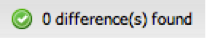

# プロファイルのスキーマ定義の初期化と更新{#initializing-and-updating-a-profile-s-schema-definition}

{{eol}}

1. を開きます。 **[!UICONTROL Schema Builder]** 設定するプロファイルの情報です。
1. A **[!UICONTROL Loading]** メッセージは、Insight プロファイルからスキーマを取得する際に表示されます。 スキーマの読み込みに要する時間は、読み込まれるプロファイルの複雑さに応じて異なります。
1. 完了すると、 **[!UICONTROL Insight Schema]** 左側のウィンドウで、 **[!UICONTROL Dashboard Schema]** をクリックします。 この概要は、 **[!UICONTROL Schema Builder]** ウィンドウ

   >[!NOTE]
   >
   >初めてスキーマを設定する場合、各指標、ディメンション、フィルターのリストは、ダッシュボードのスキーマとは異なる方法で表示されます。 これは、現時点でダッシュボードスキーマオブジェクトが存在しないためです。

   

1. 次をクリック： **[!UICONTROL Synchronize with Schema]** ボタンを使用して、Insight スキーマビューからダッシュボードスキーマビューに、すべての指標、ディメンションおよびフィルターを同期します。
1. 完了すると、違いが見つからないことを示すメッセージが表示されます。

   

1. 指標やディメンションの重複など、ダッシュボードスキーマにエラーがある場合は、保存する前に手動で修正する必要があります。

   >[!NOTE]
   >
   >指標、ディメンションまたはフィルターを **[!UICONTROL Dashboard Schema]** をダッシュボードのエンドユーザーに表示しないようにします。 ダッシュボードスキーマに項目が存在しないという警告が表示されますが、保存を妨げることはありません。

1. 準備が整ったら、 **[!UICONTROL Save]** をクリックして、変更をダッシュボードのスキーマに保存します。
1. ダッシュボードシステムは、このスキーマ定義を使用して、ダッシュボードインターフェイスのエンドユーザーが使用できるディメンション、指標、フィルターを設定します。
