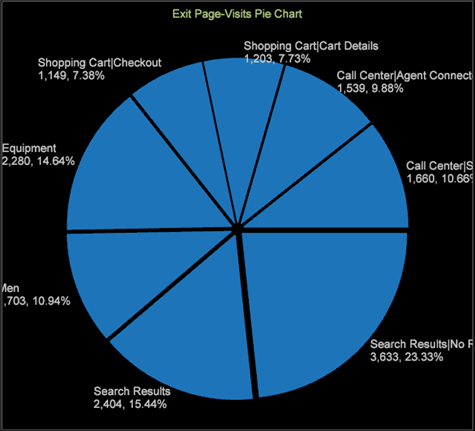

# 円グラフの更新{#pie-chart-update}

円グラフビジュアライゼーションが更新され、凡例で識別されるデフォルトのカラーを使用したり、カラーチャートに基づいてカラーを設定したりできます。

円グラフを開くと、データセットにはそれぞれ凡例に示されている色がデフォルトで設定されます。

円グラフを右クリックし、「**凡例を表示**」を選択することによって、凡例のオン/オフを切り替えられます。非表示にすると、円グラフは色分けされず、引き出し線に各セクションのエレメントが表示されます。

**円グラフのカスタマイズ**

円グラフを変更するには、円グラフを右クリックして、メニューを開きます。 

メニューを使用して、ディメンションエレメント、指標および数値の表示を変更することや、グラフの色とラベルをカスタマイズすることができます。
