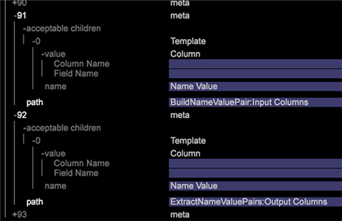

# Data Workbench 6.3 のリリースノート{#data-workbench-release-notes}

Data Workbench 6.3 のリリースノートには、新機能、アップグレード要件、バグの修正および既知の問題が含まれています。

## 新機能 {#section-1225066ea8f44cf68e42e019d0bca816}

Data Workbench 6.3 には、次の新機能が含まれています。

<table id="table_E28A6D31E7D941F7A0C2048F0F0F7838"> 
 <thead> 
  <tr> 
   <th colname="col1" class="entry"> 機能 </th> 
   <th colname="col2" class="entry"> 説明 </th> 
  </tr> 
 </thead>
 <tbody> 
  <tr> 
   <td colname="col1"> <a href="../../../home/c-get-started/c-attribution-profiles/c-attrib-algorithmic/c-attrib-algorithmic.md"> 最適なアトリビューション </a> </td> 
   <td colname="col2"> 最適なアトリビューションは、機会学習手法により、コンバージョンにつながる様々なレベルの顧客インタラクションを特定し、適切なレベルのアトリビューションを各イベントに割り当てます。最適なアトリビューションにより、成功コンバージョンイベントが発生する前の期間の接点を評価してから、Data Workbench アルゴリズムを使用して、マーケティングキャンペーンおよび内部ワークフローに特有の結果を含むデータに基づいてアトリビューションモデルを構築します。 </td> 
  </tr> 
  <tr> 
   <td colname="col1"> <a href="../../../home/c-get-started/c-exp-data-seg-exp/c-mmp-integration.md"> マスターマーケティングプロファイルとの統合 </a> </td> 
   <td colname="col2"> Adobe Experience CloudにData Workbenchして作成されたリッチな顧客セグメントを共有します。 Integrating with Profiles and Audiences enables the <a href="https://www.adobe.com/solutions/digital-marketing.html?promoid=KLXLZ" format="https" scope="external"> Adobe Experience Cloud </a> and other Adobe Analytic capabilities the opportunity to leverage rich audience segments created in Data Workbench. これには、Experience Cloudが設定および実行されている必要があります。 <p>マスターExperience Cloudとの統合により、クラスタリングや傾向スコアリングなどの予測機能を実行し、セグメントを大規模なAdobe Experience Cloudや、Adobe TargetやAdobe Experience Managerなどの他の製品に広げることができます。 </p> </td> 
  </tr> 
  <tr> 
   <td colname="col1"> <a href="../../../home/c-get-started/c-exp-data-seg-exp/c-segment-export.md#concept-ac18fdb34edc4b9592130ab98fabd05e"> セグメントのエクスポート形式オプション </a> </td> 
   <td colname="col2"> ファイル操作を追加することなく、<b>R</b> などの他の機能と直接統合するための、業界標準の形式オプションがセグメントに追加されました。これにより、よりシームレスなワークフローとより迅速な分析を実現します。 </td> 
  </tr> 
  <tr> 
   <td colname="col1"> <a href="../../../home/c-get-started/c-analysis-vis/c-visitor-cluster/c-clustering-2.md"> Clustering 2.0 </a> </td> 
   <td colname="col2"> 優先クラスター生成処理の中心を見つけるためのより高速な手法を使用する、新しい <span class="filepath">KMeans++</span> アルゴリズム（<span class="filepath">KMeans</span> は現在サポートされています）が追加されました。 </td> 
  </tr> 
  <tr> 
   <td colname="col1"> <a href="../../../home/c-get-started/c-analysis-vis/c-graphs/c-trend-lines.md#concept-2898b2ef97dc4762bda7df292713e9a2"> トレンドライン </a> </td> 
   <td colname="col2"> 非常に見やすく解釈しやすいトレンドラインが利用可能になりました。 </td> 
  </tr> 
  <tr> 
   <td colname="col1"> <a href="../../../home/c-get-started/c-analysis-vis/c-graphs/c-regression-analysis.md#concept-58ec981ab50549488585a88295fa14b7"> 回帰分析グラフ </a> </td> 
   <td colname="col2"> 分析ワークフロー内でのある要素から別の要素の直接の影響を比較する機能を提供します。 </td> 
  </tr> 
  <tr> 
   <td colname="col1"> <a href="../../../home/c-get-started/c-analysis-vis/c-chord-visualization.md#concept-ca600beb11674f3bb2696edf41f1dda9"> 弦のビジュアライゼーション </a> </td> 
   <td colname="col2"> 弦のビジュアライゼーションにより、<a href="https://docs.adobe.com/content/help/en/data-workbench/using/client/analysis-visualizations/correlation-analysis/c-correlation-analysis.html" format="http" scope="external">相関行列</a>の別の表示を提供します。 </td> 
  </tr> 
  <tr> 
   <td colname="col1"> <a href="../../../home/c-get-started/c-admin-intrf/c-query-que/c-query-string-grouping.md"> クエリ文字列のグループ化 </a> </td> 
   <td colname="col2"> カスタム eVar、prop および変数に多くの項目がある場合、ログの処理中に名前と値のペアを構築して、レポート上で項目をグルーピングすることができます。 </td> 
  </tr> 
  <tr> 
   <td colname="col1"> <a href="../../../home/c-get-started/c-analysis-vis/c-latency.md#concept-a18c23d45af0460ba531f94da0cdfe6a"> 待ち時間分析 </a> </td> 
   <td colname="col2"> 待ち時間ビジュアライゼーションを使用すると、キャンペーンなどのイベントの後に発生したイベントの前または後の数日間における潜在顧客の行動を分析することができます。 </td> 
  </tr> 
  <tr> 
   <td colname="col1"> <b>時間</b>ディメンション </td> 
   <td colname="col2"> ファインダーパネルで、「<span class="uicontrol">ディメンション</span>」タブを右クリックして、<span class="uicontrol">ディメンションタイプ／時間</span>を選択できるようになりました。検索結果に時間ディメンションのリストが表示されます。 <p>  </p> </td> 
  </tr> 
  <tr> 
   <td colname="col1"> <b>ロック</b>機能 </td> 
   <td colname="col2"> 新しい<b>ロック</b>機能により、ワークスペースがロックされているときにツールバーにアイコンが表示されます。<b>追加</b>メニューをクリックし、「<b>一時的にロック解除</b>」をクリックすると、ワークスペースのロックを解除できます。 </td> 
  </tr> 
  <tr> 
   <td colname="col1"> <b>フィルターパネル</b>の論理演算子および新しい指標機能 </td> 
   <td colname="col2"> <b>フィルターパネル</b>に AND／OR 論理演算子が追加され、データをフィルターする際に指標を結合または追加できるようになりました。指標を変更すると、それに合わせてフィルターの割合が調整されて表示されます。 </td> 
  </tr> 
  <tr> 
   <td colname="col1"> キーボードショートカット </td> 
   <td colname="col2"> Data Workbench の新しいキーボードショートカットにより、メインワークトップと個別のワークスペースを矢印キーを使用して移動できます。さらに、ワークスペースのツールバーがワークトップウィンドウに表示されるようになりました。 </td> 
  </tr> 
  <tr> 
   <td colname="col1"> Windows 8.1 のサポート </td> 
   <td colname="col2"> Microsoft Windows 8.1 64-bit がクライアントインストールで<a href="https://docs.adobe.com/content/help/ja-JP/data-workbench/using/install/c-data-workbench-client-install.html" format="https" scope="external">サポートされるようになりました</a>。 </td> 
  </tr> 
 </tbody> 
</table>

## アップグレード要件と推奨事項 {#section-8704a9ac358246cd81233dd0982d534f}

Data Workbench の新しいプロファイルが、以下の場所にある&#x200B;**ソフトウェアおよびドキュメント**&#x200B;プロファイルにあります。

```
Profiles - Current\DataWorkBench\ 
  English Translated\DataWorkBench_6.31-en-us\
```


**サーバーのアップグレード：**

>[!NOTE]
>
>If you have customized profiles that take precedence over the default files provided in the [!DNL Base] package, then you will need to update these customized files:

* **Meta.cfgファイルを更新します** (File System Unit（FSUサーバー） [!DNL E:\..\Profiles\<your custom profile>\Context\meta.cfg)]の更新されたパスワードの暗号化を設定する場合)。また、名前と値のペアの変換のエントリを追加して、 [クエリ文字列のグループ化を活用します](../../../home/c-get-started/c-admin-intrf/c-query-que/c-query-string-grouping.md)。

   1. FSU 上の [!DNL meta.cfg] ファイルを開きます。
   1. Change the data type for **[!UICONTROL Proxy Password]** from &quot; [!DNL string"] to &quot; [!DNL EncryptedString]&quot; in the *Workstation Configuration* section.

      ```
      Proxy User Name = string: 
      Proxy Password = EncryptedString:   (from Proxy Password = String) 
      Use Address File = bool: true
      ```

   1. 新しい名前と値のペアの変換を有効にする新しいエントリ *BuildNameValuePair* と *ExtractNameValuePairs* を追加します。

      ワークスペースを開き、**管理者**／**プロファイルマネージャー**&#x200B;を右クリックします。

      **コンテキスト**&#x200B;の下で、**Base** 列の **meta.cfg** ファイルをクリックし、「**ローカル化**」をクリックします。User テーブル列で右クリックし、**開く**／**ワークステーションで**&#x200B;を選択します。

      

      * 新しいウィンドウで、**metadata** をクリックし、acceptable children テンプレートを追加します。

      

      * **transformation** を開き、新しいテンプレートを追加します。

      


* **高速結合の強化のための更新**。Data Workbench での変換速度の向上を利用するために、次の設定ファイルに対してパラメーターの追加または値の変更を行います。

   * **Communications.cfg** ([!DNL E:\Server\Components\Communications.cfg])

      ```
      18 = SourceListServer:  
          URI = string: /SourceListServer/ 
          Listing Interval = int: 10 (new)
      ```

   * **Disk Files.cfg** (と [!DNL E:\Server\Components][!DNL E:\Server\Components for Processing Servers])

      ```
      Disk Cache Size (MB) = double: 1024 (from double: 256) 
      Disk Cache Read Limit (MB) = double: 768 (new)
      ```

   * **Log Processing Mode.cfg** ( [!DNL E:\Server\Profiles\<your profile>\Dataset\Log Processing Mode.cfg])

      ```
      <i>(changed)</i> 
      Batch Bytes = int: 268435456 
      Cloud Bytes = int: 268435456 
      Real Time FIFO Bytes = int: 268435456
      ```

      ```
      (new) 
      Cache Bytes = int: 32000000 
      Fast Input Decision Ratio = double: 200 
      Fast Input FIFO Bytes = int: 268435456 
      FIFO Hash Mask = int: 16383 
      Fast Merge Buffer Bytes = int: 536870912 
      Slow Merge Buffer Bytes = int: 268435456 
      Fast Merge Fan In = int: 64 
      Key Cache Size Logarithm = int: 21 
      Max Seeks = int: 512 
      Output Old Buffer Bytes = int: 536870912 
      Overflow FIFO Bytes = int: 67108864 
      Paused = bool: false
      ```

      >[!NOTE]
      >
      >* 高速結合の強化を利用するには、各 DPU に RAM が少なくとも 8 GB あることを確認してください。
      >* 新しい Log Processing Mode パラメーターが適用されている場合は、保存間隔（データセットが保存される間隔）を短くすることが必要な場合があります。変換が速く完了するので、データセットの状態ファイルには以前のバージョンよりも多くのデータが保存間隔に含まれます。

      >
      >  **保存間隔設定の値は 1800 秒（30 分）に設定することをお勧めします**。デフォルトの保存間隔は 3600 秒（1 時間）です （この行を [!DNL Log Processing Mode.cfg] に追加する必要がある場合は、先頭に空白文字が 2 個あるのでご注意ください）。
      >
      >  
      ```
      >      Save Interval (sec) = int: 1800
      >  ```
      >
      >  * **すべて**&#x200B;の処理を使用して **CrossRows** で設定されたデータセットには、新しい Log Processing Mode パラメーターを適用しないことをお勧めします。こうした設定では、この処理のメモリ使用量が環境に対して多くなりすぎてしまいます。


* **Adobe Target と DWB の統合の更新**。A new export file, [!DNL ExportIntegration.exe], replaces the existing [!DNL TnTSend.exe] file on the Insight Server ( [!DNL E:\Server\Scripts\TnTSend.exe]). この新しいエクスポートファイルは、Adobe Target の統合と、新しいマスターマーケティングプロファイル（MMP）および Adobe Audience Manager との連携の両方に対応しています。

   Adobe Target のエクスポートのために、次のコマンドを更新する必要があります。

   `Command = string: TnTSend.exe`

    を   

   ```
   <filepath>
   Command = string: ExportIntegration.exe 
   </filepath>
   ```

   >[!NOTE]
   >
   >これは、バージョン6.3より前のバージョンで作成されたエクスポートにのみ影響します。
   >
   >
   >また、古いエクスポートプロセスを使用する場合は、次を試すこともできます。
   >    
   >* ワークステーションで新しい Target エクスポートを作成します。
   >* Modify the old Test and Target export found in Server/Profiles/`<your profile>`/Export.


* **Adobe SC プロファイルの更新。** ファイルを変更するには、関連するフ [!DNL Exclude Hit.cfg] ァイルでフィールドを宣言する必要があり [!DNL Decoding Instructions.cfg] ます。

   >[!NOTE]
   >
   >If your Adobe SC profile includes a customized [!DNL Decoding Instructions.cfg] file, you will need to include a [!DNL DelimitedDecoder] parameter to your customized file.

   ```
   0 = DelimitedDecoder: 
      Delimiter = string: \t 
      Fields = vector: x items 
      …  
         5 = string: 
   Changed to: 
   
   5 = string: x-hit_source
   ```

   [!DNL DelimitedDecoder] フィールドを追加すると、機能の更新を利用し、これらの更新が原因で発生する可能性があるログ処理の問題を回避することができます。

**クライアントのアップグレード：**

* **サーバーからクライアントを更新します**。

   [!DNL Insight.cfg] ファイルが正しく設定されている場合は、サーバーを更新すると、クライアントを自動的に更新できます。

   1. Edit the [!DNL Insight.cfg] file.

      ```
      Update Software = bool: true
      ```

      その場合 **[!UICONTROL Save]**.

   1. クライアントを終了し、起動します。
   1. プロファイルに接続します。

      クライアントが自動的に Data Workbench 6.3 にアップグレードされます。

   1. クライアントを終了します。
   1. テンプレートを [!DNL Insight.cfg]

      * 変更 [!DNL Proxy Password = string:]

          を   [!DNL Proxy Password = EncryptedString:]

         以前のプロキシアドレスとプロキシパスワードの値を削除します。

      * **[!UICONTROL Save]** を参照してください。
   1. クライアントを起動します。
   1. テンプレートを [!DNL Insight.cfg].

      * すべてのサーバーのプロキシパスワードを入力し、保存します。
      * すべてのサーバーのプロキシアドレスを入力し、保存します。

         >[!IMPORTANT]
         >
         >Proxy AddressとProxy Passwordは、クライアント内で入力して保存する必要があります。
   1. プロファイルに接続します。
   >[!NOTE]
   >
   >
   >    
   >    
   >    * アカウントのロックアウトを回避するために、正確にアップグレード手順に従ってください。アカウントがロックされた場合は、記載されている正確な手順で必要な変更をすべて実行し、作業内容を保存して、クライアントを終了してください。ロックアウトが解除されるまで（約 45 分）待ってから、クライアントをもう一度起動します。
   >    * パスワードは Windows の資格情報コンテナに保存されるので、パスワードの変更はクライアントで実行する必要があります。


* **推奨**:**新しいWindowsAeroテーマ。 ** WindowsのAeroテーマを使用して、クライアントアプリケーションの外観をアップグレードします。

* **推奨事項：中国語と日本語バージョンのフォント**：

   中国語：

   * Arial
   * SimSun

   日本語：

   * MS Gothic
   * Meiryo
   * MS 明朝
   * Arial
   * SimSun

   >[!NOTE]
   >
   >*SimSunは中国語と日本語に使用できます* 。 日本語の半角文字を入力する場合は、*MS 明朝*&#x200B;も含める必要があります。[!DNL Insight.cfg] でこれらのフォントを有効にするには、次のパラメーターを追加します。

   ```
   0 = string: Arial 
   1 = string: SimSun 
   2 = string: MS Mincho
   ```

   これらのフォントをワークステーションの設定ファイル [!DNL Insight.cfg.] にリストする必要があります。

**Adobe Analytics Premium へのアップグレード**

Data Workbench の&#x200B;**最適なアトリビューション**&#x200B;を実行するには、Adobe Analytics Premium をサポートする、クライアント、サーバーおよびレポートサーバー用の新しい証明書（.pem ファイル）を Adobe ClientCare から受け取る必要があります。新しい各証明書には、次のパラメーターが設定されています。

```
Product = Premium
```

The Premium Package is available for download on **[!UICONTROL Software and Docs]** under the **[!UICONTROL Getting Started]** tab on the **Profiles and Lookup** files workspace. Navigate to `Profiles - Current\DataWorkBench\<language>\Data WorkBench_6.30-en-us\Premium_6.30_en-us.zip`.  **プレミアム**&#x200B;プロファイルをサーバーにロードしたら、カスタム *ファイルに* Premium[!DNL Profile.cfg] パラメーターを追加する必要があります。追加すると、カスタムプロファイルに、Adobe Analytics Premium の一部としてメニュー、ビジュアライゼーションおよびワークスペースを含めることができます。

## 修正されたバグ {#section-e1e3df3da3594987a325344cd5e8b855}

* **密度マップ**&#x200B;ビジュアライゼーションで最大のエレメントが見つからないという問題が修正されました。
* エレメントの面積が指標値の割合を示していなかった&#x200B;**密度マップ**&#x200B;の問題を修正しました。
* Fixed issue where dragging metric from **[!UICONTROL Finders]** panel to metric legend outside of the metric column would delete the legend from the workspace.
* Fixed issue where **[!UICONTROL Print Workspace]** using **[!UICONTROL Sidebar]** and **[!UICONTROL Both]** options will not include the Copyright info in the printed page.

## 既知の問題 {#section-751e8698e9f14b75a85f63253782be41}

* **AMD Radeon™ グラフィックカード**&#x200B;を利用している場合は、最新のグラフィックドライバーに更新する必要があります。ドライバーの一部の初期バージョンでは、OpenGL3.2 をサポートしていると謳っていますが、一貫性がありません。
* 出力をヘッダー宣言せずに&#x200B;**セグメントエクスポート**&#x200B;設定で生成すると、ファイルのはじめに偽のヘッダーが表示され、行の最初のセットと一致しなくなります。
* 「**ディメンションの追加**」が「*拡張ディメンション*」にのみ表示されます。 回避策としては、**ファインダー**&#x200B;ツールを使用してディメンションをテーブルにドラッグします。

* 3D 散布グラフビジュアライゼーションに引き出し線が含まれている場合に、ズームを使用すると、ビジュアライゼーションの境界線の外にプロットが表示されることがあります。この問題を回避するには、最初に 3D 散布グラフをズームしてからビジュアライゼーションに引き出し線を追加します。
* リモートデスクトップセッションでワークステーションを使用しているときに、ワークスペースの名前を変更すると、クラッシュします。
* リスト項目
* 「出力形式」フィールドでエクスポートファイルに引用符が付けられていない場合でも、**レガシーセグメントのエクスポートファイルは二重引用符付きで出力されます。**

   *回避策*：以下の 3 行を .export ファイルに追加します。これらの値を設定しても MMP の統合はトリガーされません（他の設定フィールドが必要なため）が、不要な自動エスケープを避けることができます。

   ```
     MMP Configuration = MMPConfiguration: 
       MMP Segment Name = string: UNESCAPE DUMMY 
       MMP Visitor ID Field = string: [Specify a Dimension from the output of 
                                       the current export]
   ```

   （最初の行の先頭には空白文字が 2 つ、次の行の先頭には 4 つあります。The Dimension from the output of the current export needs to be referenced in the [!DNL MMP Visitor ID Field].)
