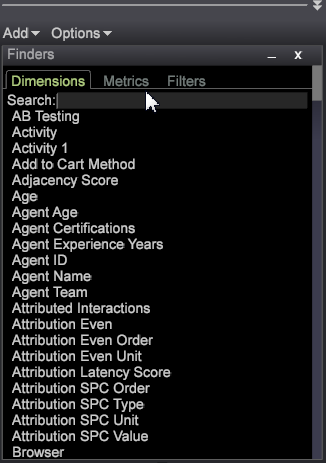
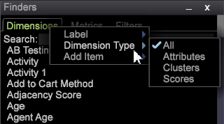

# ファインダー{#finders}

Data Workbench のファインダーパネルを使用して、指標、ディメンションおよびフィルターを選択できます。これらのパネルは、検索をサポートしており、並べ替えオプションとドラッグ＆ドロップ機能を備えています。

ファインダーパネルは、左側のサイドバーまたはワークスペース内で開くことができます。

<table id="table_3E43DBA0646842898F14F31374F9E39C"> 
 <thead> 
  <tr> 
   <th colname="col1" class="entry"> ディメンションファインダー </th> 
   <th colname="col2" class="entry"> 指標ファインダー </th> 
   <th colname="col3" class="entry"> フィルターファインダー </th> 
  </tr>
 </thead>
 <tbody> 
  <tr> 
   <td colname="col1"> 
クエリーモデル内のすべてのディメンションのリスト。 
 </td> 
   <td colname="col2"> 
クエリーモデル内のすべての指標のリスト。 
 </td> 
   <td colname="col3"> 
組織で作成されたすべてのフィルターのリスト。 
 </td> 
  </tr> 
 </tbody> 
</table>

**ファインダーを開くには：**

* ワークスペース内で右クリックし、**[!UICONTROL Tools]** > **[!UICONTROL Finder]**&#x200B;を選択します。

   「指標」、「ディメンション」および「フィルター」のタブを含むファインダーペインがワークスペース内に開きます。

* 左側のサイドバーを右クリックし、**[!UICONTROL Add]** > **[!UICONTROL Finder]**&#x200B;を選択します。

   ファインダーペインが左側のパネルに開きます。

**ファインダー**&#x200B;には、次の機能が含まれています。

<table id="table_072047E919204577AE85789BAE0F4EE8"> 
 <thead> 
  <tr> 
   <th colname="col1" class="entry"> ファインダーの機能 </th> 
   <th colname="col2" class="entry"> 詳細 </th> 
  </tr>
 </thead>
 <tbody> 
  <tr> 
   <td colname="col1"><b>ドラッグ＆ドロップ</b> </td> 
   <td colname="col2"> 
 ディメンションまたは指標をパネルからワークスペースのビジュアライゼーションにドラッグ＆ドロップして、ディメンションを変更したり、新しい指標を追加したりできます。 
 
    <ol id="ol_612DC76EC04C4FCE938B20B388C43CE8"> 
     <li id="li_7F73B781141E4B8CAE9800F580F62E44">Ctrl + Alt キーを押しながらファインダーパネルからディメンションまたは指標を選択します。 </li> 
     <li id="li_631D57976F71415AA61F33EBBFDD128A">ペインから新しいディメンションをドラッグし、ビジュアライゼーションにドロップして、ディメンションを変更または追加します。 </li> 
     <li id="li_5329FB82225F46EBBE3A996A641058DE">指標を追加するには、ペインから新しい指標をドラッグし、選択したビジュアライゼーションの指標ヘッダーにドロップします。 </li> 
    </ol> 
この方法は、テーブル、訪問者クラスター、相関行列、散布グラフおよび 2D 棒グラフ（軸による）など、すべての関連ビジュアライゼーションで使用できます。 
 </td> 
  </tr> 
  <tr> 
   <td colname="col1"><b>検索</b> </td> 
   <td colname="col2">ファインダーパネルの「検索」ボックスでは、ディメンション、指標およびフィルターの名前をフィルターできます。 
    <ul id="ul_0F6F377E9906472E99008EBE7483F689"> 
     <li id="li_75857895EDB045C8B2960393854B257D"> 
パターン一致（単純なグローバル検索）。「検索」フィールドに目的のディメンション、指標またはフィルターエンティティの名前を入力すると、一致する文字列を含む名前だけがフィルターされ、ファインダーペインに表示されます。 
 
例えば、次のように入力します。 
 <code><b>Search:</b>click</code> 
ディメンションファインダーでは、次のような結果を得ることができます。 
 
 
 
標準のパターン一致では、「.」（ドット）、「?」、「*」（スター）などのワイルドカード文字を使用することができます。 
 </li> 
     <li id="li_044F9EC1399B44CD81E1852F85137704"> 
正規表現. 追加された検索機能では、より複雑な正規表現もサポートされています。検索語句の前にプレフィックス「re:」を（スペースなしで）追加すると、正規表現として解釈されます。 
 
例えば、次のように入力します。 
 <code><b>Search:</b>re.*ip</code> 
ディメンションファインダーでは、次のような結果を得ることができます。 
 
 
 </li> 
    </ul> 
検索について詳しくは、<a href="https://experienceleague.adobe.com/docs/data-workbench/using/dataset/c-reg-exp.html" format="http" scope="external">正規表現</a>を参照してください。 
 </td> 
  </tr> 
  <tr> 
   <td colname="col1"><b>ディメンションタイプ</b> </td> 
   <td colname="col2">「ディメンション」タブでは、タブの見出しを右クリックして、ディメンションのタイプで並べ替えることができます。 
 
     <ul id="ul_D36B8474730F4859BC7AA015CC1B8EF0"> 
      <li id="li_4AE1D5699D0E45AF880A134F886B8B19">属性：訪問者、製品、地域、時間、ビデオなどの属性の特徴に基づいて構築されたディメンション。 </li> 
      <li id="li_0B2A08F8CBE94356AC506F95DC268C47">クラスター：クラスタービルダー内で構築されたディメンション。 </li> 
      <li id="li_4BC3396A680B49A4B6BDAAD066826864">スコア：傾向スコアリング内で構築されたディメンション。 </li> 
     </ul> 
 </td> 
  </tr> 
  <tr> 
   <td colname="col1"><b>ラベル</b> </td> 
   <td colname="col2">各タブでは、右クリックし、「ラベル」を選択して、ファインダーペインの名前を変更できます。 
 
 
デフォルトのディメンション、指標およびフィルターのラベルを組織の規則に従ったタブ名に変更することができます。 
 </td> 
  </tr> 
  <tr> 
   <td colname="col1"><b>項目の追加</b> </td> 
   <td colname="col2">各タブでは、右クリックし、「項目の追加」を選択して、テーブルを開き、ディメンション、指標およびフィルターを手動で追加できます。 </td> 
  </tr> 
  <tr> 
   <td colname="col1"><b>ファインダーバー</b> </td> 
   <td colname="col2">左側のサイドバーにあるファインダーバーを右クリックすると、追加機能のメニューが開きます。 
 
 </td> 
  </tr> 
  <tr> 
   <td colname="col1"><b>閉じる</b> </td> 
   <td colname="col2">ファインダーバーを右クリックし、「閉じる」を選択すると、ファインダーペインが閉じます。 </td> 
  </tr> 
  <tr> 
   <td colname="col1"><b>保存</b> </td> 
   <td colname="col2">リストをローカルに保存するには、ヘッダーバーを右クリックし、「保存」オプションを選択します。 </td> 
  </tr> 
  <tr> 
   <td colname="col1"><b>エクスポート</b> </td> 
   <td colname="col2">ファインダーパネルから選択したディメンション、指標またはフィルターのリストをエクスポートするには、ファインダーバーを右クリックし、メニューから「エクスポート」を選択します。 
 名前を追加し、Microsoft Excel にエクスポートします。 
 </td> 
  </tr> 
  <tr> 
   <td colname="col1"><b>Copy</b> </td> 
   <td colname="col2"> ディメンション、指標またはフィルターのリストをコピーします。ファイルとしてコピーすることや、暗い背景、明るい背景またはモノクロのグラフィックとしてコピーすることができます。 </td> 
  </tr> 
  <tr> 
   <td colname="col1"><b>最小化</b> </td> 
   <td colname="col2"> ファインダーペインを最小化します。ファインダーバーのみが表示されます。 </td> 
  </tr> 
  <tr> 
   <td colname="col1"><b>枠なし</b> </td> 
   <td colname="col2"> ワークスペース内でファインダーのペインを境界線なしで表示します（ただし、左側のサイドバーでは境界線なしで表示されません）。 </td> 
  </tr> 
 </tbody> 
</table>

