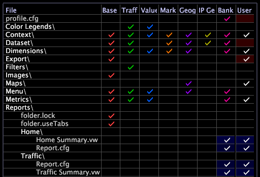

# Report Portal ユーザーインターフェイスのカスタマイズ{#customize-the-report-portal-user-interface}

Report Portalを通じて適切に表示されるレポートを生成するには、レポートセットを特定の方法で設定する必要があります。

[!DNL Report Portal]のユーザーインターフェイスは、出力ディレクトリに表示され、[!DNL profiles.xml]ファイルに一覧表示される各レポートセットフォルダーのタブと、[!DNL TopNavigation.xml]ファイルに追加する必要がある組み込みの[!DNL Admin]タブを表示するように設計されています。 組み込みの「[!DNL Admin]」タブの表示について詳しくは、「 [ユーザーのタブへの出力フォルダーのリンク… 」を参照してください。](../../../home/c-rpt-oview/c-install-rpt-port/c-rpt-port-user-inter.md#section-3f6bc47d37ed448e871f4f685f46acee).


* [レポートセットがReport Portalと互換性があることを確認…](../../../home/c-rpt-oview/c-install-rpt-port/c-rpt-port-user-inter.md#section-2b141e5d198a4bbea455699126c24706)
* [ユーザー内のタブへの出力フォルダーのリンク…](../../../home/c-rpt-oview/c-install-rpt-port/c-rpt-port-user-inter.md#section-3f6bc47d37ed448e871f4f685f46acee)

## レポートセットとReport Portalの互換性の確保{#section-2b141e5d198a4bbea455699126c24706}

レポートセットは、[!DNL Report]のスケジュール済みジョブを定義します。 次の2つの項目で構成されます。

* [!DNL Report]でレポートとして生成するワークスペースのコレクションを定義するフォルダー。
* 設定ファイル([!DNL Report.cfg])。

特に、[!DNL Report.cfg]ファイルは、レポートを生成するタイミングと出力ファイルの保存場所を[!DNL Report]に指示します。 レポートセットは、Data WorkbenchサーバーのReportsフォルダーにあります。 プロファイルには、任意の数のレポートセットを表示できます。

[!DNL Report Portal]との互換性を確保するには、レポートセットが次の要件を満たしている必要があります。

* レポートセットの出力ディレクトリには、設定済みの[!DNL profiles.xml]ファイルが含まれている必要があります。
* 各レポートセットには、「*ReportSetName*&#x200B;概要」という名前の最上位レポートを含める必要があります。ここで、*ReportSetName*&#x200B;は、レポートセットの名前と一致します。 例えば、次の[!DNL Profile Manager]は、「Home」と「Traffic」の2つのレポートセットを示しています。 各レポートセットは、サマリレポート（ [!DNL Home Summary.vw]と[!DNL Traffic Summary.vw] ）を定義します。



[!DNL Report Portal]では、概要レポートがレポートセットのタブに表示されます。 サマリレポートには、選択した任意のワークスペース、ウィンドウまたはビジュアライゼーションを含めることができます。

* 概要レポートは、レポートセットの最上位フォルダーにある唯一のレポートである必要があります。 その他のレポートはすべて、サブフォルダーに配置する必要があります。 その他のレポートを最上位フォルダーに配置すると、ポータルで表示できなくなります。

## ユーザーインターフェイスのタブへの出力フォルダーのリンク{#section-3f6bc47d37ed448e871f4f685f46acee}

[!DNL Report Portal]に表示するタブを指定するには、各プロファイルに[!DNL TopNavigation.xml]ファイルを設定する必要があります。 このファイルでは、特定のプロファイルのユーザーインターフェイスにタブとして表示されるレポートセットと、それらのタブの順序を指定します。 [!DNL TopNavigation.xml]ファイルは\*PortalName*\PortalFiles\Core\TopNav\*profileName*フォルダーにあります。

**TopNavigation.xmlファイルを編集するには**

1. IISを実行しているマシン上で、メモ帳などのテキストエディターで[!DNL TopNavigation.xml]ファイルを開きます。
1. `<TopNav>`要素のリストを編集し、次の例に示すように、出力を[!DNL Report Portal]で表示するレポートセットの名前と順序を定義します。

   ```
   <?xml version="1.0" encoding="UTF-8" standalone="no" ?>
   <TOPNAV_ELEMENTS>
   <TOPNAV>
       <NAME>Monthly Web</NAME>
     </TOPNAV>
     <TOPNAV>
       <NAME>Weekly Web</NAME>
     </TOPNAV>
   <TOPNAV> 
         <NAME>Admin</NAME> 
     </TOPNAV>
   </TOPNAV_ELEMENTS>
   ```

   >[!NOTE]
   >
   >[!DNL Admin]タブは追加機能を提供する組み込みのタブです。 [!DNL TopNavigation.xml]ファイルに含めないと、このタブは表示されず、機能は使用できません。

1. \*PortalName*\PortalFiles\Core\TopNav\ folderディレクトリに、次のプロファイル用のフォルダーを作成します。
1. 最初のプロファイルフォルダーの[!DNL TopNavigation.xml]ファイルをコピーして、新しいフォルダーに貼り付けます。
1. 必要に応じて[!DNL TopNavigation.xml]を編集し、ファイルを保存します。
1. ポータルで使用可能なその他すべてのプロファイルに対して手順3 ～ 5を繰り返します。
