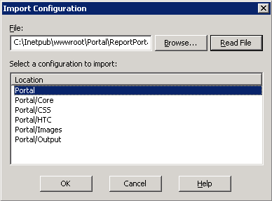

# 仮想ディレクトリ（IIS 6.0）への Report Portal のマッピング{#mapping-report-portal-to-a-virtual-directory-iis}

レポートポータルを仮想ディレクトリ(IIS 6.0)にマップする手順です。

[!DNL Report Portal]をIIS 6.0上の仮想ディレクトリにマッピングするには、次の3つのタスクが必要です。

1. [設定ファイルの編集](../../../../home/c-rpt-oview/c-install-rpt-port/c-virtual-dir/c-map-rpt-port-vdir-6.md#section-eaf1c58935074cfa840dac33e1286520)
1. [構成ファイルをIISに読み込む](../../../../home/c-rpt-oview/c-install-rpt-port/c-virtual-dir/c-map-rpt-port-vdir-6.md#section-9d61f6bfa93846dcb96973fec5573b19)
1. [IISでActive Server Pages (ASP)を有効にする](../../../../home/c-rpt-oview/c-install-rpt-port/c-virtual-dir/c-map-rpt-port-vdir-6.md#section-a7725ec2afc64ffc854c5bd8c5c31802)

3つのタスクをすべて完了する必要があります。

## 構成ファイルを編集するには{#section-eaf1c58935074cfa840dac33e1286520}

1. [!DNL Report Portal]がインストールされているマシン上で、\*PortalName*\ReportPortalSetup.xmlをメモ帳などのテキストエディタで開きます。

1. エディタの検索と置換機能を使用して、文字列「VSVirtualPortalName」をポータル名にグローバルに置き換えます（「すべて置き換え」を選択）。 例えば、「VisualReportPortal」を[!DNL Report Portal]の名前として使用する場合、「VSVirtualPortalName」を検索し、「VisualReportPortal」に置き換えます。
1. このファイル内で次の要素を探します。

   ```
   <IIsWebVirtualDir Location= "/LM/W3SVC/1/Root/PortalName/Output" AccessFlags="AccessRead | AccessScript” AppFriendlyName="Output" . . . >
   ```

1. この要素の[!DNL Path]属性を、[!DNL Report Server]がレポートセットの出力を保存するディレクトリの物理的な場所に設定します。

   出力フォルダーは任意の場所に配置でき、任意の名前を付けることができ、各レポートセットのサブフォルダーを含めることができます。

   >[!NOTE]
   >
   >これは、レポートセットの[!DNL Report.cfg]ファイルの出力ルートパラメーターで指定するのと同じディレクトリにする必要があります。 詳しくは、[Report.cfgファイルの設定](../../../../home/c-rpt-oview/c-admin-rpt/c-config-rpt-files.md#concept-cf4b95344fcb4c8c877db91e5f1d345d)を参照してください。

   次のコードの例は、レポートが[!DNL E:\VSReport\ReportOutput]に保存された場合に[!DNL Path]属性を設定する方法を示しています。

   ```
   < . . . 
   AppIsolated="2" 
       AppRoot="/LM/W3SVC/1/Root/PortalName/OutputFolder" 
       DirBrowseFlags="DirBrowseShowDate | DirBrowseShowTime |...  
       Path="E:\VSReport\ReportOutput"
   ```

   >[!NOTE]
   >
   >[!DNL Path]属性を正しく設定することが重要です。

1. [!DNL Output]要素のデフォルト[!DNL Path]を変更した場合は、*\PortalName*\PortalFiles\Output folder to the output directory that you specified in Step 4ディレクトリから[!DNL profiles.xml]ファイルを移動します。 上記の例では、[!DNL profiles.xml]を[!DNL E:\VSReport\ReportOutput]に移動します。

1. 他のすべての[!DNL IIsWebVirtualDir]要素の[!DNL Path]属性が正しい場所にマップされていることを確認します。それには、[!DNL C:\Inetpub\wwwroot]のすべてのインスタンスを検索し、それぞれを正しいパスに置き換えます。

1. ファイルを保存します。元のファイルを保持する場合は、新しい名前を付けて設定ファイルを保存できます。

## 構成ファイルをIISにインポートするには{#section-9d61f6bfa93846dcb96973fec5573b19}

1. [!DNL Report Portal]がインストールされているマシンで、**[!UICONTROL Start]** > **[!UICONTROL Administrative Tools]** > **[!UICONTROL Internet Information Systems (IIS) Manager]**&#x200B;を使用してIISマネージャを開始します。

1. Select **[!UICONTROL (local computer)]** > **[!UICONTROL Web Sites]** > **[!UICONTROL Default Web Site]**.

1. **[!UICONTROL Default Web Site]**&#x200B;を右クリックし、**[!UICONTROL New]**/**[!UICONTROL Virtual Directory]**（ファイルから）を選択します。

1. **[!UICONTROL ReportPortalSetup.xml]**&#x200B;ファイルを選択し、**[!UICONTROL Read File]**&#x200B;をクリックします。

1. 次の例に示すように、[!DNL Report Portal]に対して6つの仮想ディレクトリが一覧に表示されていることを確認します。

   

   6つの仮想ディレクトリが表示されない場合や、エラーメッセージが表示された場合は、**[!UICONTROL Cancel]**&#x200B;をクリックして設定ファイルのエラーを調べます。

1. リスト内の最初の仮想ディレクトリ（他の5つの親ディレクトリの1つ）を選択し、**[!UICONTROL OK]**&#x200B;をクリックします。 IISはマッピングをインポートし、仮想ディレクトリを既定のWebサイトに追加します。

   次の例に示すように、結果のディレクトリ構造に、1つの親フォルダー（ポータルと同じ名前を持つ）と5つのサブディレクトリがあることを確認します。

   

1. 各仮想ディレクトリをクリックして、IISがその仮想ディレクトリが表す物理ディレクトリを特定できることを確認します。 IISでエラーが表示された場合は、仮想ディレクトリ名を右クリックし、[!DNL Local Path]フィールドが正しい物理ディレクトリを指していることを確認します。

## IIS {#section-a7725ec2afc64ffc854c5bd8c5c31802}でActive Server Pages (ASP)を有効にするには

[!DNL Report Portal]を使用するには、IISでASPを有効にする必要があります。 （既定では、IIS 6.0がインストールされている場合、ASPは無効になります）。 IISでASPが有効になっていることを確認するには、次の手順を実行します。

1. [IISマネージャ]ウィンドウで、**[!UICONTROL (local computer)]** > **[!UICONTROL Web Service Extensions]**&#x200B;を選択します。
1. [!DNL Active Server Pages]拡張子が[!DNL Allowed]に設定されていることを確認します。

   

1. 「Status」が「Prohibited」の場合は、「**[!UICONTROL Active Server Pages]**」を選択し、「**[!UICONTROL Allow]**」をクリックします。
1. IISマネージャを閉じます。
