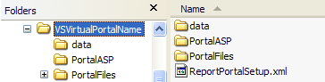

# レポートポータルアプリケーションファイルのインストール{#install-the-report-portal-application-files}

レポートポータルは、一連のアプリケーションサーバーページ(ASP)とサポートファイルで構成されています。

をインストールするに [!DNL Report Portal]は、アドビから受け取った配布ファイルからこれらのファイルを抽出し、Microsoft IISが実行されているマシンにインストールする必要があります。

**アプリケーションファイルをインストー[!DNL Report Portal]ルするには**

1. インストールパッケージ（.zipファイル）をまだダウンロードしていない場合は、アドビのFTPサイト [!DNL Report Portal] からダウンロードします。
1. IISが実行されているコンピューター上で、インストールパッケージ内のファイルを任意の場所に展開します。 この手順では、VSVirtualPortalNameフォルダーに次のサブフォルダーとファイルをインストールします。

   | フォルダまたはファイル | 説明 |
   |---|---|
   | [!DNL \data\users.mdb] | 許可された [!DNL Report Portal] ユーザーのリストを含むデータベース。 |
   | [!DNL \PortalASP\] | を構成するASPファイルを含むフォルダーで [!DNL Report Portal]す。 |
   | [!DNL \PortalFiles\] | で使用されるサポートファイルを含む5つのサブフォルダー（Core、CSS、HTC、ImagesおよびOutput）を含むフォルダーで [!DNL Report Portal]す。 |
   | [!DNL ReportPortalSetup.xml] | に関連付けられた仮想ディレクトリを定義するために使用する構成ファイル [!DNL Report Portal] （IIS 6.0でのみ使用）。 |

   ディレクトリは次の例のようになります。

   

   >[!NOTE]
   >
   >ディレクトリの名前は、この例に示す名前とは異なる場合があります。

1. VSVirtualPortalName（または他の名前）フォルダの名前を、ユーザのルート仮想ディレクトリとして使用する名前に変更します(以下、PortalName [!DNL Report Portal] と呼び *ます*)。 仮想ディレクトリの詳細については、次のセクションを参照してください。
