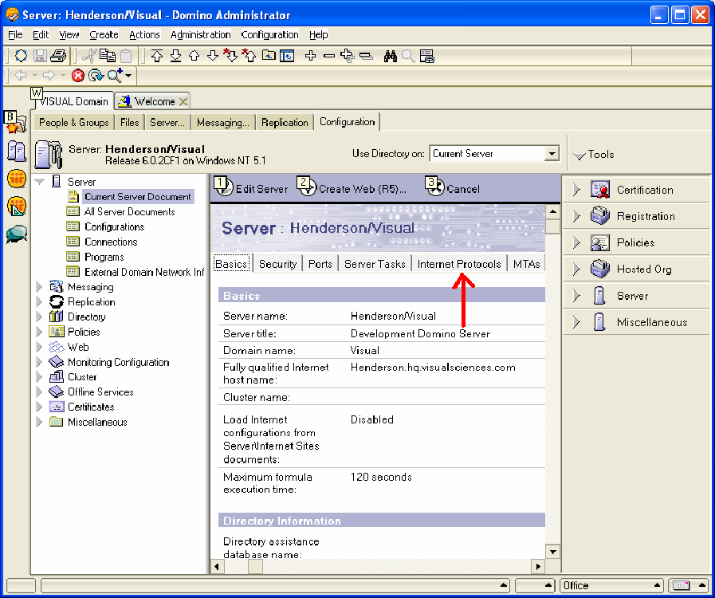

# Windows Server 2000以降で稼働するLotus Domino Server{#lotus-domino-server-on-windows-server-or-later}

Microsoft Windows Server 2000以降で実行されるWindows 3.1以降用のLotus Domino Server 6のインストールおよび設定の手順です。

Sensorのプログラムファイルは、アドビのダウンロードサイトから入手したインストールファイルにパッケージ化されます。 お使いのWebサーバー用のSensorインストールファイルがまだない場合は、次の手順を開始する前に、ダウンロード（またはアドビの担当者から入手）してください。

Sensorをインストールして設定するには、次の手順を実行する必要があります。

## Install the Program Files {#section-2f3e85083b4f4aa989a85997330e86ae}

1. Lotus Dominoマシンで、Sensorプログラムファイルをインストールするディレクトリを作成します。 ディスクキューもこのディレクトリに存在するので、選択したデバイスに必要なサイズのキューを保持するのに十分な領域があることを確認してください。

   ```
   C:\VisualSensor
   ```

1. インストールファイルの内容をLotus Dominoディレクトリに抽出します。 この手順で、Sensorは次のファイルをインストールします。

<table id="table_ABFF5F92271B4F3CB0AC68DAB6A5709F"> 
 <thead> 
  <tr> 
   <th colname="col1" class="entry"> ファイル </th> 
   <th colname="col2" class="entry"> 説明 </th> 
  </tr> 
 </thead>
 <tbody> 
  <tr> 
   <td colname="col1"> EventMessages.dll </td> 
   <td colname="col2"> イベントビューアのメッセージ </td> 
  </tr> 
  <tr> 
   <td colname="col1"> stchatlog.dll </td> 
   <td colname="col2"> コレクタモジュール </td> 
  </tr> 
  <tr> 
   <td colname="col1"> <p>TestTest.xls </p> </td> 
   <td colname="col2"> <p>設計者が制御実験の設定に使用できるExcelスプレッドシートファイル </p> <p>センサーはこのファイルを使用しません。 </p> </td> 
  </tr> 
  <tr> 
   <td colname="col1"> trust_ca_cert.pem </td> 
   <td colname="col2"> 接続プロセス中にInsightサーバーが提示するデジタル証明書の検証に使用される証明書 </td> 
  </tr> 
  <tr> 
   <td colname="col1"> TXLog.exe </td> 
   <td colname="col2"> 送信プログラム </td> 
  </tr> 
  <tr> 
   <td colname="col1"> <p>txlogd.conf </p> </td> 
   <td colname="col2"> Sensor設定ファイル </td> 
  </tr> 
 </tbody> 
</table>

>[!NOTE]
>
>インストールパッケージには、TestTest.xlsという名前のスプレッドシートファイルが含まれています。 このスプレッドシートは、設計者が制御実験を設定する際に使用するツールです。 センサー自体はこのファイルを使用しないので、Sensorを実行しているコンピューターにファイルをインストールする必要はありません（ただし、インストールは可能です）。 必要に応じて、設計者がアクセスできる場所にファイルをコピーするか、インストールパッケージからファイルを抽出します。 対照実験について詳しくは、『Insight Controlled Experiments Guide』を参照してください。

## Lotus Dominoサーバーの設定 {#section-2e2f1875a5304cdfa2cbcd0680683cfd}

Lotus Domino Serverを設定する手順です。

1. Lotus Domino Administratorにログインし、をクリックしま **[!UICONTROL Domain]**&#x200B;す。

   

1. Lotus Domino Administratorで、をクリックしま **[!UICONTROL Configuration]**&#x200B;す。

   

1. 「サーバー」ノードを展開し、をクリックしま **[!UICONTROL Current Server Document]**&#x200B;す。

   

1. Click **[!UICONTROL Current Server Document]**, then click **[!UICONTROL Internet Protocols]**.

   

1. 「HTTP」タブの「DSAPI」セクションで、単語の後をダブルクリックします [!DNL ndolextn]。

   

1. を押 **[!UICONTROL Enter]** し、ファイルのパスを入力し [!DNL dominosensor.dll] ます。

   

1. クリック **[!UICONTROL Save & Close]**.

   

## センサー設定ファイルの編集 {#section-de0eb4a646394b61abb6cd5a2b706de0}

txlogd.confファイルには、Sensorの設定パラメーターが含まれています。

このファイルを編集して、特に、ディスクキューファイルのサイズと場所、Insightサーバーのアドレス、およびこのセンサーによって生成されるイベントデータに添付されるIDを指定する必要があります。

設定ファイルには、必須パラメーターとオプションのパラメーターが含まれています。

* **必須パラメータ** ーは、Sensorのインストール時に指定する必要がある設定です。 これらの設定がないと、Sensorは正常に実行されません。
* **オプションのパラメータ** は、デフォルトで事前定義された値（変更可能）に設定される設定、またはオプション機能を有効にする設定です。

**Sensor設定ファイルを編集するには**

* テキストエデ `<Sensor directory>/txlogd.conf` ィターでファイルを開き、必要なパラメーターと必要なオプションのパラメーターを設定します。
* ファイルを保存して閉じます。

## 送信機を起動し、ディスク・キューを作成する {#section-55630de65f264274aefd771da2002852}

txlogd.confファイルを設定したら、送信プログラムを起動し、Windowsサービスとして登録し、ディスクキューを作成します。

1. Windowsのスタートメニューで、アクセサリ/コマ **ンドプロンプト** を **選択します**。

1. コマンドプロンプトウィンドウで、Sensorをインストールしたディレクトリに移動し、次のコマンドを実行します。

   ```
   txlog /regserver
   ```

   このコマンドは、トランスミッタを起動し、ディスクキューを作成し、SensorをWindowsサービスとして登録します。

1. 送信機が正しく動作していることを確認するには、 **Start/Control Panel/Administrative Tools/Servicesをクリックします**。

   >[!NOTE]
   >
   >このコマンドの順序は、使用しているWindowsのバージョンによって異なる場合があります。

   1. サービスリストで、Sensorのエントリを探し、ステータスがStartedで、スタートアップの種類がAutomaticであることを確認します。
   1. [サービス]コントロールパネルを閉じます。

1. 起動中に送信機でエラーが発生したかどうかを確認するには、スタート/コントロールパネル/管理ツール/イベントビューアをクリックし、イベントビューアを開きます。

   >[!NOTE]
   >
   >このコマンドの順序は、使用しているWindowsのバージョンによって異なる場合があります。

   1. 「Event Viewer」ウィンドウの左ペインで、「Applications」ログを選択します。
   1. 右側のウィンドウで、「Source」列に「Adobe」が含まれているイベントを探します。
   1. 「アドビ」からエラーが見つかった場合は、エラーをダブルクリックして、イベントのプロパティウィンドウを表示します。 このウィンドウには、エラーに関する詳細情報が表示されます。

1. アプリケーションログの確認が完了したら、イベントビューアを閉じます。
1. 送信機が、Sensorプログラムファイルをインストールしたディレクトリにディスクキュー( [!DNL Diskq2000.log])を作成し、ファイルのパラメーターで指定したサイズであることを [!DNL QueueSize] 確認し [!DNL txlogd.conf] ます。

   キューが正しく作成されていない場合：

   1. txtlogd.confファイルを調べ、QueueSizeパラメーターが正しく設定されていることを確認します。
   1. Sensorをインストールしたデバイスに、QueueSizeパラメーターで指定したサイズのファイルを保持するのに十分な空き領域があることを確認します。
   1. Windowsのサービス・コントロール・パネルを使用して、送信機を停止します。
   1. キューファイルを削除します。
   1. SensorをWindowsサービスとして再登録します。windowsのスタートメニューから、アクセサリ/コマンドプロンプトを選択します。 コマンドプロンプトウィンドウで、Sensorをインストールしたディレクトリに移動し、次のコマンドを実行します。

      ```
      txlog /regserver
      ```

      送信機は、連続的に動作するように設計されています。 コンピューターを再起動すると、送信機が自動的に再起動します。 送信機を手動で起動および停止する必要がある場合は、Windowsのサービスコントロールパネルを使用して実行できます。

