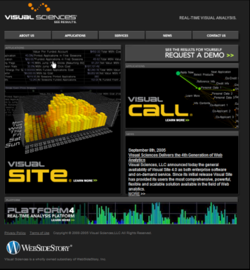

# 実験の検証{#validating-the-experiment}

実験を導入した後は、実験が正しく機能していることを検証する必要があります。

[ExpCookieURL パラメーターの変更（オプション）](../../home/c-undst-ctrld-exp/t-en-ctrld-exp/c-mod-expckurl-prm.md#concept-215bf86bab4e4ec0b0cc803ec48a8fcf) で説明したように、[!DNL Sensor] 設定ファイルの ExpCookieURL パラメーターで指定されたページを使用して、特定の実験グループに自分を配置できます。

デフォルトの仮想ページは [!DNL /setcookie.htm] ですが、ExpCookieURL パラメーターに設定した値を使用する必要があります。

## テストページのリクエスト {#section-8aed3b48d47f4e6c8869c0216f8781b1}

Web サイトに対して特定の実験グループをテストするには、ブラウザーが cookie を受け入れるように設定されている必要があり、この Web サイトに対して cookie を設定していない必要があります。

新しいグループをテストする際は、必ずその Web サイトの Cookie を消去してください。

特定の実験内の特定のグループに自分を配置するには、次の形式のクエリ文字列を使用してテストページをリクエストします。

[!DNL https://] *&lt; [!DNL sitename/?Experiment Name=Group Name]>*

次に例を示します。

[!DNL https://www.omniture.com/setcookie.htm?New_Homepage=index2]

仮想 URL リクエストがサーバーに送信されると、[!DNL Sensor] は、指定した実験内で指定したグループのメンバーであることを特定し、Web サイトのルートにリダイレクトします。 これで、Web サイト上の適切な場所に移動して、その実験やグループに対して正しいコンテンツが表示されているかどうかを検証できます。

ブラウザーに次のように入力すると、ブラウザーに Web サイトのホームページが表示され、New_Homepage 実験内の index2 グループに配置されます。

[!DNL https://www.omniture.com/setcookie.htm?New_Homepage=index2]

index2 グループの訪問者がホームページをリクエストすると、次の図のように、「Request a Demo」グラフィック・リンクがページの上部に表示されます。

