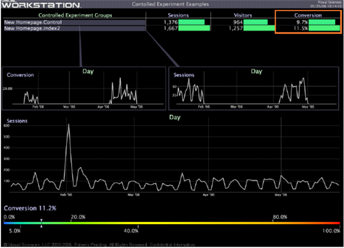

# 実験の評価{#evaluating-the-experiment}

実験に参加した訪問者の数を最小限に抑えるまで実験を実行した後は、実験の結果を評価するのに十分な統計的信頼性を確保できます。

[!DNL Insight]を使用して、仮説の一部として定義した指標または主要なパフォーマンス指標を比較し、実験が成功したかどうかを判断します（つまり、仮説は指定した信頼性で検証されました）。

この例の実験では、訪問者コンバージョンが少なくとも1.5%増加する場合、仮説が正しいことが実証されています。これは、前に定義した達成基準です。

次のワークスペースの例は、index2テストグループのコンバージョンが、コントロール母集団のコンバージョンよりも実際に1.8%高かったことを示しています。

* [実験結果の要約](../../../home/c-undst-ctrld-exp/c-vw-rslts/c-ev-exp.md#section-24a496c080a04e929764094acb00bab7)
* [結果に基づく行動の実行](../../../home/c-undst-ctrld-exp/c-vw-rslts/c-ev-exp.md#section-1623e26ced524fd9beab48ac1f9165d9)
* [アクションの監視](../../../home/c-undst-ctrld-exp/c-vw-rslts/c-ev-exp.md#section-1954311950c34637800cbd7c0711983f)

## 実験結果の要約{#section-24a496c080a04e929764094acb00bab7}

[!DNL Insight]を使用して、詳細なレポートを作成し、実験の結果を要約して説明できます。

次の例に示すように、レポートを使用して、レポートに提供した視覚的情報に基づいて結果に基づいてレコメンデーションをおこなうことができます。

## 結果に基づくアクションの実行{#section-1623e26ced524fd9beab48ac1f9165d9}

結果が明確になったら、テスト対象のページに実稼動レベルの変更を加え、同じ変更をWebサイトの他の領域に適用し、テスト、結果および加えた変更を完全に文書化して、それらの結果に対処する準備が整います。

## アクションの監視{#section-1954311950c34637800cbd7c0711983f}

対照実験が完了し、適切な変更が実装されたら、必ず検証指標の表示、コントロールグラフの作成、ダッシュボード指標の提供など、によっておこなわれた変更を監視し続けます。

テストおよび加えた変更が元の結果に影響しないと考える場合は、必ず仮説を再テストする準備をしてください。
