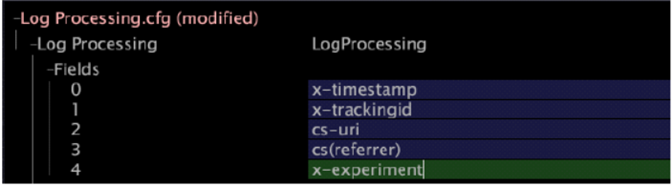

# Log Processing.cfg の変更{#modifying-log-processing-cfg}

拡張ディメンションの作成に使用するLog Processing.cfgファイルにx-experimentフィールドを追加する必要があります。

[Transformation.cfgの変更](../../../home/c-undst-ctrld-exp/c-vw-rslts/t-mod-trfmtn.md#task-d61b02853a82492c9a76e3c5fe8a3fb6)を参照してください。

**Log Processing.cfgを変更するには**

1. [!DNL Insight]で、ワークスペース内で右クリックして&#x200B;**[!UICONTROL Admin]** / **[!UICONTROL Profile Manager]**&#x200B;をクリックするか、[!DNL Admin]タブでプロファイル管理ワークスペースを開いて、[!DNL Profile Manager]を開きます。
1. [!DNL Profile Manager]で&#x200B;**[!UICONTROL Dataset]**&#x200B;をクリックして、内容を表示します。
1. [!DNL Log Processing.cfg]の横のチェックマークを右クリックし、**[!UICONTROL Make Local]**&#x200B;をクリックします。 このファイル用のチェックマークが [!DNL User] 列に表示されます。
1. 新しく作成されたチェックマークを右クリックし、**[!UICONTROL Open]** / **[!UICONTROL in Insight]**&#x200B;をクリックします。 [!DNL Log Processing.cfg]ウィンドウが表示されます。
1. **[!UICONTROL Fields]** をクリックしてその内容を表示します。
1. 現在のリストの最後のフィールドを右クリックし、**[!UICONTROL Add new]** > **[!UICONTROL Field]**&#x200B;をクリックします。
1. 次の例に示すように、新しく作成したフィールドに「 x-experiment 」と入力します。

   

1. ウィンドウ上部の&#x200B;**[!UICONTROL (modified)]**&#x200B;を右クリックし、「**[!UICONTROL Save]**」をクリックします。
1. [!DNL Profile Manager]で、[!DNL User]列の[!DNL Log Processing.cfg]のチェックマークを右クリックし、**[!UICONTROL Save to]** / *&lt;**[!UICONTROL profile name]***&#x200B;をクリックして、作業プロファイルに対してローカルに加えた変更を保存します。

   >[!NOTE]
   >
   >データセットの再処理は直ちに開始されます。

   ログ処理とフィールドについて詳しくは、『*データセット設定ガイド*』を参照してください。
