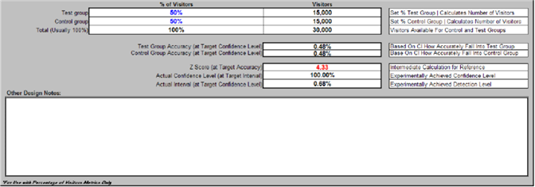

# テストデザインスプレッドシート{#experiment-design-spreadsheet}

このファイルは、ワークシートとしてだけでなく、テストに関する意思決定の記録としても機能します。

テストの設計に役立つ情報が必要な場合は、アドビが提供するテスト設計スプレッドシート（VS Controlled Experient Design.xlsという名前のデフォルト）を使用できます。

テストデザインのスプレッドシートは、該当する指標が訪問者の割合として定義されていて、ある条件を満たす場合にのみ、有用な統計的推測を提供できます。 つまり、訪問者ベースの指標の仮説をテストする場合にのみ役立ちます。

**テスト設計ファイルを使用してテストを設計するには**

1. Webまたはアプリケーションサーバーに管理者がアクセスできる場合は、Webクラスター内の任 [!DNL Sensor] 意のマシン上のインスト [!DNL Sensor] ールフォルダーに移動します。 管理者アクセス権がない場合は、アドビのアカウントマネージャーに問い合わせて、ファイルをリクエストしてください。
1. VS Controlled Experient Design.xlsファイルを開きます。 （必要に応じて、このファイルの名前を変更できます）。

   次のページのスプレッドシートは、このガイド全体で使用される例の仮説をテストする際に、どのようにしてスプレッドシートを完成させるかを示す例です。

   

   

   

1. 次の表で説明する、このファイル内のすべてのフィールドのテキストまたは値を青で入力します。 計算フィールドは、2つ目の表で定義されます。

<table id="table_C343F7A4BF3D4E0E9A5E9739EC7C2E10"> 
 <thead> 
  <tr> 
   <th colname="col1" class="entry"> このフィールドで… </th> 
   <th colname="col2" class="entry">     </th> 
  </tr> 
 </thead>
 <tbody> 
  <tr> 
   <td colname="col1"> テストタイトル </td> 
   <td colname="col2"> テストを説明する名前。 </td> 
  </tr> 
  <tr> 
   <td colname="col1"> テストの説明 </td> 
   <td colname="col2"> 実験の説明。 </td> 
  </tr> 
  <tr> 
   <td colname="col1"> 調査中の指標 </td> 
   <td colname="col2"> 
テストの基になる指標の名前。 
 
例：訪問者コンバージョン 
 </td> 
  </tr> 
  <tr> 
   <td colname="col1"> 指標の定義 </td> 
   <td colname="col2"> 
テストの基となる指標の定義。 
 
形式：訪問者[X]/訪問者数 
 
例：  Visitors[URI='conversionpage.asp']/Visitors
 </td> 
  </tr> 
  <tr> 
   <td colname="col1"> 意図された開始時間 </td> 
   <td colname="col2"> テストを開始する日時。 </td> 
  </tr> 
  <tr> 
   <td colname="col1"> 意図された終了時間 </td> 
   <td colname="col2"> テストを終了する日時。 </td> 
  </tr> 
  <tr> 
   <td colname="col1"> 該当する選択 </td> 
   <td colname="col2"> （オプション）データセットをさらにセグメント化するディメンション名と要素セットまたは範囲。 </td> 
  </tr> 
  <tr> 
   <td colname="col1"> テストURI </td> 
   <td colname="col2"> 仮説に含まれるURI。 コントロールグループの現在のURIと、テストグループ用に作成または作成する代替URIを定義します。 </td> 
  </tr> 
  <tr> 
   <td colname="col1"> アプリの選択に対する期待される指標 </td> 
   <td colname="col2"> Webサイトに対して予想される指標値の見出し。 </td> 
  </tr> 
  <tr> 
   <td colname="col1"> 日別平均訪問者数 </td> 
   <td colname="col2"> Webサイトへの1日あたりの平均訪問者数。 </td> 
  </tr> 
  <tr> 
   <td colname="col1"> 訪問者コンバージョン </td> 
   <td colname="col2"> Webサイトの平均訪問者コンバージョン率。 </td> 
  </tr> 
  <tr> 
   <td colname="col1"> テスト・グループの指標名が…であるかどうかを判断する </td> 
   <td colname="col2"> 指標値の比較方法を示す見出し。 </td> 
  </tr> 
  <tr> 
   <td colname="col1"> コントロールグループの値より大きい </td> 
   <td colname="col2"> テスト中にテストグループの指標が増加したと結論付けるには、このフィールドをTrueに設定します。 結論を導くために必要な訪問者数を減らすには、このフィールドをFalseに設定します。 Trueに設定することをお勧めします。 </td> 
  </tr> 
  <tr> 
   <td colname="col1"> コントロールグループの値より小さい </td> 
   <td colname="col2"> テスト中にテストグループの指標が減少したと結論付けるには、このフィールドをTrueに設定します。 Trueに設定することをお勧めします。 </td> 
  </tr> 
  <tr> 
   <td colname="col1"> 最低（検出レベル） </td> 
   <td colname="col2"> テストグループの指標を、コントロールグループの指標よりも高いまたは低くする割合。 </td> 
  </tr> 
  <tr> 
   <td colname="col1"> 少なくとも </td> 
   <td colname="col2"> テストグループ値に必要な信頼性レベル。 信頼性レベルは、指定された期待値が真である確率を測定する偽陽性の数を決定します。 </td> 
  </tr> 
  <tr> 
   <td colname="col1"> のパワーレベル </td> 
   <td colname="col2"> テストグループ値に必要な電力レベル。 電力レベルは、偽陰性の数を決定します。 </td> 
  </tr> 
  <tr> 
   <td colname="col1"> 訪問者の割合 </td> 
   <td colname="col2"> 訪問者の値の割合の見出し。 </td> 
  </tr> 
  <tr> 
   <td colname="col1"> テストグループ </td> 
   <td colname="col2"> テストグループに含める訪問者の割合。 この数値は、「訪問者」セクションの「合計（通常100%）」フィールドの値が、「最小訪問者数が必要(Test+Control Groups)」フィールドの値以上になるまで再生できます。これらの値は、次の表で説明します。 </td> 
  </tr> 
  <tr> 
   <td colname="col1"> コントロールグループ </td> 
   <td colname="col2"> 制御グループに含める訪問者の割合。 </td> 
  </tr> 
  <tr> 
   <td colname="col1"> その他のデザインノート </td> 
   <td colname="col2"> 今後の参照用に保存するメモ。 </td> 
  </tr> 
 </tbody> 
</table>

残りのフィールドは、入力した値に基づいて計算され、次の表で説明します。

| フィールド | 説明 |
|---|---|
| アプリの選択に対する期待される指標 | Webサイトに対して予想される指標値の見出し。 |
| 期間ごとの予想訪問者数 | このフィールドは、通常、スプレッドシートによって自動的に計算されます。 ほとんどの日に、Webサイトが再訪問者よりも多くの新規訪問者を受け取ることを前提としています。 そうでない場合、このセルの計算は、テスト中に予想された実際の訪問者数で上書きされます。 |
| タイプIエラーの計算されたZスコア | 偽陽性の結果のZスコア。 これは中間的な統計計算です。 |
| タイプIIエラーの計算されたZスコア | 偽陰性の結果のZスコア。 これは中間的な統計計算です。 |
| 必要な最小訪問者数（テスト+コントロールグループ） | 指定した信頼性レベル、電力レベルおよびZスコアを満たすためにテストに必要な最小訪問者数。「期間別の予想訪問者数」フィールドの値に対する割合として表されます。 |
| 必要な最小訪問者数（テスト+コントロールグループ） | 指定した信頼性レベル、電力レベルおよびZスコアを満たすために、テストに必要な最小訪問者数。 この値は、「訪問者」セクションの「合計（通常100%）」フィールドの値以下にする必要があります。 |
| テストの最小時間（日） | 指定した信頼性レベル、電力レベルおよびZスコアを満たすためにテストを実行する必要がある最小日数。 この計算された数は、「期間別の予想訪問者数」フィールドで説明したのと同じ問題に従う必要があります。 再訪問者が多数いるWebサイトの場合、「最小実験時間（日数）」フィールドは、「最小訪問者数が必要」フィールドの値と等しい数の個別訪問者を表示するのに必要な予想日数です。 |
| 訪問者 | 訪問者の値の見出し。 |
| テストグループ | テストグループで必要な訪問者数。 |
| コントロールグループ | コントロールグループで必要な訪問者の数。 |
| 合計（通常100%） | テストに必要な訪問者の合計数。 この値は、「最小訪問者数が必要（テスト+コントロールグループ）」フィールドの値以上である必要があります。 |
| テストグループの精度（ターゲットの信頼性レベル） | テストグループに対して計算された指標の測定値が、その真の値のこの割合内に収まる可能性が、指定した信頼性レベルと等しいことを示す割合。 |
| コントロールグループの精度（ターゲットの信頼性レベル） | 制御グループに対して計算された指標の測定値が、その真の値のこの割合の範囲内にあるという、指定した信頼性レベルと等しい可能性があることを示す割合。 |
| Zスコア（ターゲットの精度） | 特定の値の標準偏差の数が、テストの平均値からの値です。 |
| 実際の信頼性レベル（ターゲット間隔） | 実験で得られた信頼水準。 信頼水準は、指定された期待値が真となる確率を測定します。 |
| 実際の間隔（ターゲットの信頼性レベル） | テストで達成される信頼区間。不明な母集団パラメーターを含むと思われる値の推定範囲を提供します。 この範囲は、指定されたサンプルデータのセットから計算されます。 |

[最小訪問者数が必要] （[テスト+コントロールグループ]）フィールドの値を確認する必要があります。..

列の合計フィールドの値と比較し [!DNL Visitors] ます。

テストが統計的に有効な場合は、「合計（通常100%）」フィールドの値が「最小訪問者数が必要（テスト+コントロールグループ）」フィールドの値と等しいか、それ以上である必要があります。

入力値が表示されると、このワークシートの例で示すように、10,475人の訪問者が入力された95%の信頼性率（この数値を増やすことはできますが、対照実験で推奨される最小信頼性）を達成するために、この実験に参加する必要があります。 現在設計されているテストには、30,000人の訪問者が含まれており、これは必要な最低訪問者数を大きく上回っています。

日数を同じに保つと、合計訪問者数が引き続き必要な最小値を満たすか、それを超える限り、信頼性レベルを高めることができます。

1. レコード用のファイルを保存し、ファイルの情報を使用して、テスト設定スプレッドシートを使用してテストを設定します。 このスプレッドシートの詳細については、「テストの [設定と展開」を参照してください](../../home/c-undst-ctrld-exp/t-crt-ctrld-exp/c-cnfg-dply-exp.md#concept-50f1de0242904698937bb72b3ea1b429)。
