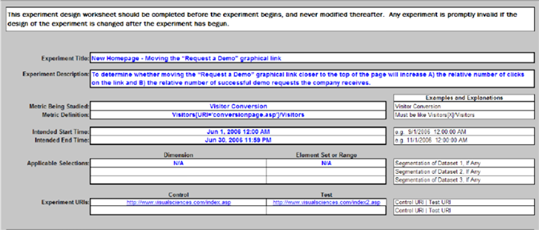

# 実験設計スプレッドシート{#experiment-design-spreadsheet}

{{eol}}

このファイルは、ワークシートとしてだけでなく、実験に関する決定の記録としても機能します。

実験の設計に役立つ場合は、Adobeが提供する実験設計スプレッドシート（デフォルトでは VS Controlled Experiment Design.xls という名前）を使用できます。

実験設計スプレッドシートは、該当する指標が、ある条件を満たす訪問者の割合として定義されている場合にのみ、有用な統計的推測を提供できます。 つまり、訪問者ベースの指標の仮説をテストする場合にのみ役立ちます。

**実験設計ファイルを使用して実験を設計するには**

1. Web またはアプリケーションサーバーへの管理者アクセス権がある場合は、 [!DNL Sensor] 任意の [!DNL Sensor] マシンを web クラスター内に配置します。 管理者アクセス権がない場合は、担当のAdobeアカウントマネージャーに連絡してファイルをリクエストしてください。
1. VS Controlled Experiment Design.xls ファイルを開きます。 （必要に応じて、このファイルの名前を変更できます）。

   次のページのスプレッドシートは、このガイドで使用する仮説の例をテストする準備をする際に、スプレッドシートを完了する方法の例です。

   

   

   

1. 次の表に示すように、このファイルのすべてのフィールドのテキストまたは値を青で入力します。 2 番目のテーブルで計算フィールドが定義されます。

<table id="table_C343F7A4BF3D4E0E9A5E9739EC7C2E10"> 
 <thead> 
  <tr> 
   <th colname="col1" class="entry"> このフィールドでは… </th> 
   <th colname="col2" class="entry">   </th> 
  </tr> 
 </thead>
 <tbody> 
  <tr> 
   <td colname="col1"> 実験タイトル </td> 
   <td colname="col2"> 実験のわかりやすい名前。 </td> 
  </tr> 
  <tr> 
   <td colname="col1"> 実験の説明 </td> 
   <td colname="col2"> 実験の説明。 </td> 
  </tr> 
  <tr> 
   <td colname="col1"> 調査中の指標 </td> 
   <td colname="col2"> 
実験の基となる指標の名前。 
 
例：訪問者コンバージョン 
 </td> 
  </tr> 
  <tr> 
   <td colname="col1"> 指標の定義 </td> 
   <td colname="col2"> 
実験の基となる指標の定義。 
 
形式：訪問者 [X]/訪問者 
 
例：  Visitors[URI='conversionpage.asp']/Visitors
 </td> 
  </tr> 
  <tr> 
   <td colname="col1"> 意図された開始時間 </td> 
   <td colname="col2"> 実験を開始する日時。 </td> 
  </tr> 
  <tr> 
   <td colname="col1"> 意図された終了時間 </td> 
   <td colname="col2"> 実験を終了する日時。 </td> 
  </tr> 
  <tr> 
   <td colname="col1"> 適用可能な選択項目 </td> 
   <td colname="col2"> （オプション）データセットをさらにセグメント化するディメンション名と要素セットまたは範囲。 </td> 
  </tr> 
  <tr> 
   <td colname="col1"> 実験 URI </td> 
   <td colname="col2"> 仮説に含まれる URI。 コントロール母集団の現在の URI と、テストグループ用に作成または作成する代替 URI を定義します。 </td> 
  </tr> 
  <tr> 
   <td colname="col1"> アプリ選択に対して期待される指標 </td> 
   <td colname="col2"> Web サイトに必要な指標値の見出し。 </td> 
  </tr> 
  <tr> 
   <td colname="col1"> 1 日あたりの平均訪問者数 </td> 
   <td colname="col2"> 1 日あたりの Web サイトへの訪問者の平均数。 </td> 
  </tr> 
  <tr> 
   <td colname="col1"> 訪問者コンバージョン </td> 
   <td colname="col2"> Web サイトの平均訪問者コンバージョン率です。 </td> 
  </tr> 
  <tr> 
   <td colname="col1"> Experiment は、テストグループの指標名が…かどうかを判断します。 </td> 
   <td colname="col2"> 指標の値の比較方法を示す見出しです。 </td> 
  </tr> 
  <tr> 
   <td colname="col1"> コントロール母集団の値より大きいか </td> 
   <td colname="col2"> 実験中にテストグループの指標が増加したと結論付けるには、このフィールドを True に設定します。 このフィールドを False に設定すると、結論を出すのに必要な訪問者の数を減らすことができます。 Adobeでは、True に設定することをお勧めします。 </td> 
  </tr> 
  <tr> 
   <td colname="col1"> コントロール母集団の値より小さいか </td> 
   <td colname="col2"> 実験中にテストグループの指標が減少したと結論付けるには、このフィールドを True に設定します。 Adobeでは、True に設定することをお勧めします。 </td> 
  </tr> 
  <tr> 
   <td colname="col1"> 少なくとも（検出レベル） </td> 
   <td colname="col2"> テストグループの指標をコントロールグループの指標より高いまたは低くする割合。 </td> 
  </tr> 
  <tr> 
   <td colname="col1"> 少なくとも </td> 
   <td colname="col2"> テストグループ値の信頼水準。 信頼水準は、指定された期待値が真である確率を測定するための偽陽性の数を決定します。 </td> 
  </tr> 
  <tr> 
   <td colname="col1"> との累乗レベル </td> 
   <td colname="col2"> テストグループ値の必要な電力レベルです。 累乗レベルは、偽陰性の数を決定します。 </td> 
  </tr> 
  <tr> 
   <td colname="col1"> %の訪問者 </td> 
   <td colname="col2"> 訪問者の割合の値の見出し。 </td> 
  </tr> 
  <tr> 
   <td colname="col1"> テストグループ </td> 
   <td colname="col2"> テストグループに含める訪問者の割合。 この数値を使用して再生できます。その後は、「訪問者」セクションの「合計（通常 100%） 」フィールドの値が、「最小訪問者数が必要（テスト+コントロールグループ） 」フィールドの値と等しいかそれ以上になります。 </td> 
  </tr> 
  <tr> 
   <td colname="col1"> コントロール母集団 </td> 
   <td colname="col2"> コントロール母集団に含める訪問者の割合。 </td> 
  </tr> 
  <tr> 
   <td colname="col1"> その他のデザインノート </td> 
   <td colname="col2"> 後で参照できるように保存するメモ。 </td> 
  </tr> 
 </tbody> 
</table>

残りのフィールドは、入力した値に基づいて計算され、次の表で説明します。

| フィールド | 説明 |
|---|---|
| アプリ選択に対して期待される指標 | Web サイトに必要な指標値の見出し。 |
| 期間別予想訪問者数 | このフィールドは、通常、スプレッドシートによって自動的に計算されます。 ほとんどの日に、Web サイトがリターン訪問者よりも多くの新規訪問者を受け取ることを前提としています。 そうでない場合、このセルの計算は、実験中に予想された実際の訪問者数で上書きされます。 |
| タイプ I エラーの計算 Z スコア | 偽陽性の結果の Z スコア。 これは、中間の統計的計算です。 |
| タイプ II エラーの計算 Z スコア | 偽の否定的な結果の Z スコア。 これは、中間の統計的計算です。 |
| 必要な最小訪問者数（テストグループとコントロールグループ） | 指定した信頼水準、電力レベル、Z スコアを満たすために実験で必要な最小訪問者数。「期間あたりの予想訪問者数」フィールドの値の割合で表されます。 |
| 必要な最小訪問者数（テストグループとコントロールグループ） | 指定した信頼水準、電力レベル、Z スコアを満たすために実験で必要な最小訪問者数。 この値は、「訪問者」セクションの「合計（通常 100%） 」フィールドの値以下である必要があります。 |
| 最小実験時間（日数） | 指定した信頼水準、電力レベル、Z スコアを満たすために、実験を実行する必要がある最小日数。 この計算された数には、「期間ごとの予想訪問者数」フィールドで説明したのと同じ問題が含まれます。 Web サイトに再訪問者が多数いる場合、「最小実験時間（日数） 」フィールドは、個別訪問者の数が「最小訪問者数必須」フィールドの値と等しくなるまでにかかる予想日数です。 |
| 訪問者 | 訪問者値の見出し。 |
| テストグループ | テストグループで必要な訪問者の数。 |
| コントロール母集団 | コントロール母集団で必要な訪問者の数。 |
| 合計（通常 100%） | 実験に必要な訪問者の合計数。 この値は、「必要な最小訪問者数（テスト+コントロールグループ） 」フィールドの値以上である必要があります。 |
| テストグループの精度（ターゲットの信頼水準） | テストグループに対して計算された指標の測定値が、真の値のこの割合内にあるという、指定された信頼水準と等しい可能性があることを示す割合。 |
| コントロール母集団の精度（ターゲットの信頼水準） | コントロール母集団に対して計算された指標の測定値が、真の値のこの割合内にあるという、指定された信頼水準と等しい可能性があることを示す割合。 |
| Z スコア（ターゲットの精度で） | 指定された値の標準偏差の数は、テスト平均からのものです。 |
| 実際の信頼水準（ターゲット間隔） | 実験で達成された信頼水準。 信頼水準は、指定された期待値が真である確率を測定します。 |
| 実際の間隔（ターゲットの信頼水準） | 実験で達成された信頼区間。不明な母集団パラメーターを含むと考えられる値の推定範囲を提供します。 この範囲は、指定されたサンプルデータセットから計算されます。 |

必要な最小訪問者数（テストグループとコントロールグループ）フィールドの値を確認する必要があります。..

を比較し、 [!DNL Visitors] 列。

実験が統計的に有効であるためには、「合計（通常 100%） 」フィールドの値が「最小訪問者数が必要（テスト+コントロールグループ） 」フィールドの値と等しいかそれ以上である必要があります。

入力値の例を見ると、ワークシートの例で示すように、10,475 人の訪問者が、入力された 95%の信頼率（この数値を増やすことができますが、対照実験に対して推奨される最低信頼性）を達成するために、この実験に参加する必要があります。 現在設計されている実験には、30,000 人の訪問者が含まれます。これは、必要な最小訪問者数を大きく上回ります。

日数を同じにしておくと、訪問者の合計数が必要な最小値を超えるか、それを超える限り、信頼水準を高めることができます。

1. レコードのファイルを保存し、ファイルの情報を使用して、実験設定スプレッドシートを使用して実験を設定します。 このスプレッドシートについて詳しくは、 [実験の設定とデプロイ](../../home/c-undst-ctrld-exp/t-crt-ctrld-exp/c-cnfg-dply-exp.md#concept-50f1de0242904698937bb72b3ea1b429).
