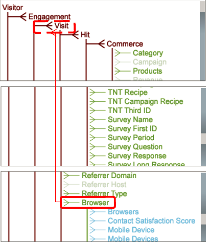

# スキーマデザイン可算構造{#schema-design-countable-structures}

スキーマの設計と実装に関するData Workbench(DWB)の可算に関する説明。

## Data Workbenchでの可算について {#section-6e6b8d1c17634d669e62c91a80a0bc62}

最上位のレベルには可算ディメンションがあります。 可算ディメンションは2つの主要な機能を果たします。 まず、要素をカウントするディメンションを指定します。 つまり、可算は次のような質問に答えます。

* ホームページを訪問した訪問者は何人か。

* Google.comからの訪問回数はいくつか。

`<discoiqbr>`一般に、可算ディメンションは合計の指標を作成するときに使用します。作成した指標からは、そのディメンションのすべてのエレメントの数（合計）が得られます。可算ディメンションを定義することで、予約数、商品の注文件数など、事例の数をカウントすることができます。例えば、カウント可能なエレメント（オンラインストアでの注文に対応するログエントリ）を持つ可算ディメンション注文を定義できます。 ビジュアライゼーション内の注文件数を表示する場合は、注文件数の合計指標を定義します。この指標は、ディメンションに対して評価することも、ディメンションにフィルターを適用することもできます。

可算ディメンションは他のディメンションの親または他の可算ディメンションの子にすることができます。

ルートの可算ディメンションをデータ内の追跡IDと関連付ける必要はありませんが、データセットのルートの可算ディメンションで、追跡IDフィールド(x-trackingid)をキーとして使用するように設定することをお勧めします。 そうすることで、ルート可算の各エレメントが x-trackingid の一意の値に関連付けられ、各エレメントに関するすべてのデータがグループ化されます。

可算ディメンションは、以下のパラメーターによって定義します。

<table id="table_5E00B72CFDD645368ADCC25AB9B5E53D"> 
 <thead> 
  <tr> 
   <th colname="col1" class="entry"> パラメーター </th> 
   <th colname="col2" class="entry"> 説明 </th> 
   <th colname="col3" class="entry"> デフォルト </th> 
  </tr>
 </thead>
 <tbody> 
  <tr> 
   <td colname="col1"> 名前 </td> 
   <td colname="col2"> Data Workbench のユーザーが見てわかりやすいディメンションの名前。ディメンション名にハイフン（-）を含めることはできません。 </td> 
   <td colname="col3"> </td> 
  </tr> 
  <tr> 
   <td colname="col1"> 
Comments 
 </td> 
   <td colname="col2"> 
(オプション)拡張ディメンションについてのメモ。

    &lt;/p> &lt;/td>
<td colname="col3"> </td> 
  </tr> 
  <tr> 
   <td colname="col1"> 
Condition 
 </td> 
   <td colname="col2"> 
入力フィールドが可算ディメンションの作成に寄与する条件。ディメンションという切り口から見えるログエントリとその（データセットスキーマにおける）すべての子の集合が、指定された条件によって制限されます。 
 </td> 
   <td colname="col3"> </td> 
  </tr> 
  <tr> 
   <td colname="col1"> Hidden </td> 
   <td colname="col2"> Data Workbench のインターフェイスにディメンションを表示するかどうかを指定します。デフォルトでは false に設定されています。例えば、指標の基準としてのみ使用されるディメンションであれば、このパラメーターを true に設定して、Data Workbench に表示されないようにすることができます。 </td> 
   <td colname="col3"> false </td> 
  </tr> 
  <tr> 
   <td colname="col1"> キー </td> 
   <td colname="col2"> 
(オプション)キーとして使用するフィールドの名前。このパラメーターを定義した場合、可算ディメンションのエレメントは、その親のエレメントと、キーとして指定したフィールドの個別の値との組み合わせごとに存在することになります。 
 
可算ディメンションの各エレメントは、連続性を持ったログエントリの集合に関連付けられている必要があります。そのため、ログエントリがキーごとに並んでいなかった場合、キーフィールドが変化するたびに、可算ディメンションのエレメントが作成されます。そのような状況を回避するために、時系列に連続した一意のキーを使用することをお勧めします。 
 </td> 
   <td colname="col3"> </td> 
  </tr> 
  <tr> 
   <td colname="col1"> Parent </td> 
   <td colname="col2"> 
 親ディメンションの名前。すべての可算ディメンションは、親ディメンションになることができます。特定のディメンションをデータセットのスキーマにおける最上位のディメンションとするには、このパラメーターを「root」に設定します。定義済みのディメンションは、データセットのルート可算ディメンションになります。例えば、Site を使用している場合、Visitor ディメンションがデータセットのルート可算ディメンションとなります。 
 
注意：ルート可算ディメンションは、必ずしもデータ内の追跡 ID に関連付けられている必要はありません。ただし、データセットのルート可算ディメンションを設定するときに、そのキーとして追跡 ID フィールド（x-trackingid）を使用することをお勧めします。そうすることで、ルート可算の各エレメントが x-trackingid の一意の値に関連付けられ、各エレメントに関するすべてのデータがグループ化されます。別の方法でデータセットを設定したい場合は、アドビにお問い合わせください。 
 </td> 
   <td colname="col3"> </td> 
  </tr> 
 </tbody> 
</table>

次の例は、Web サイトトラフィックから収集されたイベントデータを使用する可算ディメンションの定義です。この可算ディメンションは、特定のセッション内の Web キャンペーンイベントをカウントします。Web サーバーに対するすべての電子メールキャンペーンリソース要求が、「email=」を含んだ cs-uri-query で行われることを前提としています。この例で関心の対象となるのは、特定のセッション期間中、電子メールキャンペーンに対して訪問者が反応を示した回数であって、cs-uri-query(email) フィールドの実際の値ではありません。

可算の2つ目の主な機能は、可算がデータセットスキーマ構造のバックボーンを形成することです。 データスキーマおよびその他すべてのディメンションは、グループ化され、可算に属するように編成されます。 言い換えると、次元を「カテゴリ」と考えると、可算はこれらの「カテゴリ」をグループに編成する方法です。
1つの可算ディメンションの下にグループ化されたディメンションは、可算ディメンションの「レベル」にあると見なされます。 例えば、下の図では、「電子メールアドレス」が訪問者レベル、「ブラウザー」が訪問レベルであることがわかります。 「親」と「子」は、可算とその下にグループ化されたディメンションとの関係を指します。 例えば、訪問者は電子メールアドレスの「親」です。 逆に、電子メールアドレスは訪問者の「子」です。  

## Data Workbenchでの可算の作成 {#section-491f3e8e4fbc429e95d6c97f012a208e}

次の手順を実行して、Data Workbenchで可算を作成します。

1. プロファイルマネージャーを開く
1. Transformationフォルダーの下で設定ファイルを作成し、ワークステーションで開きます。
1. 「拡張ディメンション」で右クリックし、追加次のように「新規」>「可算」を選択します。 

1. 新しい可算の名前を入力します。 次の例では、Customer Countableが定義されています。 これが可算レベルの最上位レベルの場合は、親の書き込みルートに入ります。 

   可算がトップレベル1でない場合は、親フィールドに親可算の名前を入力します。 以下の例では、エンゲージメント可算が作成され、この可算の親が顧客です。 

スキーマデザイン、可算構造、オフラインデータフィード設定のData Workbenchのアーキテクチャについて詳しくは、「 [データセットスキーマインターフェイス](https://docs.adobe.com/content/help/en/data-workbench/using/client/admin-ui/c-dtst-sch-intrf.html)」を参照してください。
