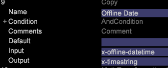

# イベント時間の設定{#setting-up-event-time}

この節では、Data Workbenchデータセットのタイムスタンプを作成する方法について説明します。

## イベント時間について {#section-e10ef2b5b6244dc5b215836e3c77d663}

Event Timeは、リクエスト（またはイベント）が発生した日時です。

通常、オンラインデータの場 *合、x_hit_time_gmtがタイムスタンプフィールドとして* 使用されます。 呼び出しの時刻は、オフラインデータ（コールセンターデータなど）のタイムスタンプとして使用できます。 これは必須フィールドで、すべてのデータソースに、タイムスタンプとして使用できる1つのフィールドが含まれている必要があります。 この情報は、組織から提供されます。

DWBでは、次の事前定義された変数がタイムスタンプを取り込みます。

<table id="table_C24BD56CEB4E42F68D645EBB65585D16"> 
 <tbody> 
  <tr> 
   <td colname="col1"><i>x-timestamp</i> </td> 
   <td colname="col2"> 
 リクエストがサーバーによって受信された日付と時刻（GMT）。時刻は、1600 年 1 月 1 日からの 100 ナノ秒数で表されます。 
 
Example: 127710989320000000 would be the <i>x-timestamp</i> value for 11:28:52.0000000 on Tuesday,September 13, 2005. 
 </td> 
  </tr> 
  <tr> 
   <td colname="col1"><i>x-timestring</i> </td> 
   <td colname="col2"> <i>YYYY-MM-DD HH:MM:SS.mmm 形式の x-timestamp。</i> </td> 
  </tr> 
  <tr> 
   <td colname="col1"><i>x-unixtime</i> </td> 
   <td colname="col2"> <i>x-unixtimeは</i> 、1970年1月1日0時1分からの秒数を表すエポック時間です。 </td> 
  </tr> 
 </tbody> 
</table>

日付フィールドの形式に基づいて、x-timestamp、x-unixtimeまたはx-timestringが使用されます。 例えば、受信データの形式がYYYY-MM-DDの場合、x-timestringが使用されます。

タイムスタンプはいずれかの形式で定義され、DWBは他の2つの形式を内部的に生成します。 また、これらは事前定義されたDWBフィールドで、他のフィールドに同じ名前を使用しないでください。

## DWBで定義されたタイムゾーン {#section-3cdd12254342442b917376661e1d9c9f}

日付フィールドに以下のタイムゾーンのいずれかが含まれている場合、DWBはそのタイムゾーンの行全体を考慮します。 例えば、あるファイルの日付が2015-01-01 00:00:00 gmtと定義され、別のファイルの値が2015-01-01 00:00:00 cstである場合、最初のファイルの日付はGMTで、2番目のファイルの日付はGMTで考慮されますCSTタイムゾーン。

| コード | タイムゾーン |
|---|---|
| gmt | グリニッジ標準時 |
| est | 東部標準時 |
| edt | 東部夏時間 |
| cst | 中部標準時 |
| cdt | 中部夏時間 |
| mst | 山岳部標準時 |
| mdt | 山地夏時間 |
| pst | 太平洋標準時 |
| pdt | 太平洋夏時間 |

>[!NOTE]
>
>DWBは、上記のタイムゾーンのみを処理します。

## カスタムタイムゾーンの設定 {#section-7c351921f22b439b81c73f40d5b47536}

DWBは、タイムゾーンのオフセットを処理しません。 タイムゾーンのオフセットを考慮するには、データをそのオフセットタイムゾーンでフォーマットする必要があります。

例：cstタイムゾーンの日付形式を考慮するには、クライアントからのデータの形式をYYYY-MM-DD HH:MM:SS UTC +/-HHMMにします。

2015-10-18 05:00:00 UTC -0200

## イベント時間/タイムスタンプの設定方法 {#section-81507080f0b44ae6b83d3650ba019812}

日付フィールドの形式に基づいて、 *x-timestamp、x-unixtime* 、または ** x-timestring変数が使用されます。 次の例では、 *x-hit_time_gmtはUNIXのepoc形式なので* 、 *x-unixtime* が使用されます。

DWBファイル(ま [!DNL foundation.cfg] たはDatasetログ処理フォルダーの下にあるその他の設定ファイル)で、Copy変換を使用して、次に示すようにイベント時間を設定します。

日付フィールドの形式に基づいて、x-timestamp、x-unixtimeまたはx-timestring変数が使用されます。 次の例では、x-hit_time_gmtがUNIXのepoc形式なので、x-unixtimeが使用されます。

Insight foundation.cfg（または、Datasethaログ処理フォルダーの他の設定）で、Copy変換を使用して、次のようにイベント時間を設定します。 

の日付がYYYY-MM-DD HH:MM:SS.mmm形式の場合、x-timestringが使用されます。 例：日付フィールドがDWBで定義されている形式（YYYY/MM/DDなど）以外の場合は、まずDWBが受け入れるタイムスタンプ形式の1つで形式設定し、対応する変数に割り当てます。 下のスクリーンショットでは、日付が最初にYYYY-MM-DD形式に変換され、次に*x-timestring *variableに割り当てられています。 

