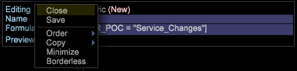

# 指標の設定{#metrics-setup}

この節では、Data Workbenchで指標を作成する方法について説明します。

## 指標について {#section-f0412e851fcb4ac9886dca4003d42cec}

指標は、表示回数、注文件数、実行された呼び出し数、売上高など、顧客の行動に関する量的な情報です。 指標はレポートの基盤であり、データの関係性を確認して把握する助けになります。

指標ディメンションを使用すると、指標の数を特定のレベルでグループ化できます。 また、指標の数を特定のレベル別にグループ化することもできます。

## 新しい指標の作成 {#section-60a413899d1b4707965e06fb5ef7fc4e}

新しい指標を作成するには、次の手順に従います。

1. ツール/ **指標エデ** ィターをクリックしま ****&#x200B;す。

1. 指標エディターで、新しい指標の名前と数式を入力します。 

1. Metricsフォルダーに保存します。 

## 派生指標の作成と編集 {#section-ebdcd3ec652f485e90e001d694eab6d0}

Use a Metric Editor to define a new metric by name, formula, and format, which is saved to the [!DNL User\profile_name\Metrics] folder for later use.

1. **管理者／プロファイル**&#x200B;メニューオプションを使用するか、指標を作成するフォルダーの User 列を右クリックし、**作成／新しい指標**&#x200B;をクリックして、新しい指標エディターを開きます。指標エディターが表示されます。

1. In the *Name* parameter, type a name for the new metric.

   >[!NOTE]
   >
   >スペース（ ）は使用できますが、アンダースコア（_）は使用できません。また、以下の記号は使用できません。 + - * /

   

1. In the *Formula* parameter, type an expression for the new metric.

   >[!NOTE]
   フィルターは角括弧で囲む必要があります [ ] を式の中で使用します。 追加の指標式の構文ルールについては、指標式の構 [文を参照してください。](https://docs.adobe.com/content/help/en/data-workbench/using/client/qry-lang-syntx/c-syntx-mtrc-exp.html)

   This table provides sample expressions for extended metrics. 

   >[!NOTE]
   適切な式を入力すると、プレビュー行に新しい指標の値が表示されます。 式にエラーがある場合は、プレビュー行にエラーメッセージが表示されます。

1. 右クリックし、「保存」を選 **択します**。 When you save the metric, a file representing the new metric is created on your computer in the DWB *Installation directory \User\profile name\Metrics* folder.

## 既存の派生指標の編集 {#section-4b5b7baf885b45cc8b358d1bd774e925}

1. プロファイルマネージャーまたは 指標マネージャーの profile name 列で、編集する指標ファイルのチェックマークを右クリックし、「**ローカル化**」をクリックします。
1. Right-click the check mark for the metric file in the User column and click **Open** from the workbench.

   >[!NOTE]
   また、ビジュアライゼーション内の指標関連領域を右クリックして指標エディターを開き、指標メニューを表示することもできます。

1. **指標エディター**&#x200B;で、*新しい派生指標の作成*&#x200B;の手順 2 ～ 4 を使用して、必要に応じて指標定義を編集し、保存します。

   編集した指標をプロファイルのすべてのユーザーが使用できるようにする場合は、プロファイルマネージャーを使用して、作成した指標を作業プロファイルに公開する必要があります。 

詳しくは、ドキュメントを参照してください。

[指標式の構文](https://docs.adobe.com/content/help/en/data-workbench/using/client/qry-lang-syntx/c-syntx-mtrc-exp.html)

[派生指標の作成と編集](https://docs.adobe.com/content/help/en/data-workbench/using/client/admin-ui/profile-mgr/c-drvd-mtrcs.html)
