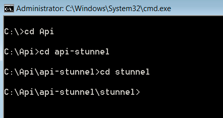

# クエリAPIの設定{#query-api-setup}

クエリAPIの設定に関するクイックガイドです。

クエリAPIを設定するには、次の手順に従います。

1. クエリAPI証明書の取得

   アドビのテクニカルオペレーションチームに電子メールを送信 — `Dataworkbench@adobe.com`.

   クエリAPIに使用するCN名を指定してください(クエリAPIのような汎用名を指定し `<Client>` てください)。

   >[!NOTE]
   >
   >テクニカルオペレーションは証明書を生成し、URLにアップロードします。 チケットの生成が成功した場合は、アドビコンサルタントにテクニカルオペレーションから通知を受け取り、チケットが再度お客様に送信されるように伝えてください。

1. APIスタンネルのダウンロードと抽出を参照してください。 コンサルタントからapi-stunnelファイルを受け取ります。

   Perlがマシンにインストールされていることを確認します。

   抽出したフォルダー（ファイルをコピーするフォルダーパス）で、Query API証明書をstunnelフォルダー内にコ *ピーし* ます。

1. Stunnel.confの設定

   *Stunnel* (証明書をコピーした場所 ** )フォルダー内にstunnel.confというファイルがあるはずです。

   ファイルをメモ帳で編集します。

   

   次のようにパラメータを変更します。 

   このファイルで2つのパラメーターを変更する必要があります。

   * *Cert* =証明書の名前。 この例では、Aadhithya Ramani QAPI Client.pemです。
   * *Connect* =メインDPUのサーバー名。

1. *Query.pmをコピーします*。

   *Query.pmファイルは* 、Insight APIフォルダーで使用できます。

   Query.pm *(* Query.pm)ファイルをコピーして、Perl Libraryフォルダに貼り付けます(通常は*C:\Perl64\lib *ですが、Perlがマシンのどこにインストールされているかを確認してください)。

1. *api-http.plファイルの変更*

   api-http.plファイルは、api-stunnelフォルダーにあります。

   変更するパラメーターは1つだけ

   *My $profile* =クエリAPIを設定するプロファイル名。

1. Query APIをインストールします。

   システムのコマンドプロンプトを「管理者」として開き、次の図のようにスタンネルを展開したディレク *トリに移動* します。 

   Run the following command *.\stunnel -install*. 

   コマンドの実行後、stunnelがインストールされたというメッセージが *ウィンドウ* に表示されます。

   >[!NOTE]
   >
   >コマンドの実行後、stunnelがインストールされたというメッセージが *ウィンドウ* に表示されます。

1. Query APIスタンネルの設定のテスト

   このプロセスの最後の手順は、クエリAPIの設定をテストすることです。 api-stunnelディレクトリのインストールに使用したコマンドプロンプトで、 

   次のコマンド* perl api-http.pl*を使用して、そのフォルダーにあるPerlスクリプトを実行します。 

   スクリプトの実行後、結果は下のスクリーンショットのようになります(結果の日時と値は、Query APIを設定したプロファイル内の時点と他のパラメーター（手順6）に応じて異なります)。 

