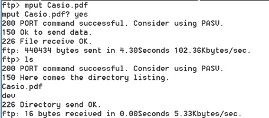

# 内部および外部FTPサーバの検証{#validation-of-internal-and-external-ftp-servers}

内部FTPと外部FTPの設定を検証するために必要な最小限の手順を簡単に説明します。

内部FTPは、アドビ内部のコンサルタント/アーキテクトがファイルのアップロードまたはダウンロードのためにFTPサイトに接続する必要がある場合に使用されます。一方、外部FTPは、主にユーザが必要なデータファイルをアップロードする際に使用します。

FTPサーバーの設定について詳しくは、 [File Transfer Protocolを参照してください](https://docs.adobe.com/content/help/en/analytics/export/ftp-and-sftp/ftp-overview.html)。

## 検証手順 — 外部FTP {#section-24428111b5c542ce81a765cd63424b97}

1. コマンドプロンプトを開きます。 （Windows + Rキーを押し、「cmd」と入力）
1. Type ftp `<ftp server>`
1. ユーザー名とパスワードを入力します。 

1. 一部のファイルを移動できるローカルディレクトリを変更します。 次のコマンドを使用します。

[!DNL ftp> lcd C:\Users\andixit\Desktop]

ローカルディレクトリに移動しま [!DNL C:\Users\andixit\Desktop]した。

1. ローカルからリモートの場所にファイルをコピーします。 

1. リモートサーバーからログアウトします。 （次のコマンドを使用）

[!DNL ftp> bye]

[!DNL 221 Goodbye]

>[!NOTE]
>
>FTPを検証する別の方法は、Filezillaを使用する方法です。 ホスト名、ユーザー名、パスワード、ポートを指定します。 パネルの右側はリモートサイトで、左側はローカルサイトです。 ローカルサイトからリモートサイトへ、およびv.vからFTPドラッグ&amp;ドロップしたファイルを検証するには、次の手順に従います。

## 検証手順 — 内部FTP {#section-b1f7a789ad6848cf9027f7953d81066e}

上記の手順に従って、アドビの任意のサーバーからの内部ftpを検証できます。
