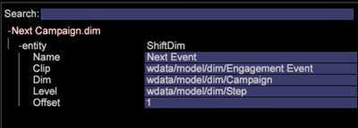

# 派生ディメンションのセットアップ{#derived-dimensions-setup}

{{eol}}

様々なタイプの派生（クライアント側）Dimensionと、それらをData Workbenchで設定する方法。

## 派生Dimensionのタイプ {#section-33e6dcc9ab9745de9b830cecb2427ca3}

**指標のDimension**

指標のDimensionでは、指標のカウントを特定のレベル別にグループ化できます。 また、指標カウントを特定のレベルでグループ化することもできます。 指標Dimensionを作成したら、その指標の値に基づいてデータをセグメント化できます。

例 1:旅行会社ですが、5 回未満の便を予約した顧客と、自分の頻繁なチラシとウェブサイト上での行動活動の違いを理解したいと考えている場合は、どのようにすればよいですか？

予約数を指標としてカウントするだけで、Web サイトでの行動を把握するために、ここでは、指標に基づいて顧客をセグメント化する方法を教えてください。

例 2:あなたは金融銀行で、顧客が投資した CD の数に基づいて顧客をグループ化したいと考えています。 顧客を 3 層にセグメント化したい。 第 1 層 — CD が 10 枚以上、第 2 層 — CD が 5 枚以上、第 1 層が 10 枚未満のお客様 — CD が 0 枚以上、第 3 層が 5 枚未満のお客様

お持ちの情報は、CD 投資の数を示す指標です。分析に対して、疲れた顧客セグメントをどのように作成しますか。

*指標Dimensionの作成 — ワークステーション経由*

OOB 指標ディメンションの 1 つをローカルにマークし、そのディメンションの名前をカスタム名に変更/ RenameDim.example のローカルコピーを作成し、.dim 拡張子を持つ適切なディメンション名に変更します

ワークステーションで新しく作成したディメンションを開き、変更を加えます。 要件に基づいて、指標ディメンションの次のパラメーターを変更します。 

指標 — グループ化する指標

レベル — 指標がグループ化されるレベル

バケット開始 — 指標Dimensionの開始要素。 オフセットに同じ値を入力します。

バケットサイズ — 指標のグループ化サイズ。 同じ値を尺度で入力

バケット数 — ディメンションに表示する要素の最大数

他のユーザーと共有する場合は、新しく作成したディメンションをサーバーに保存します。

**プレフィックスDimension**

プレフィックスディメンションの主な目的は、元のディメンションの要素をグループ化し、グループ化された要素にわかりやすい名前を付けることです。

例えば、小売サイトを所有し、サイトに婦人服、メンズアパレル、玩具、ゲーム、ホームデコールなどの様々なサイトセクションがあり、これらの各サイトセクションに関連付けられているページが複数あるとします。 パス分析を実行し、あるサイトセクションから別のサイトセクションに移動するトラフィックに関するインサイトを取得したい場合。 URI ディメンションを使用する場合は、パスブラウザーまたはプロセスマップの各サイトセクションの各ページを引っ張って、分析を実行する必要があります。

同じ分析は、サイトセクションのページが単一の要素としてグループ化されたプレフィックスディメンションがある場合に簡単に実行できます。

接頭表記Dimension:

ビジュアライゼーションメニューから 2D プロセスマップを開きます。

要件に基づいて、接頭表記寸法の次のパラメータを変更します。

マップの変更Dimension- 2D プロセスマップに使用するDimension( 例：（SMS タイポロジ）

マップレベルの変更Dimension — 上記のディメンションのレベル

マップクリップDimensionを変更 — データを表示する可算レベル。

マップ指標の変更 — 表示する指標です。

2D プロセスマップを設定したら、「マップの変更Dimension」パラメータで指定した寸法を開きます。

グループ化する要素を選択します。 Ctrl + Alt キーを押しながら、要素をプロセスマップにドラッグ&amp;ドロップします。

表示される点を右クリックし、グループ名を変更します。 グループ化する要素を 3 つ選択した場合、デフォルトの名前は「3 選択済み」になります。

ビジュアライゼーションのアウトラインを右クリックし、表示されるメニューからディメンションを保存します。

**Dimension名を変更**

名前のDimensionは、既存のディメンションから作成されます。 ディメンション名の変更の主な目的は、ディメンションの要素にわかりやすい名前を付けることです。 標準の「名前を変更」ディメンションは、URI ディメンションから作成される Page ディメンションです。 URI ディメンションは、ページの技術的な名前を知らない人にとって混乱の原因となる可能性があります。そのため、Page ディメンションで URI ディメンションの要素の名前を変更できます。

カスタムの名前変更DIMENSIONの作成：

「名前を変更」ディメンションの要素には、元のベースディメンションの要素との 1 対 1 のマッピングが含まれます。 これを確認するには、ワークステーション/メモパッドで、名前変更Dimensionの.dim ファイルを開きます。 元の次元の各要素に対して、ファイル内の値（文字列の名前変更）が 1 つだけあることに気がつきます。

名前を変更する要素が少ない場合は、ワークステーションで.dim ファイルを作成し、以下で説明する手順で各要素の名前を変更できます。

RenameDimension用の.dim ファイルを作成する手順 — Workstation の使用

名前を変更する要素の数が少ない場合は、このオプションを使用します。

1. 空のワークスペースを開き、Dimensionマネージャを開きます。 右クリックして、管理者/プロファイル/プロファイルマネージャーを選択します。
1. [ ファイル ] 列の [Dimension] フォルダを展開します。
1. File Column の Page Folder を展開し、Second to Last 列の Page.dim ファイルを右クリックし（通常、この列は Profile Name を表します）、「Make Local」オプションをクリックします。
1. 「User」列の Page.dim を右クリックし、「コピー」オプションをクリックし、コピーした.dim ファイルをDimensionディレクトリの下の目的のフォルダに貼り付けます。
1. エラーメッセージで「 OK 」をクリックします。
1. ここで、2 つの Page.dim ファイルが「Dimension」フォルダーの下に存在することに気が付きます。 1 つはDimension\ページディレクトリの下の元のファイルで、もう 1 つは手順 4 で貼り付けたコピーファイルです。
1. User 列の下に最近貼り付けた Page.dim ファイルを右クリックし、Page.dim と表示される青/グレーの入力ボックスをクリックします。 入力ボックスが緑色に変わり、カーソルが点滅し、変更できることを示します。 作成する名前変更ディメンションの名前を入力します。
1. File Column 内の Page.dim ファイルが、手順 7 で指定した新しいファイル名に変更されます。 User 列（最後の列）の new.dim ファイルを右クリックし、Open/In Workstation を選択します。
1. .dim ファイルがワークステーションで開かれたら、エンティティの横のプラス記号 (+) をクリックし、それを展開します。 「親」フィールドに対して存在する値を観察し、「URI」ディメンションを反映します。 「wdata/model/dim/URI」と表示されます。青/灰色の入力ボックスをクリックして、URI を、要素名を変更するディメンションの名前に変更します。
1. 名前を変更するディメンションがデータセット内に存在することを確認します。 Dimension名では大文字と小文字が区別されるので、元のディメンションの大文字と小文字が区別されます。
1. ディメンション名の横に表示される「変更済み」を確認します。 これは、元の寸法が変更されたことを示します。 手順 9 で行った変更を維持するnew.dim （変更済み）を右クリックし、「名前を付けて保存」オプションをクリックします。
1. 手順 10 ごとにディメンションを保存すると、キャンペーン用に新しく作成した名前変更ディメンションを名前変更用に使用できるようになります。 これは、ローカルでのみ使用できます。
1. 他のユーザーが自分で作成したディメンションを表示するには、自分が作成したディメンションをプロファイルに保存する必要があります。 新しい次元の.dim ファイルを「User」列（最後の列）で右クリックし、次元を保存する「保存先/プロファイル名」をクリックします。
1. ファイルをプロファイルに保存すると、このプロファイルにアクセスできるすべてのワークステーションユーザーは、キャンペーンの名前変更ディメンションを表示できます。

接頭表記と寸法作成ツールの名前変更

Adobeには、接頭辞と名前変更ツールを生成する ExcelDimensionがあります。

次に、ツールを使用して接頭表記/名前変更寸法を生成する手順を示します。

1. Excel ツールを保存する *Adobe_DWB_Dimension_ジェネレーター.xlsm* フォルダー内に保存されます。 Adobeカスタマーケアに連絡して、ツールをダウンロードしてもらってください。
1. ツールを開き、マクロを有効にします。 

1. 使用する値をデータシートに入力します。

   例えば、製品Dimensionに基づいて製品ブランドプレフィックスディメンションを作成します。 データ・シートでは、次の情報が取り込まれます。 

   各製品は、データシートのブランドに割り当てられます。

1. 「設定」タブで、作成するディメンションに関する情報を入力します。 上記のサンプルデータには、次の情報が入力されます。 

   名前：接頭表記/名前変更寸法の名前

   タイプ：プレフィックス/名前変更

   ソース寸法：元のDimension

   一致する列：一致する列

   結果列：新しいディメンションに使用する値。

1. 「 」というタイトルのボタンをクリックします *ここをクリック*. 

1. dim ファイルは、ツールが保存されたフォルダーと同じフォルダーに生成されます。 

   プロファイルマネージャを使用して、dim ファイルをDimensionフォルダに保存します。

**シフトDimension**

シフトディメンションを使用すると、特定の可算Dimension内にある任意のディメンションの N 番目の要素を確認できます。

また、特定の可算Dimension内の任意のディメンションの —N 番目の要素を振り返ることもできます

例 1:

* セッション内の N 番目のページ — 次のページDimension
* すべてのセッションにわたる、訪問者の N 番目のページ — 訪問者の次のページ —
* ユーザーの N 番目の呼び出し

可算ディメンションの N 番目の要素を知ることが重要なのはなぜですか？

* セッションで表示された 5 番目のページを把握したい場合。
* 「無料確認アカウント」キャンペーンを表示した後、どの 2ndcampaign が閲覧されたかを把握するために、キャンペーンに対してパスを設定しますか？
* 「エージェントとチャット」リンクをクリックする前に訪問者がクリックしたリンクを把握したい場合は、 

「次の URI 」は、テンプレートとして使用できる OOB Shift ディメンションの 1 つです。 上の例では、エンゲージメントイベント（Clip =エンゲージメントイベント）内のキャンペーン (Dim = Campaign) の 2nd(Offset = 1) 要素を示しています。

ここでは、offset 1 はイベントの右側を見ることを意味します。

その他の OOB シフトDimension

*次のページ:*

ページDimensionで現在選択されているページの後にセッション内で表示された次のページ

ここでは、オフセットは 1、レベルはページビュー、ディメンションはページ、クリップはセッションです

*前のページ:*

ページDimensionで現在選択されているページの前にセッションで表示された前のページ

ここでは、オフセットは —1、レベルはページビュー、ディメンションはページ、クリップはセッションです

訪問者が現在選択しているキャンペーンの前に閲覧した以前のキャンペーンは何ですか？

ここでのオフセットは —1、Level は Campaign の応答、Dim は Campaign の応答属性値、Clip は Visitor です。

*ShiftDimensionの作成 — Via Workstation*

* OOB シフトディメンションの 1 つをローカルとしてマーク
* そのディメンションの名前をカスタム名に変更
* 新しく作成されたディメンションをワークステーションで開いて変更
* 要件に基づいて、指標ディメンションの次のパラメーターを変更します。

   * レベル可算ディメンション
   * オフセット — 後方向を探す
   * Dim — 要素を分析するDimension
   * Clip-Countable を表示します。

* 他のユーザーと共有する場合は、新しく作成したディメンションをサーバーに保存します。

**最終 NDimension**

最後の NDimensionは、システムの時刻のDimensionと時刻の基準でのみ機能します。 OOB 時間ディメンションは、日、週、時間、月です。 これらの各ベース時間ディメンションに対して、最近の N ディメンションを作成できます（過去 10 日間、過去 72 時間、過去 8 週間、過去 6 ヶ月など）。 最後の NDimensionは、現在の「レポート時間指標」またはシステムの現在時刻に基づいて最後の N を計算します。 

カウント — ディメンションに表示する要素の合計数

範囲オフセット — オフセット値は、N 日/週の最終値を計算するための開始点（日/週）を示します。

**None.dim**

None.dim は Alias 次元です。 拡張ディメンションからエイリアスを作成するために使用されます。

例：

None.dim では、エンティティは「wdata/model/dim/Parent/+name」（変更可能）と定義され、ディメンションファイルの名前に従ってディメンションを作成します。 そのため、Dimensionフォルダーの下に None.dim ファイルのコピーを作成し（この例では、 Visitor Profile フォルダーの下の None.dim ファイルのコピーと名前の変更）、名前を「Log Source ID.dim」に変更すると、Log Source ID を持つ新しい派生ディメンションが Visitor Profile の下の Menu に表示されます。

変更前： 

None.dim の変更後： 

エンティティは、拡張ディメンション名に変更できます。この場合、次に示すように、同じディメンションを指す別の名前を持つ別のディメンションに変更できます。

この例では、「Source Name.dim」には次の内容が含まれます。 

そのため、Dimensionソース ID を指す別のログソース名が表示されます。 

**派生Dimensionの非表示**

派生Dimensionを非表示にするには、 *表示* プロパティを「false」に設定します。 
