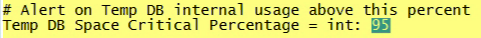

# 監視プロファイルのインストール{#installing-the-monitoring-profile}

Data Workbench監視プロファイルのインストール手順。

## インストール手順{#section-d4355dbea8a447f48ab168db6ccff612}

1. 新しいSensorインスタンスを、タグ付きWebページデータ収集に使用する場合と同じように設定します。 zig.gifファイルがSensor Webサーバーのドキュメントルートにあることを確認してください。 センサーは、モニタープロファイルと同じホストで実行できます。 （この目的でテキストファイルを使用する場合は、問題になりません）。

   >[!NOTE]
   >
   >このSensorインスタンスは、監視エージェントからのトラフィックのみを受信するように専用にする必要があります。 また、このコレクション用にWebサーバーを再利用する場合は、別のポートで実行するようにセンサーを設定できます。

1. [!DNL txlogd.conf]ファイルには、次のデフォルトの行が含まれます。

   ```
   <b>ContentFilterExclude</b> image/,text/css,application/x-javascript,text/javascript
   ```

   Data Workbench監視プロファイルアプリケーション（または「タグ付き」ページ実装）の場合、GIFファイルを介して収集するには、画像タイプを削除する必要があります。 更新された行は次のとおりです。

   ```
   <b>ContentFilterExclude </b>text/css,application/x-javascript,text/javascript
   ```

1. [!DNL insight_monitor.zip/insight_monitor_agent]を一時的な場所にコピーします。
1. 環境に合わせて[!DNL insight_monitor_agent.cfg]ファイルを更新します。 設定ファイル内のコメントに従います。

   **監視設定ファイル：**

   

   すべての情報を収集する場所を定義し、URLアドレスを指定します。 これは専用のセンサーである必要があり、このアプリケーション以外のトラフィックは受信しないでください。

   

   eがあると仮定したパスがあります。ディスク。 このパスは、環境に合わせて変更できます。

   

   変換プロファイルを実行する際に、Data Workbenchが応答しなくなる場合があります。 この値を使用すると、プロセスが応答しない状態で3回連続でアラートを送信できます。 これは、偽陽性アラートを減らす方法です。

   

   ここで、環境ディメンションとグループディメンションを設定します。 ホストごとに異なる場合があります。

   これはです。このパスでエラーログを表示すると、モニターエージェントが何を実行しているかを正確に確認できます。

   

   これは、temp dbを内部で使用するためです。 処理能力に達すると、警告が表示される場合があります。 これは、物理ディスクの使用量とは異なります。

1. *insight_monitor_agent*&#x200B;フォルダーを、Data Workbenchサーバーを実行する各DPUおよびFSUホストにコピーします。 設定ファイルで指定されているデフォルトの場所は[!DNL e:\insight_monitor_agent]ですが、この場所は変更できます。

1. 10分ごとにエージェントを呼び出すWindowsスケジュールタスクを追加します（この期間は、処理レートの計算で想定されます）。 プログラムは[!DNL e:insight_monitor/insight_monitor_agent.exe]です。 引数はconfig-file e:\insight_monitor\insight_monitor.cfgです。 e:\insight_monitorから開始します。 タスクを実行するユーザーは、[!DNL e:\insight_monitor]の読み取り/書き込みとWin32 OLEオブジェクト[!DNL root\CIMV2]の読み取りの権限が必要です（Data Workbenchサーバーのサービス開始モードを確認し、ローカルディスク上の領域の割合を確認するために必要です）。

1. 監視レコードが蓄積されるにつれ、VSLファイルが拡大し始めていることを確認します。 小規模なインストールではトラフィック量が極めて少なくなるので、この処理には時間がかかります（10分ごとに、エージェントはホスト固有のデータに対して1回のヒットと、1つの処理プロファイルに対して1回のヒットのみを送信します）。
1. insight_monitor.zip\profiles\Insight Historic to a temporary locationを解凍します。
1. [!DNL profile.cfg]、[!DNL dataset\cluster.cfg]、および[!DNL dataset\segment export.cfg]のホスト名を更新します。

1. Data Workbenchのプロファイルディレクトリにファイルを更新します。
1. [!DNL dataset\log processing.cfg]のログサーバーとパスを、Sensor VSLが蓄積する場所に更新します。
1. [] オプションで、プロファイルとで同じ操作をおこ [!DNL Insight Profile Status] ないま [!DNL Insight Server Status]す。さらに、ステータスプロファイルは、2日間の時間枠で夜間に再処理されます。 Windowsスケジュールタスクの追加：プログラムは[!DNL e:\insight_monitor\insight_reprocess.exe]です。 引数は[!DNL --profile-path="PATH TO PROFILES\insight profile status" --start-days-ago=2]です。 [!DNL start in]は空白のままにします。 *&quot;insight server status&quot;*&#x200B;用に別のスケジュール済みタスクを追加します。 *insight_reprocess.exeは、ログ処理* に対する読み取り/書き込み *アクセス権を必要とします。* cfgtoは、開始時間を更新します。

1. さらに、ステータスプロファイルは、2日間の時間枠で夜間に再処理されます。 Windowsスケジュールタスクの追加：プログラムは&#x200B;*e:\insight_monitor\insight_reprocess.exe*&#x200B;です。 引数は — [!DNL -profile-path="PATH TO PROFILES\insight profile status" --start-days-ago=2]です。 *先頭は*&#x200B;空白のままにします。 [!DNL "insight server status"]の別のスケジュール済みタスクを追加します。 [!DNL insight_reprocess.exe] は、開始時間を更新するために、への読み取り/書き込 [!DNL log processing.cfg] みアクセス権が必要です。各プロファイルが累積したモニターVSLを読み取っていることを確認します。 この場合も、非常に少ないボリュームのため、時間がかかります（おそらく数時間）。

## インストールに関する注意{#section-17722441ab0046fcbcb46b957d56230a}

* **ライセンスを取得したテスト環境での監視プロファイルの設定**&#x200B;を参照してください。テスト環境パッケージは、Data Workbenchの実装に含まれており、アプリケーションをインストールして設定できます。 実稼動FSUまたはDPUサーバーにインストールする場合は、別のポートで実行するようにサーバーを設定する必要があります。
* **監視プロファイル専用の新しいセンサーのデプロイ**&#x200B;を参照してください。監視プロファイルを実行するサーバーに、新しいSensorインスタンスをインストールする必要があります。 これは、センサーの実稼働インスタンスに加えておこなわれます。 （監視プロファイル専用の実稼動サーバーまたは非実稼動サーバーにセンサーをインストールする場合、追加料金は発生しません）。
* **data workbenchのメンテナンス中にモニターエージェントを無効にする**。稼動時間とパフォーマンスの指標を汚染しないように、サービスInsightServer(Omniture Insight Server)のサービス開始モードを手動に設定できます。 便利なPowerShellコマンドは、*set-service -name insightserver -startuptype manual*&#x200B;です。 メンテナンス後に自動に戻す：*set-service -name insightserver -startuptype automatic*。 もう1つのオプションは、モニターエージェントのスケジュール済みタスクを一時的に無効にすることです。
* **ステータスプロファイルには、古いホス** トとプロファイル、および古いホストとプロファイルのマッピングを削除するための、末尾のウィンドウが必要です。ただし、イベントデータの量が非常に少なく、Data Workbenchがバッファーしない場合は、ウィンドウを処理するために、ウィンドウのサイズをかなり拡張する必要が生じる場合があります。
* **エージェントは、Data Workbenchの詳細なステータス**(イベントデータログのタイムスタンプがUTC(VSLファイルなど)であると仮定してローカルホスト時間で報告)から、全体的で最も古い現在時刻を収集します。イベントデータのタイムスタンプがUTC以外のタイムゾーンにある場合、結果のInsightプロファイルステータスプロファイルで基準時間がオフセットされます。 イベントデータのタイムスタンプの&#x200B;**すべて**&#x200B;が同じタイムゾーンにある場合は、そのオフセットを&#x200B;*Insight Profile Status\metrics\as of delay minutes.metric*&#x200B;に追加できます。

* **2つの新しいディメンションが導入され、実稼動、ステージング、テストサーバー、他の状態のサーバーなど**、サーバーが異なる状態にある場合にユーザーをグループ化するのに役立ちます。例えば、「稼動時間」を検索する場合は、実稼動モードでのみサーバーを確認します。 その結果、グループディメンションは、必要に応じてサーバーを任意にグループ化するもう1つの方法になります。 たとえば、監視構成ファイルでは、オペレーション、開発、マーケティングなど、部門がサービスを提供するホストを設定できます。
