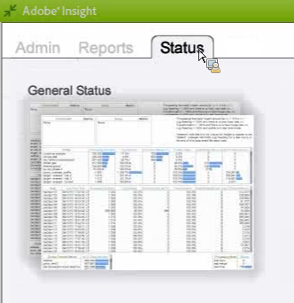

# Data Workbench のプロファイルステータスワークスペース{#data-workbench-profile-status-workspace}

{{eol}}

Data Workbench のプロファイルステータスプロファイルは、サーバー指標や履歴データではなく、プロファイルに基づいて、Data Workbench サーバーの正常性に関する現在の情報を提供します。

## Data Workbenchプロファイルのステータス {#section-65d1fa393cfd450cbacef3cba823fcc1}

このステータスプロファイルは、Data Workbench サーバーの最新の情報を提供しますが、10 分ごとにエージェントがポーリングされ、レポートには常にこの 10 分の待ち時間が含まれるので、リアルタイムではありません。 より正確に言えば、このプロファイルで生成されるデータセットは、エージェントからのサーバーの最新の監視を提供します。ほとんどの場合、デフォルトのポーリング期間は 10 分です。

Data Workbench の Profile Status プロファイルで使用されるディメンションに関する追加のリファレンス情報については、 [Insight プロファイルステータスプロファイル](../../../home/monitoring-installation/monitoring-profiles/monitoring-profile-using.md#concept-d4cd7da41c8a42bab4aea25418264e64).

このレポートは、コンポーネントや特定のトラフィックの変動ではなく、運用を監視する場合に便利です。

これは、誰がどのモードにいるかを感じさせます。特定のプロファイルに対して高い Fast Input 率が表示される場合、そのプロファイルは Fast Input モードになります。

停止指標が 1 の場合、サーバーは停止します。 値が 0 の場合、サーバーは停止しません。

**大きなバッチ読み込みのログ読み込み**

