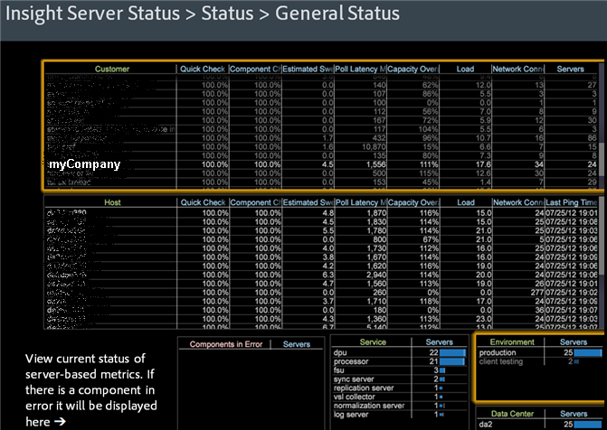

# Data Workbenchサーバーのステータスワークスペース{#data-workbench-server-status-workspace}

Data Workbenchサーバーステータスプロファイルは、プロファイル指標や履歴データではなく、サーバーに基づくData Workbenchサーバーの正常性に関する現在の情報を提供します。

## 一般ステータス {#section-65d1fa393cfd450cbacef3cba823fcc1}

Data Workbenchサーバーステータスプロファイル内で一般ステータスデータセットビューを開きます。

Data Workbenchサーバーステータスプロファイルで使用されるディメンションに関するその他の参照情報については、Insightサーバーステータスプロファイル [のディメンションを参照してくださ](../../../home/monitoring-installation/monitoring-appendix/monitoring-servers-profile.md#concept-8cbeb91e99bc42e2b52b22d551423f8a) い。

## ディスクの状態 {#section-36406f5f1262457e89ff13ad917f621f}

temp.dbの内部使用を含む、現在のディスク使用状況を表示します。

